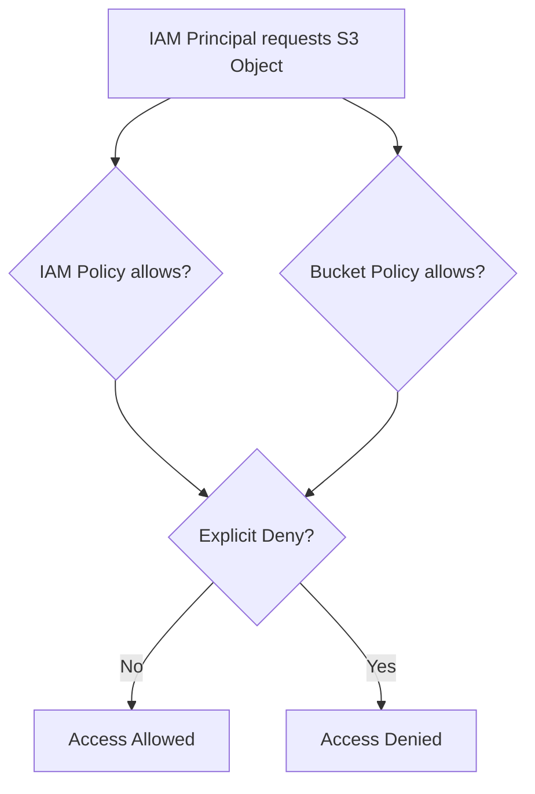
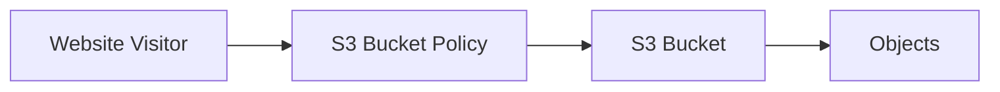

# 115. S3 Security: Bucket Policy

## 🎯 Giới thiệu

Bài này giới thiệu các cơ chế security trong Amazon S3, tập trung vào S3 Bucket Policy, IAM permissions, ACL và Block Public Access.

## 1. 👤 User-Based Security

- User-Based Security dùng IAM policies.
- IAM Policy xác định API calls nào được phép cho một IAM user cụ thể.

Ví dụ:

- IAM user trong cùng AWS account cần truy cập S3.
- Gán IAM permissions thông qua policy.
- Nếu policy cho phép, user có thể truy cập S3 bucket.

## 2. 📂 Resource-Based Security

Resource-Based Security trong S3 chủ yếu là S3 Bucket policies:

- Là bucket-wide rules.
- Có thể gán trực tiếp từ S3 console.
- Dùng để cho phép user cụ thể truy cập bucket.
- Dùng cho Cross-Account Access.
- Dùng để làm S3 bucket public.

Ngoài ra còn có:

- Object ACL: finer-grain security, có thể disabled.
- Bucket ACL: ít phổ biến hơn, cũng có thể disabled.

Trong transcript, cách phổ biến hiện nay để quản lý security trên S3 bucket là Bucket policies.

## 3. ✅ Khi nào IAM principal được access S3 object?

Một IAM principal có thể access S3 object nếu:

- IAM permissions cho phép, hoặc resource policy cho phép.
- Không có explicit deny cho action đó.

## 4. 🔒 S3 Bucket Policy

S3 Bucket Policy là JSON-based policy.

Các thành phần chính:

- `Resource`: bucket hoặc objects mà policy áp dụng.
- `Effect`: `Allow` hoặc `Deny`.
- `Action`: API actions được allow/deny, ví dụ `GetObject`.
- `Principal`: account hoặc user mà policy áp dụng; `*` nghĩa là anyone.

Ví dụ trong bài:

- `Principal: *`
- `Action: GetObject`
- `Resource: bucket/*`

Kết quả: public reads cho tất cả objects trong bucket.

## 5. 🚀 Use Cases của Bucket Policy

- Grant public access cho bucket.
- Force objects phải encrypted khi upload.
- Grant access cho another account.

### Public Access

### EC2 Access to S3

- IAM users không phù hợp để gắn trực tiếp vào EC2 instance.
- Cần dùng IAM role cho EC2 instance.
- EC2 instance role có IAM permissions phù hợp để truy cập S3 bucket.

### Cross-Account Access

- IAM user ở AWS account khác cần access bucket.
- Bucket Policy phải cho phép Cross-Account Access cho IAM user đó.

## 6. ⚠️ Block Public Access

- Block Public Access là bucket setting.
- Đây là lớp bảo mật bổ sung để tránh company data leaks.
- Nếu setting này bật, bucket sẽ không public kể cả khi S3 Bucket Policy cho phép public.
- Nếu bucket không bao giờ nên public, hãy giữ setting này bật.
- Nếu mọi bucket trong account không bao giờ nên public, có thể set ở account level.

## 📊 Bảng tóm tắt

| Tiêu chí | Mô tả |
|----------|------|
| User-Based Security | IAM policies |
| Resource-Based Security | S3 Bucket policies |
| ACL | Object ACL và Bucket ACL, có thể disabled |
| Policy format | JSON |
| Public read | Bucket Policy với `Principal: *` và `GetObject` |
| EC2 access S3 | Dùng IAM role |
| Cross-Account Access | Dùng Bucket Policy |
| Block Public Access | Ngăn bucket public dù policy cấu hình sai |

## 💡 Mẹo ghi nhớ cho kỳ thi AWS

- S3 public access thường liên quan đến Bucket Policy và Block Public Access.
- EC2 truy cập S3 nên dùng IAM role.
- Cross-Account Access vào S3 bucket dùng Bucket Policy.
- Explicit deny luôn chặn access.

## ✅ Kết luận

S3 security có thể đến từ IAM Policy, Bucket Policy, ACL và encryption. Trong bài này, trọng tâm là Bucket Policy: công cụ phổ biến để public bucket, cấp quyền cross-account và kiểm soát quyền ở cấp bucket.
