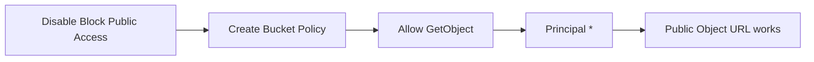

# 116. S3 Security: Bucket Policy Hands On

## 🎯 Giới thiệu

Bài thực hành tạo S3 Bucket Policy để public file `coffee.jpg` thông qua object URL. Trọng tâm là tắt Block Public Access, tạo policy bằng AWS Policy Generator và cấp quyền `GetObject` cho mọi người.

## 1. ⚠️ Cho phép Public Access ở Bucket Setting

Ban đầu bucket đang block toàn bộ public access.

Các bước:

- Vào tab Permissions.
- Edit Block Public Access setting.
- Bỏ chọn setting block public access.
- Xác nhận vì đây là hành động nguy hiểm.

⚠️ Lưu ý trong transcript:

- Chỉ tắt block public access khi chắc chắn muốn set public bucket policy.
- Nếu dữ liệu công ty bị public, có thể gây data leaks.

## 2. 📜 Tạo Bucket Policy

Trong tab Permissions:

- Bucket policy ban đầu chưa có.
- Có thể xem policy examples trong documentation.
- Demo dùng AWS Policy Generator.

Thiết lập trong AWS Policy Generator:

- Policy type: S3 Bucket Policy.
- Effect: Allow.
- Principal: `*`, nghĩa là anyone.
- AWS Service: Amazon S3.
- Action: `GetObject`.
- Amazon Resource Name: bucket ARN + `/*`.

Vì `GetObject` áp dụng cho objects trong bucket, ARN cần có slash và star:

```text
arn:aws:s3:::bucket-name/*
```

## 3. 🚀 Public Object URL

Sau khi generate policy:

- Copy policy vào Bucket policy editor.
- Save changes.
- Mở object URL của `coffee.jpg`.
- Image hiển thị được bằng public URL.



## 📊 Bảng tóm tắt

| Tiêu chí | Mô tả |
|----------|------|
| Mục tiêu | Public `coffee.jpg` qua object URL |
| Setting cần đổi | Block Public Access |
| Tool dùng | AWS Policy Generator |
| Policy type | S3 Bucket Policy |
| Principal | `*` |
| Action | `GetObject` |
| Resource | Bucket ARN + `/*` |
| Kết quả | Mọi object trong bucket public read |

## 💡 Mẹo ghi nhớ cho kỳ thi AWS

- Muốn public object bằng Bucket Policy thì Block Public Access không được chặn.
- `GetObject` cần resource ở cấp object: `bucket-arn/*`.
- `Principal: *` nghĩa là anyone.

## ✅ Kết luận

Bài thực hành cho thấy public access trong S3 cần cả hai phần: bucket cho phép public access và Bucket Policy cho phép `GetObject`. Khi cấu hình đúng, object URL public có thể truy cập trực tiếp từ internet.
