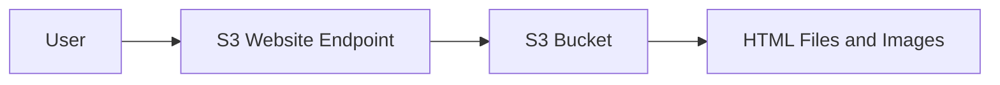

# 117. S3 Website Overview

## 🎯 Giới thiệu

Amazon S3 có thể được dùng để host static websites và cho phép website truy cập được từ internet thông qua website endpoint phụ thuộc vào AWS region.

## 1. 🌐 Static Website Hosting

- S3 có thể host static websites.
- Bucket chứa files như HTML files và images.
- Sau khi bật website hosting, user có thể truy cập website qua S3 website URL.
- Website URL phụ thuộc vào region nơi bucket được tạo.

## 2. 🔓 Public Reads là điều kiện bắt buộc

Static website hosting sẽ không hoạt động nếu bucket không có public reads.

Liên hệ với bài trước:

- Cần dùng S3 Bucket Policy để cho phép public access.
- Nếu sau khi bật website hosting mà gặp `403 Forbidden`, nghĩa là bucket chưa public.
- Cần attach S3 Bucket Policy cho phép bucket public.

## 📊 Bảng tóm tắt

| Tiêu chí | Mô tả |
|----------|------|
| Tính năng | S3 Static Website Hosting |
| Nội dung lưu trong bucket | HTML files, images |
| URL | Phụ thuộc AWS region |
| Điều kiện quan trọng | Public reads enabled |
| Lỗi thường gặp | `403 Forbidden` khi bucket chưa public |
| Cách xử lý | Attach S3 Bucket Policy cho public access |

## 💡 Mẹo ghi nhớ cho kỳ thi AWS

- S3 static website cần public reads.
- `403 Forbidden` sau khi bật website hosting thường là dấu hiệu bucket chưa public.
- Bucket Policy là phần quan trọng để website endpoint truy cập được nội dung.

## ✅ Kết luận

S3 có thể host static website bằng cách bật static website hosting trên bucket và đảm bảo bucket cho phép public reads thông qua S3 Bucket Policy.
