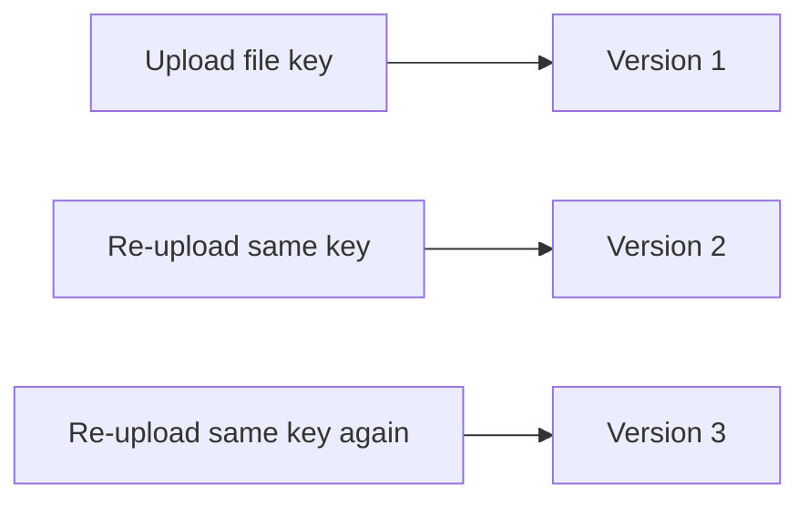

# 119. S3 Versioning

## 🎯 Giới thiệu

S3 Versioning cho phép lưu nhiều phiên bản của cùng một file trong Amazon S3. Đây là bucket-level setting và giúp update website hoặc files an toàn hơn.

## 1. 📌 Versioning hoạt động như thế nào?

- Versioning được bật ở cấp bucket.
- Khi upload file lần đầu, S3 tạo một version tại key đó.
- Khi upload lại cùng key, S3 không ghi đè hoàn toàn mà tạo version mới.
- Các version tiếp theo có thể là version 2, version 3, v.v.

## 2. ✅ Best Practice

Trong transcript, versioning bucket được xem là best practice vì:

- Bảo vệ khỏi unintended deletes.
- Khi delete file, S3 thêm delete marker thay vì xóa hẳn version cũ.
- Có thể restore versions trước đó.
- Có thể rollback về previous version.

## 3. ⚠️ Notes quan trọng

- File không được versioned trước khi bật versioning sẽ có version `null`.
- Suspend versioning không xóa previous versions.
- Suspend versioning là thao tác an toàn theo transcript.

## 📊 Bảng tóm tắt

| Tiêu chí | Mô tả |
|----------|------|
| Phạm vi cấu hình | Bucket level |
| Upload cùng key | Tạo version mới |
| Delete file | Thêm delete marker |
| Restore | Có thể restore previous versions |
| Rollback | Có thể quay về version cũ |
| File trước khi bật versioning | Version `null` |
| Suspend versioning | Không xóa previous versions |

## 💡 Mẹo ghi nhớ cho kỳ thi AWS

- Versioning giúp chống unintended deletes.
- File tồn tại trước khi bật versioning có version ID là `null`.
- Suspend versioning không xóa lịch sử version.

## ✅ Kết luận

S3 Versioning là cơ chế quan trọng để bảo vệ object, rollback nội dung và giảm rủi ro khi xóa hoặc update file trong bucket.
