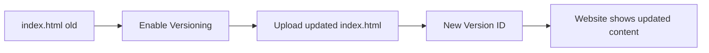
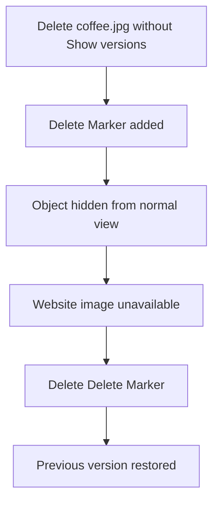

# 120. S3 Versioning - Hands On

## 🎯 Giới thiệu

Bài thực hành bật S3 Versioning, upload lại `index.html`, rollback website bằng cách xóa version mới, và restore object bằng cách xóa delete marker.

## 1. ✅ Enable Bucket Versioning

Trong tab Properties:

- Vào Bucket Versioning.
- Edit và enable versioning.
- Từ thời điểm này, các file bị overwrite sẽ tạo thêm versions trong bucket.

## 2. 🚀 Update Website bằng Version mới

Luồng demo:

- Website ban đầu hiển thị `I love coffee`.
- Sửa `index.html` thành `I REALLY love coffee`.
- Upload lại `index.html`.
- Refresh website thấy nội dung mới.

Khi bật `Show versions`:

- `beach.jpg` và `coffee.jpg` có version ID `null` vì được upload trước khi bật versioning.
- `index.html` có version `null` và một version ID mới.

## 3. 🔁 Rollback bằng cách xóa Version mới

Để quay lại `I love coffee`:

- Bật `Show versions`.
- Chọn version ID mới của `index.html`.
- Delete specific version ID.
- Đây là permanent delete.
- Cần nhập `permanently delete`.
- Refresh website sẽ quay lại version cũ.

⚠️ Permanent delete là destructive operation và không thể undo theo transcript.

## 4. 🗑️ Delete Marker và Restore Object

Khi tắt `Show versions` và delete `coffee.jpg`:

- S3 không xóa underlying object.
- S3 thêm delete marker.
- Object không còn hiển thị trong view thường.
- Website không tải được image và có thể thấy `404 Not Found`.

Để restore:

- Bật `Show versions`.
- Chọn delete marker.
- Permanently delete delete marker.
- Previous version của object được restore.

## 📊 Bảng tóm tắt

| Tiêu chí | Mô tả |
|----------|------|
| Bật versioning | Properties > Bucket Versioning |
| File cũ trước versioning | Version ID `null` |
| Upload lại cùng key | Tạo version ID mới |
| Rollback | Xóa version mới |
| Xóa version cụ thể | Permanent delete |
| Xóa object view thường | Tạo delete marker |
| Restore object | Xóa delete marker |

## 💡 Mẹo ghi nhớ cho kỳ thi AWS

- Delete object trong versioned bucket thường tạo delete marker.
- Delete specific version ID là permanent delete.
- Xóa delete marker sẽ làm previous version xuất hiện lại.

## ✅ Kết luận

S3 Versioning giúp update và rollback an toàn. Cần phân biệt rõ delete marker với permanent delete vì hai thao tác này có hậu quả khác nhau trong versioned bucket.
