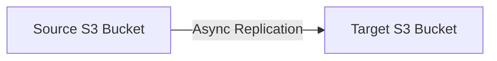

# 121. S3 Replication

## 🎯 Giới thiệu

Amazon S3 Replication có hai loại chính: Cross-Region Replication (CRR) và Same-Region Replication (SRR). Replication sao chép objects bất đồng bộ giữa source bucket và target bucket.

## 1. 🔁 CRR và SRR

- CRR: Cross-Region Replication.
- SRR: Same-Region Replication.
- Source bucket sao chép dữ liệu sang target bucket.
- Replication diễn ra asynchronous, chạy background.

## 2. ✅ Điều kiện để Replication hoạt động

- Phải enable Versioning ở cả source bucket và destination bucket.
- Nếu dùng CRR, hai regions phải khác nhau.
- Nếu dùng SRR, hai buckets ở cùng region.
- Buckets có thể nằm ở different AWS accounts.
- Cần cấp IAM permissions phù hợp cho S3 service để đọc và ghi vào các buckets được chỉ định.

## 3. 🚀 Use Cases

### Cross-Region Replication (CRR)

- Compliance.
- Lower latency access vì dữ liệu ở region khác.
- Replicate data across accounts.

### Same-Region Replication (SRR)

- Aggregate logs từ nhiều S3 Buckets.
- Live replication giữa production và test accounts.

## 📊 Bảng tóm tắt

| Tiêu chí | CRR | SRR |
|----------|-----|-----|
| Tên đầy đủ | Cross-Region Replication | Same-Region Replication |
| Region | Khác region | Cùng region |
| Cơ chế | Asynchronous replication | Asynchronous replication |
| Versioning | Bắt buộc ở source và destination | Bắt buộc ở source và destination |
| Use Cases | Compliance, lower latency, cross-account replication | Aggregate logs, prod-test live replication |

## 💡 Mẹo ghi nhớ cho kỳ thi AWS

- S3 Replication luôn cần Versioning ở cả hai buckets.
- CRR khác region, SRR cùng region.
- Replication là asynchronous.
- Cần IAM permissions cho S3 service.

## ✅ Kết luận

S3 Replication giúp sao chép objects giữa buckets cho compliance, latency, cross-account, log aggregation hoặc live replication. Điều kiện quan trọng nhất cần nhớ là Versioning phải bật ở cả source và destination buckets.
