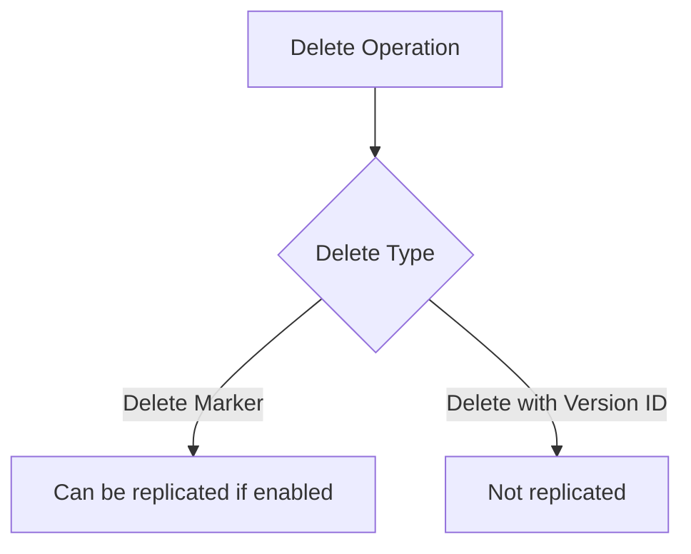
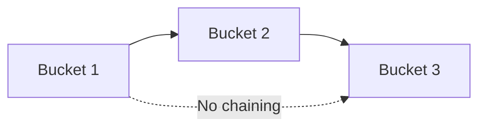

# 122. S3 Replication Notes

## 🎯 Giới thiệu

Bài này bổ sung các lưu ý quan trọng về S3 Replication: chỉ replicate new objects sau khi bật replication, cách xử lý existing objects, delete marker và giới hạn no chaining.

## 1. 📌 New Objects vs Existing Objects

- Sau khi enable Replication, chỉ new objects được replicated.
- Existing objects không tự động replicate bằng replication rule vừa bật.
- Muốn replicate existing objects, cần dùng S3 Batch Replication.

S3 Batch Replication dùng để:

- Replicate existing objects.
- Replicate objects bị failed Replication.

## 2. 🗑️ Delete Operations

- Có thể replicate delete markers từ source bucket sang target bucket.
- Đây là optional setting.
- Deletes có version ID không được replicated.
- Permanent deletion không replicate để tránh malicious deletes lan từ bucket này sang bucket khác.

## 3. ⚠️ No Chaining of Replications

- Không có replication chaining.
- Nếu bucket 1 replicate sang bucket 2.
- Và bucket 2 replicate sang bucket 3.
- Objects từ bucket 1 sẽ không được replicate tiếp sang bucket 3.

## 📊 Bảng tóm tắt

| Tiêu chí | Mô tả |
|----------|------|
| Sau khi bật replication | Chỉ new objects được replicated |
| Existing objects | Dùng S3 Batch Replication |
| Failed replication objects | Có thể xử lý bằng S3 Batch Replication |
| Delete marker | Có thể replicate nếu bật optional setting |
| Delete with version ID | Không replicated |
| Replication chaining | Không hỗ trợ |

## 💡 Mẹo ghi nhớ cho kỳ thi AWS

- Replication rule mới không tự copy objects cũ.
- Existing objects cần S3 Batch Replication.
- Delete marker có thể replicate, permanent delete theo version ID thì không.
- Không có chaining: bucket 1 không tự đi tiếp sang bucket 3 qua bucket 2.

## ✅ Kết luận

Các lưu ý về S3 Replication thường xuất hiện trong câu hỏi thi: chỉ new objects replicate, existing objects cần S3 Batch Replication, delete marker là optional, permanent delete không replicate, và không có replication chaining.
