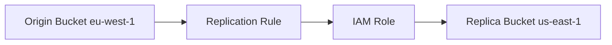
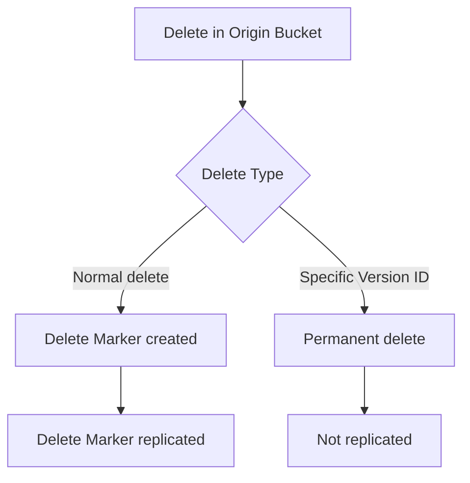

# 123. S3 Replication - Hands On

## 🎯 Giới thiệu

Bài thực hành tạo source bucket và target bucket, bật Versioning, cấu hình replication rule, kiểm tra object replication và delete marker replication.

## 1. 📂 Tạo Source Bucket và Target Bucket

Tạo origin bucket:

- Tên ví dụ: `s3-stephane-bucket-origin-v2`.
- Region ví dụ: `eu-west-1`.
- Enable Bucket Versioning vì replication chỉ hoạt động khi versioning bật.

Tạo target bucket:

- Tên ví dụ: `s3-stephane-bucket-replica-v2`.
- Region có thể cùng region để làm SRR hoặc khác region để làm CRR.
- Demo chọn `us-east-1`, nên đây là Cross-Region Replication.
- Enable Bucket Versioning trên target bucket.

## 2. ⚠️ Object có trước khi bật Replication

- Upload `beach.jpg` vào origin bucket trước khi tạo replication rule.
- File này chưa được replicate vì replication chưa cấu hình.
- Khi bật replication, chỉ objects mới sau thời điểm đó được replicate.

## 3. 🔁 Tạo Replication Rule

Trong origin bucket:

- Vào Management.
- Tạo replication rule `DemoReplicationRule`.
- Set rule enabled.
- Rule scope: apply to all objects in the bucket.
- Destination: target bucket trong cùng account.
- AWS nhận diện destination region là `us-east-1`, nên đây là CRR.
- IAM role: tạo role mới cho replication.

Khi được hỏi replicate existing objects:

- Chọn no trong demo.
- Muốn replicate previous objects thì dùng Batch Operation / S3 Batch Operation.

## 4. ✅ Kiểm tra Object Replication

- Upload `coffee.jpg` sau khi replication rule đã sẵn sàng.
- Object được replicate sang target bucket sau vài giây.
- Khi bật `Show versions`, version ID của `coffee.jpg` ở replica giống version ID ở origin.
- Muốn replicate `beach.jpg` đã upload trước đó, cần upload một version mới của file.

## 5. 🗑️ Delete Marker Replication

Trong replication rule:

- Delete marker replication mặc định không enabled.
- Có thể edit rule và enable delete marker replication.

Sau khi bật:

- Delete `coffee.jpg` trong origin bucket.
- Vì bucket versioned, thao tác này tạo delete marker.
- Delete marker được replicate sang replica bucket.
- Khi không show versions, `coffee.jpg` không hiển thị ở cả hai buckets.
- Khi show versions, vẫn thấy versions và delete marker.

## 6. ⚠️ Permanent Delete không Replicate

- Nếu delete một specific version ID trong origin bucket, đó là permanent delete.
- Permanent delete không replicate sang replica bucket.
- Vì chỉ delete markers được replicated, không phải deletes theo version ID.

## 📊 Bảng tóm tắt

| Tiêu chí | Mô tả |
|----------|------|
| Source bucket | Origin bucket |
| Target bucket | Replica bucket |
| Versioning | Bắt buộc trên cả hai buckets |
| Demo region | `eu-west-1` sang `us-east-1` |
| Replication type | Cross-Region Replication |
| Existing objects | Không replicate tự động |
| New objects | Replicate sau khi rule enabled |
| Version ID | Được replicate |
| Delete marker | Replicate nếu bật setting |
| Permanent delete | Không replicate |

## 💡 Mẹo ghi nhớ cho kỳ thi AWS

- Objects cũ trước khi bật replication không tự replicate.
- Version ID có thể được replicate.
- Delete marker replication là setting riêng.
- Delete specific version ID là permanent delete và không replicate.

## ✅ Kết luận

Bài hands-on củng cố các điểm thi quan trọng của S3 Replication: cần Versioning, replication rule chỉ áp dụng cho objects mới, existing objects cần Batch Operation, delete marker có thể replicate còn permanent delete thì không.
