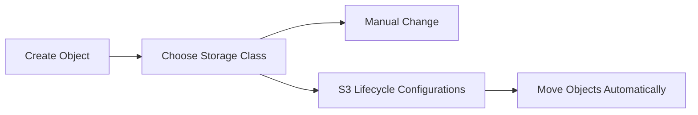
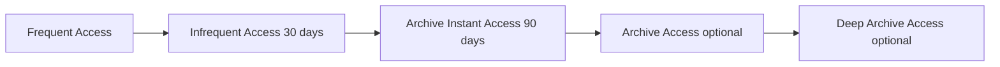

# 124. S3 Storage Classes Overview

## 🎯 Giới thiệu

Bài này tổng quan các Amazon S3 Storage Classes, khái niệm durability, availability, retrieval time, retrieval cost, minimum storage duration và S3 Intelligent-Tiering.

## 1. 📦 Các S3 Storage Classes

Các storage classes được nhắc trong transcript:

- Amazon S3 Standard-General Purpose.
- Amazon S3 Infrequent Access.
- Amazon S3 One Zone-Infrequent Access.
- Glacier Instant Retrieval.
- Glacier Flexible Retrieval.
- Glacier Deep Archive.
- Amazon S3 Intelligent-Tiering.

Khi tạo object:

- Có thể chọn storage class.
- Có thể sửa storage class thủ công.
- Có thể dùng Amazon S3 Lifecycle configurations để tự động move objects giữa storage classes.

## 2. 🧱 Durability và Availability

### Durability

- Durability thể hiện khả năng object bị mất bởi Amazon S3.
- Amazon S3 có durability rất cao: 11 nines.
- Ví dụ trong transcript: lưu 10 triệu objects trên Amazon S3 thì trung bình có thể mất 1 object mỗi 10.000 năm.
- Durability giống nhau cho tất cả S3 storage classes.

### Availability

- Availability thể hiện mức độ service sẵn sàng.
- Availability phụ thuộc vào storage class.
- S3 Standard có 99.99% availability.
- Transcript diễn giải tương đương khoảng 53 phút mỗi năm service không available.

## 3. 🚀 S3 Standard-General Purpose

- Availability: 99.99%.
- Dùng cho frequently accessed data.
- Là storage class mặc định.
- Low latency và high throughput.
- Có thể chịu được two concurrent facility failures phía AWS.

Use Cases:

- Big Data Analytics.
- Mobile and gaming applications.
- Content distribution.

## 4. 📉 S3 Infrequent Access

### S3 Standard-IA

- Dành cho data ít truy cập hơn.
- Vẫn cần rapid access khi cần.
- Chi phí thấp hơn S3 Standard.
- Có retrieval cost.
- Availability: 99.9%.

Use Cases:

- Disaster Recovery.
- Backups.

### S3 One Zone-IA

- High durability trong single AZ.
- Data sẽ bị mất nếu AZ bị destroy.
- Availability: 99.5%.

Use Cases:

- Secondary copy of backups.
- On-premises data backup copy.
- Data có thể recreate.

## 5. 🧊 Glacier Storage Classes

Glacier là low-cost object storage cho archiving và backup.

Pricing:

- Pay for storage.
- Pay for retrieval cost.

### Glacier Instant Retrieval

- Retrieval trong milliseconds.
- Dùng cho data truy cập khoảng once a quarter.
- Minimum storage duration: 90 days.
- Phù hợp backup cần access trong milliseconds.

### Glacier Flexible Retrieval

- Trước đây gọi là Amazon S3 Glacier.
- Có 3 retrieval options:
  - Expedited: 1 đến 5 minutes.
  - Standard: 3 đến 5 hours.
  - Bulk: 5 đến 12 hours, free.
- Minimum storage duration: 90 days.

### Glacier Deep Archive

- Dành cho long-term storage.
- Retrieval options:
  - Standard: 12 hours.
  - Bulk: 48 hours.
- Lowest cost theo transcript.
- Minimum storage duration: 180 days.

## 6. 🤖 S3 Intelligent-Tiering

S3 Intelligent-Tiering tự move objects giữa access tiers dựa trên usage patterns.

Chi phí:

- Có small monthly monitoring fee.
- Có auto-tiering fee.
- Không có retrieval charges.

Tiers trong transcript:

- Frequent Access tier: automatic, default tier.
- Infrequent Access tier: automatic, cho objects không accessed 30 days.
- Archive Instant Access tier: automatic, cho objects không accessed over 90 days.
- Archive Access tier: optional, configurable từ 90 days đến 700+ days.
- Deep Archive Access tier: optional, configurable từ 180 days đến 700+ days.

## 📊 Bảng tóm tắt

| Storage Class | Availability / Retrieval | Use Case / Ghi chú |
|---------------|--------------------------|--------------------|
| S3 Standard | 99.99%, low latency, high throughput | Frequently accessed data, Big Data Analytics, mobile/gaming, content distribution |
| S3 Standard-IA | 99.9%, rapid access, có retrieval cost | Disaster Recovery, backups |
| S3 One Zone-IA | 99.5%, single AZ | Secondary backups, data có thể recreate |
| Glacier Instant Retrieval | Milliseconds retrieval, minimum 90 days | Backup cần truy xuất rất nhanh |
| Glacier Flexible Retrieval | 1-5 minutes, 3-5 hours, hoặc 5-12 hours | Archiving và backup, minimum 90 days |
| Glacier Deep Archive | 12 hours hoặc 48 hours | Long-term storage, minimum 180 days |
| S3 Intelligent-Tiering | Auto tiering, no retrieval charges | Không biết trước access patterns |

## 💡 Mẹo ghi nhớ cho kỳ thi AWS

- Durability 11 nines áp dụng cho mọi S3 storage classes trong bài.
- Availability thay đổi theo storage class.
- Standard-IA có retrieval cost.
- One Zone-IA mất data nếu AZ bị destroy.
- Glacier Instant Retrieval là milliseconds; Glacier Flexible Retrieval có thể chờ đến 12 hours; Deep Archive có thể chờ 48 hours.
- S3 Intelligent-Tiering phù hợp khi không biết access patterns.

## ✅ Kết luận

S3 Storage Classes giúp tối ưu chi phí và cách truy cập dữ liệu. Cần nắm sự khác nhau giữa Standard, IA, One Zone-IA, các Glacier tiers và Intelligent-Tiering, đặc biệt là availability, retrieval time, retrieval cost và minimum storage duration.
