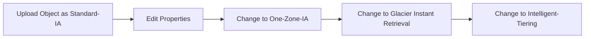
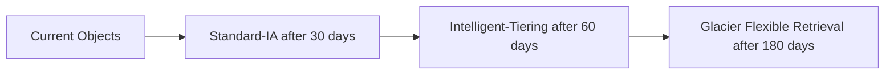

# 125. S3 Storage Classes Hands On

## 🎯 Giới thiệu

Bài thực hành chọn S3 Storage Class khi upload object, chỉnh storage class sau khi upload, và tạo lifecycle rule để tự động move objects giữa các tiers.

## 1. 📂 Tạo Bucket và Upload Object

Các bước trong demo:

- Tạo bucket tên `s3-storage-classes-demos-2022`.
- Chọn một region bất kỳ.
- Upload object `coffee.jpeg`.
- Khi upload, xem phần Properties của object.
- Trong Storage Class, S3 hiển thị nhiều lựa chọn storage classes.

## 2. 📦 Chọn Storage Class khi Upload

Các storage classes trong console:

- S3 Standard: default.
- Intelligent-Tiering: dùng khi không biết data patterns và muốn AWS tiering tự động.
- Standard-IA: data infrequently accessed nhưng vẫn cần low latency.
- One-Zone-IA: data có thể recreate, lưu trong one AZ only.
- Glacier Instant Retrieval.
- Glacier Flexible Retrieval.
- Glacier Deep Archive.
- Reduced Redundancy: deprecated storage tier, không được mô tả trong khóa học.

Trong demo:

- Chọn Standard-IA.
- Upload object.
- Object hiển thị storage class là Standard-IA.

## 3. 🔁 Change Storage Class sau khi Upload

Sau khi object đã upload:

- Vào object Properties.
- Scroll đến Storage Class.
- Edit storage class.
- Có thể đổi sang One-Zone-IA.
- Sau khi save, object class thay đổi thành One-Zone-IA.

Có thể tiếp tục đổi sang:

- Glacier Instant Retrieval.
- Intelligent-Tiering.
- Các class khác tùy nhu cầu.

## 4. ⚙️ Automate bằng Lifecycle Rules

Trong bucket Management:

- Tạo lifecycle rule tên `DemoRule`.
- Apply to all objects in the bucket.
- Chọn move current versions between storage classes.
- Tạo transitions tự động.

Ví dụ transitions trong transcript:

- Chuyển sang Standard-IA sau 30 days.
- Chuyển sang Intelligent-Tiering sau 60 days.
- Chuyển sang Glacier Flexible Retrieval sau 180 days.

## 📊 Bảng tóm tắt

| Tiêu chí | Mô tả |
|----------|------|
| Bucket demo | `s3-storage-classes-demos-2022` |
| Object demo | `coffee.jpeg` |
| Storage class ban đầu | Standard-IA |
| Có thể đổi sau upload | Có, trong object Properties |
| One-Zone-IA | Lưu trong one AZ only, rủi ro mất object nếu AZ destroyed |
| Intelligent-Tiering | AWS tự tiering theo data patterns |
| Reduced Redundancy | Deprecated |
| Lifecycle rule | Tự động move objects giữa storage classes |

## 💡 Mẹo ghi nhớ cho kỳ thi AWS

- Storage Class có thể chọn khi upload object.
- Có thể đổi Storage Class thủ công sau khi upload.
- Lifecycle rules giúp automate transition giữa storage classes.
- One-Zone-IA chỉ lưu ở one AZ và dùng cho data có thể recreate.
- Reduced Redundancy là deprecated trong transcript.

## ✅ Kết luận

Bài hands-on cho thấy S3 Storage Classes không chỉ được chọn lúc upload mà còn có thể thay đổi sau đó. Với Lifecycle Rules, có thể tự động chuyển objects qua Standard-IA, Intelligent-Tiering hoặc Glacier Flexible Retrieval theo thời gian.
