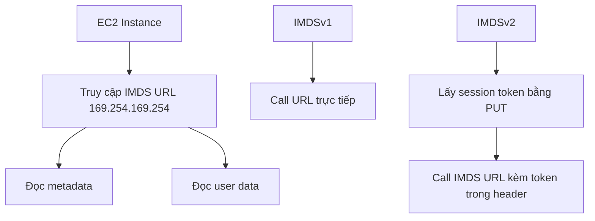

# 126. AWS EC2 Instance Metadata

## 🎯 Giới thiệu
- **EC2 Instance Metadata** hay **IMDS (Instance Metadata Service)** là một tính năng rất mạnh của **EC2**.
- Mục tiêu chính: cho phép **EC2 instance** tự “biết” thông tin về chính nó mà **không cần IAM Role cho mục đích đó**.
- Instance sẽ truy cập một URL đặc biệt: `169.254.169.254` để lấy thông tin.
- Ngoài **metadata**, URL này còn cho phép truy cập **user data** của instance.

## 1. Instance Metadata là gì
- **Metadata** là thông tin về instance.
- Từ metadata, có thể biết:
  - instance name
  - public IP
  - private IP
  - nhiều thông tin khác
- Có thể lấy được:
  - **IAM Role name** gắn với EC2 instance
  - một số **credentials**
- Không thể biết:
  - **IAM policy** nào được gắn vào role

## 2. Metadata vs User Data
- **Metadata**: thông tin về instance.
- **User data**: launch script của EC2 instance.
- Cùng truy cập qua cơ chế URL của IMDS, nhưng bài học này tập trung vào **metadata service**.

## 3. IMDSv1 và IMDSv2
- Có 2 phiên bản của IMDS:
  - **IMDSv1**
    - truy cập URL trực tiếp
    - hoạt động ngay, không cần bước bổ sung
  - **IMDSv2**
    - được bật mặc định
    - an toàn hơn
    - cần 2 bước:
      1. lấy **session token** bằng `PUT`
      2. gọi IMDS URL kèm token trong **header**
- AWS chuyển từ **IMDSv1** sang **IMDSv2** vì lý do **security**.

## 📊 Bảng tóm tắt
| Tiêu chí | Mô tả |
|----------|------|
| Mục đích | EC2 tự lấy thông tin về chính nó |
| URL truy cập | `169.254.169.254` |
| Dữ liệu lấy được | instance name, public IP, private IP, IAM Role name, một số credentials |
| Giới hạn | Không biết được IAM policy gắn với role |
| User data | Launch script của EC2 instance |
| IMDSv1 | Truy cập trực tiếp, đơn giản |
| IMDSv2 | Có token, an toàn hơn, cần 2 bước |

## 💡 Mẹo ghi nhớ cho kỳ thi AWS
- Nhớ nhanh: **IMDS = thông tin của EC2 về chính nó**.
- **169.254.169.254** là địa chỉ cần nhớ.
- **IMDSv1** = direct access.
- **IMDSv2** = `PUT` lấy token rồi mới gọi metadata.
- Có thể lấy **role name** và **credentials**, nhưng **không lấy được IAM policy**.

## ✅ Kết luận
- **EC2 Instance Metadata Service (IMDS)** là cách để EC2 đọc thông tin nội bộ của chính nó qua URL đặc biệt.
- Bài học trọng tâm là phân biệt **IMDSv1** và **IMDSv2**, trong đó **IMDSv2** an toàn hơn và là phiên bản mặc định.
- Đây là kiến thức quan trọng cho cả **học thực hành** lẫn **ôn thi AWS**.
