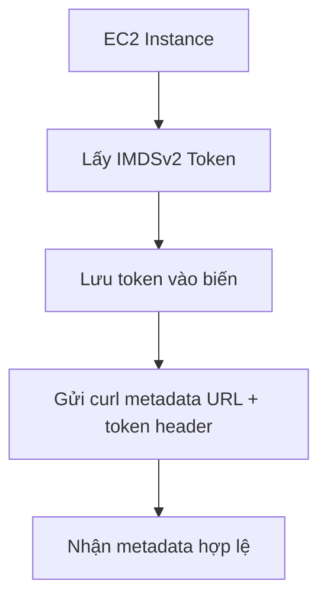

# 127. AWS EC2 Instance Metadata - Hands On

## 🎯 Giới thiệu
Bài học này thực hành với **EC2 Instance Metadata Service** để hiểu cách EC2 tự truy cập metadata của chính nó và cách lấy **credentials** của **IAM role** thông qua metadata service.

- Tạo một EC2 instance tên `DemoEC2`
- Dùng **Amazon Linux 2023 AMI**
- Trong phần **Advanced details**, có thể chọn metadata version:
  - `V1 and V2`
  - `V2 only`
- Với **Amazon Linux 2023**, transcript cho thấy phải dùng **IMDSv2 only**
- Kết nối vào instance bằng **EC2 Instance Connect**
- Sau đó thử query metadata service từ bên trong instance

## 1. IMDSv1 không hoạt động trên instance này
Khi thử dùng URL của **IMDSv1**:

- Gọi `curl` vào metadata URL
- Kết quả nhận được là **401 Unauthorized**
- Điều này cho thấy không thể truy cập theo cách IMDSv1 trên instance đang dùng

📌 Ý chính:
- **IMDSv1** không dùng được trong tình huống này
- Cần chuyển sang **IMDSv2**

## 2. IMDSv2 yêu cầu lấy token trước
Để truy cập metadata bằng **IMDSv2**, phải thực hiện 2 bước:

1. Gửi request để lấy **token**
2. Dùng token đó trong header khi gọi metadata URL

Sau khi lấy token:
- Có thể kiểm tra token bằng `echo $token`
- Sau đó gọi lại metadata URL kèm token
- Lúc này request thành công, không còn `Unauthorized`

Mermaid flowchart:

## 3. Query metadata và lấy IAM role credentials
Khi đã có token, có thể truy vấn nhiều thông tin từ metadata service.

### Các điểm quan trọng:
- Nếu URL có **trailing slash** `/` thì hiểu như một **directory**
- Nếu không có trailing slash thì đó là một **value**
- Có thể lấy:
  - `host-name`
  - `local-ipv4`
  - và nhiều thông tin khác

### Ví dụ với IAM role
Ban đầu:
- Instance chưa gắn **IAM role**
- Truy vấn `identity-credentials` rồi đi vào `security-credentials` sẽ trả về **not found**

Sau đó:
- Vào **Security > Modify IAM role**
- Gắn một **IAM role** cho EC2 instance
- Chờ khoảng 30 giây
- Query lại metadata

Kết quả:
- Truy cập được đường dẫn dài đến credentials của instance
- Nhận được JSON gồm:
  - `AccessKeyId`
  - `SecretAccessKey`
  - `Token`
  - `Expiration`

📌 Ý nghĩa:
- EC2 instance lấy được credentials để dùng **IAM role**
- Việc này diễn ra qua **EC2 Instance Metadata Service**
- **AWS CLI** và **SDK** có thể tự xử lý phía sau, không cần thao tác thủ công

## 📊 Bảng tóm tắt
| Tiêu chí | Mô tả |
|----------|------|
| Dịch vụ | **EC2 Instance Metadata Service (IMDS)** |
| Phiên bản dùng trong bài | **IMDSv2** |
| IMDSv1 | Thử gọi nhưng bị **401 Unauthorized** |
| Yêu cầu của IMDSv2 | Phải lấy **token** trước rồi mới gọi metadata URL |
| Dữ liệu lấy được | `host-name`, `local-ipv4`, metadata khác |
| IAM role credentials | Lấy được `AccessKeyId`, `SecretAccessKey`, `Token`, `Expiration` |
| Điểm cần nhớ | Metadata service cung cấp credentials cho EC2 khi instance có **IAM role** |

## 💡 Mẹo ghi nhớ cho kỳ thi AWS
- **IMDSv2 = 2 bước**: lấy **token** rồi mới query metadata
- Thấy **401 Unauthorized** khi gọi metadata thì nghĩ ngay đến:
  - chưa dùng đúng **IMDSv2**
  - hoặc thiếu token
- Có **trailing slash** trong URL metadata thì thường là đang đi vào một nhánh dữ liệu
- EC2 có **IAM role** thì credentials được lấy thông qua **metadata service**
- **AWS CLI** và **SDK** có thể tự lấy credentials phía sau, không cần bạn làm tay
- Nếu cần kiểm tra metadata, nhớ các ví dụ như `host-name` và `local-ipv4`

## ✅ Kết luận
Bài này cho thấy cách EC2 truy cập **metadata service** và cách **IMDSv2** hoạt động theo mô hình lấy token trước. Quan trọng nhất là hiểu rằng khi EC2 gắn **IAM role**, instance có thể lấy **credentials tạm thời** thông qua metadata service để dùng với AWS services.
