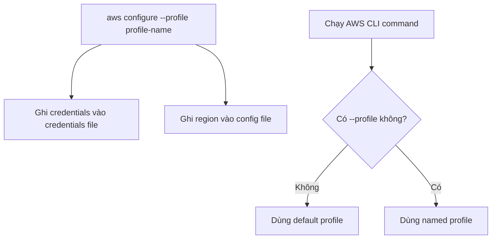

# 128. AWS CLI Profiles

## 🎯 Giới thiệu
- Khi làm việc với nhiều AWS accounts, bạn không nên chỉ dùng `default` profile.
- AWS CLI cho phép tạo **profile** để lưu riêng `AWS access key id`, `secret access key`, và `region` cho từng account.
- Nhờ đó, bạn có thể chuyển qua lại giữa các account ngay trong command line.

## 1. `default` profile và giới hạn khi chỉ dùng một account
- Trong file `credentials`, `default` section chứa `AWS access key id` và `secret access key`.
- Trong file `config`, `default` section cũng chứa cấu hình mặc định như `region`.
- Nếu chỉ có `default`, mọi lệnh AWS CLI sẽ chạy theo account mặc định đó.

## 2. Tạo và cấu hình profile mới
- Dùng lệnh:

```bash
aws configure --profile <profile-name>
```

- Lệnh này cho phép tạo một profile mới với tên tùy chọn.
- Khi cấu hình xong, AWS CLI sẽ ghi thêm:
  - một section mới trong `credentials`
  - một section mới trong `config`
- Mỗi profile có bộ credentials riêng và có thể có `region` riêng.
- Ví dụ trong transcript:
  - profile mới được đặt tên là `my other AWS accounts`
  - `region` được chọn là `us-west-2`

## 3. Sử dụng profile khi chạy lệnh AWS CLI
- Nếu chạy:

```bash
aws s3 ls
```

  thì lệnh sẽ dùng `default` profile.
- Nếu muốn chạy trên profile khác, thêm `--profile`:

```bash
aws s3 ls --profile <profile-name>
```

- Điều này giúp bạn target đúng AWS account đã cấu hình.



## 📊 Bảng tóm tắt
| Tiêu chí | Mô tả |
|----------|------|
| `default` profile | Profile mặc định được dùng khi không chỉ định `--profile` |
| Profile mới | Được tạo bằng `aws configure --profile <name>` |
| `credentials file` | Lưu `AWS access key id` và `secret access key` cho từng profile |
| `config file` | Lưu `region` và các cấu hình liên quan cho từng profile |
| Cách chạy lệnh theo profile khác | Thêm `--profile <profile-name>` vào command |

## 💡 Mẹo ghi nhớ cho kỳ thi AWS
- `aws configure` → cấu hình cho `default` profile.
- `aws configure --profile <name>` → tạo profile mới.
- Không chỉ định `--profile` → dùng `default`.
- Cần thao tác nhiều AWS accounts → nhớ dùng profiles để tránh nhầm account.

## ✅ Kết luận
- AWS CLI Profiles là cách quản lý nhiều AWS accounts bằng các bộ credentials riêng.
- Bạn cần nhớ hai điểm chính:
  - tạo profile bằng `aws configure --profile`
  - chọn profile khi chạy lệnh bằng `--profile`
- Đây là mẹo thực chiến quan trọng khi làm việc với nhiều account AWS.
