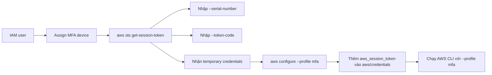

# 129. AWS CLI with MFA

## 🎯 Giới thiệu
Lecture này trả lời câu hỏi thi về cách dùng **Multi-Factor Authentication (MFA)** với **AWS CLI** hoặc **SDK**.

- Khi muốn dùng MFA với CLI, bạn phải tạo **temporary session**.
- API cần nhớ là **STS GetSession Token**.
- Kết quả trả về gồm:
  - **Access Key Id**
  - **Secret Access Key**
  - **Session Token**
- Đây là **temporary credentials**, có **Expiration**.

## 1. Luồng hoạt động của MFA với CLI
Quy trình trong transcript diễn ra như sau:



- Đầu tiên vào **IAM** và gán **virtual MFA device** cho user.
- Xác nhận MFA bằng 2 mã từ authenticator app như **Authy**.
- Sau khi **Assign MFA** thành công, bạn lấy được **ARN** của MFA device để dùng cho lệnh CLI.
- Chạy:

```bash
aws sts get-session-token --serial-number <MFA_ARN> --token-code <MFA_CODE>
```

- Lệnh này trả về bộ credentials tạm thời.
- Các credentials này dùng được cho các API call trong thời gian hiệu lực.

## 2. Cấu hình và sử dụng temporary credentials
Sau khi có temporary credentials:

- Chạy `aws configure --profile mfa`
- Nhập:
  - **AWS Access Key ID**
  - **AWS Secret Access Key**
  - **Default region name**
  - **output format**
- Mở file `aws/credentials`
- Thêm dòng:

```ini
aws_session_token = <SESSION_TOKEN>
```

- Từ đó, mọi API call dùng profile này sẽ dùng **temporary credentials**.
- Ví dụ:

```bash
aws s3 ls --profile mfa
```

- Lệnh này gọi API đến **Amazon S3** bằng profile `mfa`.

## 3. Điểm cần nhớ cho kỳ thi
- **STS GetSession Token** là API dùng để tạo temporary session token khi có MFA.
- MFA device được gán trong **IAM** cho user.
- Output của `get-session-token` gồm:
  - **Access Key**
  - **Secret Access Key**
  - **Session Token**
  - **Expiration**
- Muốn CLI dùng được credentials tạm thời thì phải thêm **aws_session_token** vào `aws/credentials`.
- Khi chạy CLI, nhớ dùng `--profile mfa`.

## 📊 Bảng tóm tắt
| Tiêu chí | Mô tả |
|----------|------|
| Mục tiêu | Dùng **MFA** với **AWS CLI** hoặc **SDK** |
| API chính | **STS GetSession Token** |
| Đầu vào cần có | **serial-number** và **token-code** |
| Kết quả | **Temporary credentials** gồm Access Key, Secret Access Key, Session Token |
| Cấu hình CLI | `aws configure --profile mfa` |
| File cần sửa | `aws/credentials` |
| Dòng cần thêm | `aws_session_token` |
| Ví dụ sử dụng | `aws s3 ls --profile mfa` |

## 💡 Mẹo ghi nhớ cho kỳ thi AWS
- Nhớ công thức: **MFA + CLI = STS GetSession Token**
- Nếu đề bài hỏi “làm sao dùng MFA để gọi CLI/SDK”, đáp án là:
  - tạo **temporary session**
  - dùng **STS GetSession Token**
- Nếu thấy `Session Token`, hãy nghĩ ngay đến:
  - **temporary credentials**
  - file `aws/credentials`
  - profile riêng như `mfa`
- Chỉ cần nhớ 3 giá trị quan trọng của output:
  - **Access Key**
  - **Secret Access Key**
  - **Session Token**

## ✅ Kết luận
Để dùng **MFA** với **AWS CLI**, bạn phải lấy **temporary credentials** bằng **STS GetSession Token**, rồi cấu hình chúng vào một profile riêng và thêm **aws_session_token** vào `aws/credentials`. Đây là điểm cốt lõi của bài và cũng là ý quan trọng nhất cho kỳ thi.
