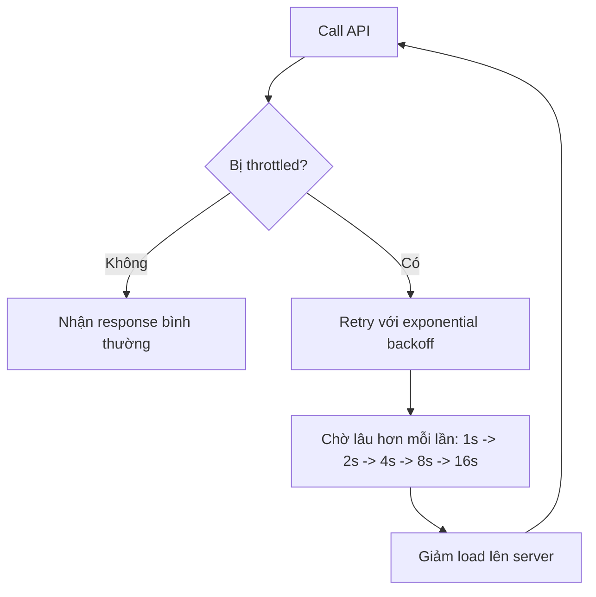

# 131. Exponential Backoff & Service Limit Increase

## 🎯 Giới thiệu
Bài này nói về **AWS limits / quotas**, cách xử lý khi bị **throttling exception**, và khi nào cần yêu cầu **service limit increase** hoặc **API throttling limit increase**.

## 1. AWS Limits và Quotas
AWS có 2 nhóm giới hạn chính:

- **API rate limits**: giới hạn số lần gọi API trong một khoảng thời gian.
- **Service quotas / service limits**: giới hạn số lượng tài nguyên có thể chạy.

Ví dụ trong transcript:
- `DescribeInstances` của **EC2** có giới hạn **100 calls/second**.
- `GetObject` của **S3** có giới hạn **5,500 GET/second per prefix**.
- Với **on-demand standard instances**, account có thể chạy tối đa **1,152 vCPUs**.

Khi vượt giới hạn:
- Có thể gặp lỗi **intermittent error** do bị **throttled**.
- Nếu tình trạng xảy ra thường xuyên vì tải cao, cần **request increase** từ AWS.

## 2. Exponential Backoff
**Exponential backoff** là chiến lược retry khi gặp **throttling exception**.

Cách hoạt động:
- Retry lần đầu sau **1 giây**
- Lần tiếp theo chờ **2 giây**
- Sau đó **4 giây**
- Rồi **8 giây**
- Rồi **16 giây**

Ý nghĩa:
- Càng retry nhiều thì thời gian chờ càng tăng.
- Giúp giảm tải đồng thời lên server.
- Khi nhiều client cùng retry, áp lực lên hệ thống sẽ giảm dần.

## 3. Khi nào dùng và ai chịu trách nhiệm
Theo transcript:

- Nếu thấy **throttling exception** do gọi API quá nhiều, câu trả lời thi thường là **exponential backoff**.
- Nếu dùng **AWS SDK**, cơ chế retry này đã được tích hợp sẵn.
- Nếu gọi **AWS API** trực tiếp, bạn phải tự implement **exponential backoff**.

### Mermaid flow

## 📊 Bảng tóm tắt
| Tiêu chí | Mô tả |
|----------|------|
| API rate limits | Giới hạn số lần gọi API, ví dụ `DescribeInstances` và `GetObject` |
| Service quotas | Giới hạn số tài nguyên, ví dụ tối đa `1,152 vCPUs` cho on-demand standard instances |
| Throttling | Xảy ra khi vượt giới hạn, gây lỗi gián đoạn |
| Exponential backoff | Retry với thời gian chờ tăng dần: 1s, 2s, 4s, 8s, 16s |
| SDK behavior | **AWS SDK** đã có retry mechanism sẵn |
| Direct API call | Nếu gọi API trực tiếp thì bạn phải tự implement backoff |
| Quota increase | Có thể request AWS tăng limit, kể cả qua **Service Quota API** |

## 💡 Mẹo ghi nhớ cho kỳ thi AWS
- Gặp từ khóa **throttling** hoặc **too many API calls** thì nghĩ ngay đến **exponential backoff**.
- **SDK** thường đã tự xử lý retry, còn gọi **API trực tiếp** thì bạn phải tự làm.
- Nếu vấn đề là **giới hạn tài nguyên** dùng quá mức, hãy nghĩ đến **service limit increase / service quota increase**.
- Nhớ phân biệt:
  - **API rate limits** = số lần gọi API
  - **Service quotas** = số lượng resource

## ✅ Kết luận
Bài học nhấn mạnh rằng khi vượt **AWS limits/quota**, bạn cần phân biệt giữa:
- lỗi do **API rate limits** để xử lý bằng **exponential backoff**,
- và giới hạn tài nguyên cần **request increase** từ AWS.

Đây là chủ đề rất hay xuất hiện trong câu hỏi thi AWS về **throttling**, **retry**, và **service quota**.
