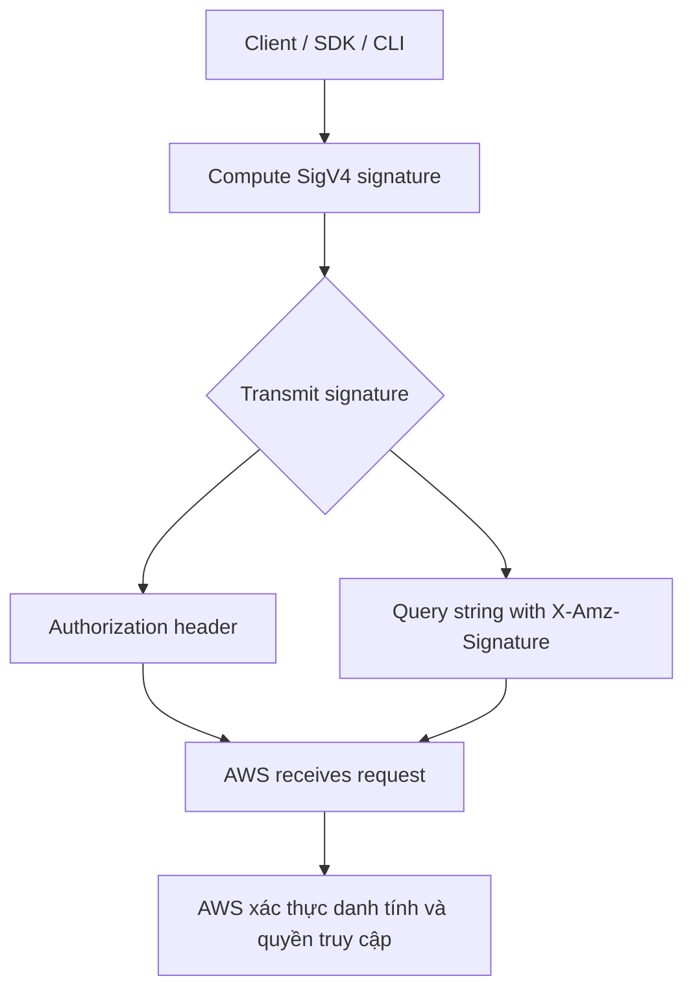

# 132. AWS Signature v4 Signing (Sigv4)

## 🎯 Giới thiệu
- Khi gọi AWS HTTP API, request thường cần được **sign** để AWS biết:
  - Bạn là ai
  - Bạn có được phép thực hiện request đó hay không
- Việc sign request dùng **AWS credentials**, օրինակ:
  - `access key`
  - `secret key`
- Trong thực tế, khi dùng **AWS CLI** hoặc **AWS SDK**, request sẽ được sign **tự động**.
- Có một số trường hợp với **Amazon S3** không cần sign, ví dụ khi đọc một **public object**.
- Với hầu hết API calls, bạn phải sign HTTP request bằng **SigV4**.

## 1. SigV4 trong AWS API request
- **SigV4** là cách dùng để ký request gửi đến AWS.
- Bài giảng nhấn mạnh:
  - Không cần học chi tiết cách tính signature
  - Cần nhớ **request AWS thường phải được sign**
- AWS dùng signature để xác định request đến từ ai và có hợp lệ hay không.

## 2. Hai cách truyền signature tới AWS
Sau khi signature đã được tính xong, có 2 cách truyền tới AWS:

- **Authorization header**
  - Signature được gửi trong HTTP header `Authorization`
  - Đây là cách mà **CLI** thường dùng mặc định
- **Query string**
  - Signature được nhúng trực tiếp trong URL
  - Key quan trọng là **`X-Amz-Signature`**

## 3. Ví dụ với Amazon S3 URL
- Trong ví dụ, một file `coffee.jpg` trong **Amazon S3** được mở trực tiếp trên browser.
- URL được browser tạo ra có chứa các thành phần của signature, gồm:
  - `security token`
  - `algorithm` cho biết là **SigV4**
  - `date`
  - `expires`
  - `AMZ credentials`
  - `AMZ signature`
- Điều này cho thấy browser có thể dùng URL đã được ký để truy cập file S3.

## 📊 Bảng tóm tắt
| Tiêu chí | Mô tả |
|----------|------|
| Mục đích | Sign AWS HTTP API request để AWS biết bạn là ai và bạn có quyền hay không |
| Cách ký | Dùng AWS credentials như `access key` và `secret key` |
| Công cụ hỗ trợ | **AWS CLI** và **AWS SDK** tự động sign request |
| Ngoại lệ | Một số request S3, যেমন đọc **public object**, không cần sign |
| Cách truyền signature | `Authorization` header hoặc query string |
| Query string key | `X-Amz-Signature` |
| Ý nghĩa thi AWS | Phải nhớ request AWS thường cần được sign bằng **SigV4** |

## 💡 Mẹo ghi nhớ cho kỳ thi AWS
- **SigV4 = signing cho AWS request**
- Nhớ 2 cách truyền signature:
  - **Header**: `Authorization`
  - **URL**: `X-Amz-Signature`
- **CLI/SDK tự động sign**
- Với **S3 public object**, có thể không cần sign
- Khi thấy URL S3 có nhiều tham số như `expires`, `credential`, `signature` thì đó là dấu hiệu của request đã được ký

## ✅ Kết luận
- **SigV4** là cơ chế dùng để ký request gửi vào AWS.
- AWS CLI và SDK làm việc này tự động.
- Signature có thể được truyền bằng **Authorization header** hoặc bằng **query string** với `X-Amz-Signature`.
- Trong ví dụ S3, URL được ký cho phép browser truy cập file theo cách đã xác thực.
