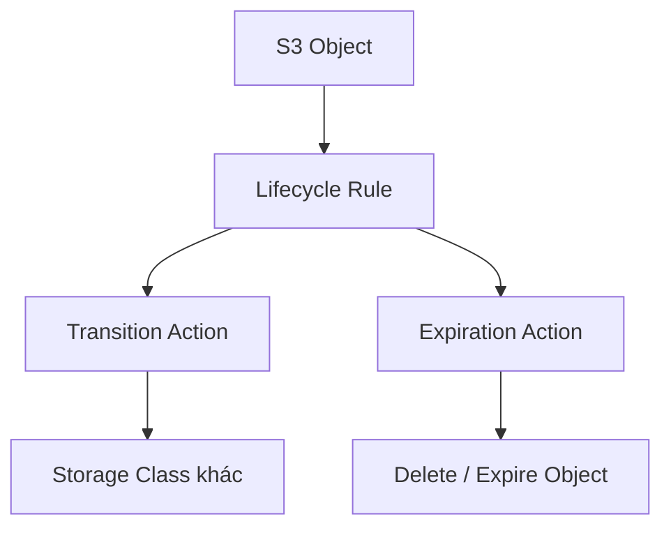

# 133. S3 Lifecycle Rules (with S3 Analytics)

## 🎯 Giới thiệu
- **S3 Lifecycle Rules** dùng để tự động hóa việc **transition** object giữa các **storage class** hoặc **expiration** object theo thời gian.
- Mục tiêu là tối ưu chi phí lưu trữ và phù hợp với kiểu truy cập dữ liệu:
  - Dữ liệu truy cập ít thì chuyển sang lớp rẻ hơn.
  - Dữ liệu cần archive thì chuyển sang các lớp **Glacier** hoặc **Deep Archive**.
- Có thể áp dụng lifecycle theo:
  - **Entire bucket**
  - Một **prefix** cụ thể trong bucket
  - **Object tags** cụ thể

## 1. Transition Actions và Expiration Actions
- **Transition action**:
  - Dùng để chuyển object sang storage class khác sau một khoảng thời gian.
  - Ví dụ:
    - Chuyển sang **Standard IA** sau 60 ngày
    - Chuyển sang **Glacier** để archive sau 6 tháng
- **Expiration action**:
  - Dùng để xóa hoặc hết hạn object sau một thời gian.
  - Ví dụ:
    - Xóa access log files sau **365 ngày**
    - Xóa **old versions** nếu bucket đã bật **versioning**
    - Xóa **incomplete multipart uploads** nếu đã tồn tại hơn 2 tuần

## 2. Các tình huống thiết kế thường gặp trong bài thi
- Nếu object **ít truy cập**:
  - Chuyển sang **Standard IA**
- Nếu object cần **archive**:
  - Chuyển sang các tier **Glacier** hoặc **Deep Archive**
- Ví dụ 1:
  - Ứng dụng trên **EC2** tạo thumbnail từ ảnh gốc upload lên **Amazon S3**
  - Thumbnail có thể tạo lại dễ dàng, chỉ cần giữ **60 ngày**
  - Ảnh gốc cần truy xuất ngay trong 60 ngày, sau đó có thể chờ tới 6 giờ
  - Cách làm:
    - Ảnh gốc: để **Standard**, sau 60 ngày chuyển sang **Glacier**
    - Thumbnail: dùng **prefix** để tách riêng, đưa vào **One-Zone IA**, rồi **expire/delete** sau 60 ngày
- Ví dụ 2:
  - Yêu cầu khôi phục object đã xóa **ngay lập tức trong 30 ngày**
  - Sau đó, trong tối đa **365 ngày**, object đã xóa phải có thể khôi phục trong **48 giờ**
  - Cách làm:
    - Bật **S3 versioning**
    - Object bị xóa sẽ được ẩn bởi **delete marker**
    - Tạo rule để chuyển **non-current versions** sang **Standard IA**
    - Sau đó tiếp tục chuyển non-current versions sang **Glacier Deep Archive** để archive

## 3. S3 Analytics
- **Amazon S3 Analytics** giúp xác định **số ngày tối ưu** để transition object giữa các storage class.
- Theo transcript:
  - Chỉ đưa ra recommendation cho **Standard** và **Standard IA**
  - **Không áp dụng** cho **One-Zone IA** hoặc **Glacier**
- Kết quả:
  - Tạo ra một **CSV report**
  - Report chứa **recommendations** và **statistics**
  - Được cập nhật **daily**
  - Mất khoảng **24 đến 48 giờ** mới bắt đầu có dữ liệu phân tích
- Đây là bước đầu tốt để:
  - Xây dựng lifecycle rules hợp lý
  - Hoặc cải thiện lifecycle rules hiện có

## 📊 Bảng tóm tắt
| Tiêu chí | Mô tả |
|----------|------|
| Mục đích | Tự động transition hoặc expire S3 object |
| Transition | Chuyển object sang storage class khác sau một thời gian |
| Expiration | Xóa object, old versions, hoặc incomplete multipart uploads |
| Phạm vi áp dụng | Toàn bucket, theo prefix, hoặc theo object tags |
| Dữ liệu ít truy cập | Thường chuyển sang **Standard IA** |
| Dữ liệu archive | Chuyển sang **Glacier** hoặc **Deep Archive** |
| S3 versioning | Hỗ trợ recovery object đã xóa thông qua **delete marker** |
| S3 Analytics | Đề xuất thời điểm transition tối ưu cho **Standard** và **Standard IA** |
| Output của Analytics | **CSV report** cập nhật hằng ngày |
| Độ trễ dữ liệu | Khoảng **24 to 48 hours** để bắt đầu thấy phân tích |

## 💡 Mẹo ghi nhớ cho kỳ thi AWS
- Nhớ 2 nhóm hành động chính của lifecycle:
  - **Transition** = đổi storage class
  - **Expiration** = xóa/hết hạn
- Khi đề bài nói đến:
  - **infrequently accessed** → nghĩ tới **Standard IA**
  - **archive** → nghĩ tới **Glacier / Deep Archive**
- Nếu cần phân biệt nhiều loại object trong cùng bucket:
  - Dùng **prefix** hoặc **object tags**
- Nếu yêu cầu khôi phục object đã xóa:
  - Nghĩ tới **S3 versioning** và **non-current versions**
- Nếu hỏi cách chọn thời điểm transition tối ưu:
  - Nghĩ tới **S3 Analytics**

## ✅ Kết luận
- **S3 Lifecycle Rules** giúp tự động quản lý vòng đời object trong S3 bằng **transition** và **expiration**.
- **S3 Analytics** hỗ trợ tìm thời điểm transition hợp lý, nhưng chỉ cho **Standard** và **Standard IA**.
- Đây là chủ đề rất hay gặp trong câu hỏi tình huống về **chi phí lưu trữ**, **archive**, và **quản lý version** trên **Amazon S3**.
