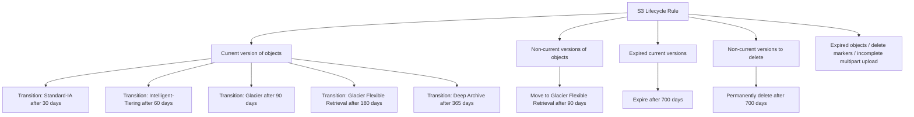

# 134. S3 Lifecycle Rules - Hands On

## 🎯 Giới thiệu
S3 Lifecycle Rules được dùng để tự động hóa việc quản lý object trong bucket theo thời gian. Trong bài hands-on này, rule được tạo dưới `Management`, đặt tên `demo rule`, áp dụng cho tất cả objects trong bucket.

## 1. Các loại hành động của Lifecycle Rule
Transcript nêu ra **5 nhóm hành động** chính:

- Chuyển **current versions** của object giữa các `storage classes`
- Chuyển **non-current versions** của object giữa các `storage classes`
- Làm hết hạn `expired current versions` của object
- Xóa vĩnh viễn `non-current versions` của object
- Xóa `expired objects`, `delete markers`, hoặc `incomplete multi-part upload`

### Mermaid flow

## 2. Current versions và Non-current versions
### Current versions
- Là version mới nhất của object
- Là version người dùng nhìn thấy
- Có thể chuyển qua nhiều `storage classes` theo thời gian
- Ví dụ trong transcript:
  - `Standard-IA` sau 30 ngày
  - `Intelligent-Tiering` sau 60 ngày
  - `Glacier` sau 90 ngày
  - `Glacier Flexible Retrieval` sau 180 ngày
  - `Deep Archive` sau 365 ngày

### Non-current versions
- Là version bị ghi đè bởi version mới hơn
- Có thể chuyển sang `Glacier Flexible Retrieval`
- Transcript ví dụ:
  - Sau 90 ngày thì chuyển để không cần dùng cho retrieval nữa
- Cũng có thể được cấu hình để xóa vĩnh viễn sau 700 ngày

## 3. Expiration và tự động hóa
- Có thể cấu hình để:
  - `expire current versions` sau 700 ngày
  - `permanently delete non-current versions` sau 700 ngày
- Lifecycle rule chạy **ngầm ở background**
- Mục tiêu là tự động hóa việc di chuyển object giữa các `storage classes`

## 📊 Bảng tóm tắt
| Tiêu chí | Mô tả |
|----------|------|
| Mục đích | Tự động hóa quản lý S3 objects theo thời gian |
| Phạm vi áp dụng | Tất cả objects trong bucket |
| Current version | Version mới nhất, hiển thị cho người dùng |
| Non-current version | Version đã bị ghi đè bởi version mới |
| Hành động chính | Transition, expiration, permanent delete, xóa delete markers, xóa incomplete multipart upload |
| Ví dụ transition | `Standard-IA`, `Intelligent-Tiering`, `Glacier`, `Glacier Flexible Retrieval`, `Deep Archive` |
| Cơ chế hoạt động | Rule chạy trong background |

## 💡 Mẹo ghi nhớ cho kỳ thi AWS
- `Current version` = version mới nhất
- `Non-current version` = version cũ bị ghi đè
- Nhớ 5 nhóm hành động của Lifecycle Rule:
  - chuyển current versions
  - chuyển non-current versions
  - expire current versions
  - delete non-current versions
  - xóa expired objects / delete markers / incomplete multipart upload
- Khi thấy bài nói về tự động hóa lưu trữ theo thời gian trong S3, hãy nghĩ ngay đến `Lifecycle Rules`
- Các mốc thời gian trong transcript để nhớ nhanh:
  - 30 ngày
  - 60 ngày
  - 90 ngày
  - 180 ngày
  - 365 ngày
  - 700 ngày

## ✅ Kết luận
S3 Lifecycle Rules cho phép tự động chuyển object giữa các `storage classes` và tự động xóa object theo thời gian. Trong bài này, trọng tâm là phân biệt `current versions` và `non-current versions`, cùng với các hành động transition và expiration mà rule có thể thực hiện trong background.
