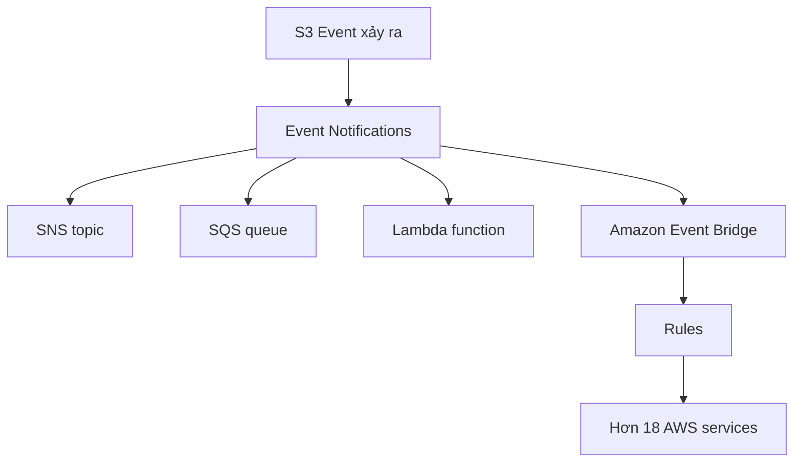

# 135. S3 Event Notifications

## 🎯 Giới thiệu
Amazon S3 Event Notifications cho phép bạn **phản ứng tự động** khi có sự kiện xảy ra trong S3, như:
- Object được **created**
- Object bị **removed**
- Object được **restored**
- Có **replication** diễn ra

Bạn có thể **filter event** theo điều kiện, ví dụ chỉ xét các object kết thúc bằng `JPEG`.

## 1. Các use case và event types
- Dùng khi muốn xử lý tự động dựa trên thay đổi trong S3.
- Ví dụ điển hình: **generate thumbnails** cho toàn bộ ảnh upload lên S3.
- S3 có thể tạo **nhiều event notifications** khác nhau theo nhu cầu.

## 2. Destinations và luồng xử lý
S3 Event Notifications có thể gửi đến các đích:
- `SNS topic`
- `SQS queue`
- `Lambda function`
- `Amazon Event Bridge`

Thông tin quan trọng:
- Event thường được deliver trong **vài giây**
- Đôi khi có thể mất **1 phút hoặc lâu hơn**
- Với `Event Bridge`, bạn có thêm:
  - **advanced filtering** hơn
  - filter theo `metadata`, `object size`, `name`
  - gửi đến **multiple destinations**
  - các tính năng như **archive events**, **replay events**
  - **more reliable delivery**

## 3. IAM permissions và resource policies
Để Event Notifications hoạt động, cần có **IAM permissions**, nhưng không dùng IAM role cho S3 trong trường hợp này.

Thay vào đó, dùng **resource access policies** gắn lên destination:
- Với `SNS`:
  - dùng `SNS resource access policy`
  - cho phép S3 gửi message vào SNS topic
- Với `SQS`:
  - dùng `SQS resource access policy`
  - cho phép S3 gửi data vào SQS queue
- Với `Lambda`:
  - dùng `Lambda resource policy`
  - cho phép S3 invoke Lambda function

Các policy này hoạt động tương tự như **S3 bucket policy** ở mức ý tưởng.

## 📊 Bảng tóm tắt
| Tiêu chí | Mô tả |
|----------|------|
| Mục đích | Tự động phản ứng với event trong Amazon S3 |
| Event phổ biến | Object created, removed, restored, replication |
| Filtering | Có thể filter theo điều kiện, ví dụ suffix `JPEG` |
| Destinations | `SNS`, `SQS`, `Lambda`, `Amazon Event Bridge` |
| IAM/POLICY | Dùng resource access policies trên destination, không dùng IAM role cho S3 |
| Độ trễ | Thường vài giây, đôi khi 1 phút hoặc lâu hơn |
| Event Bridge | Cho filtering nâng cao, multiple destinations, archive, replay, delivery tin cậy hơn |

## 💡 Mẹo ghi nhớ cho kỳ thi AWS
- Nhớ 4 đích chính của S3 Event Notifications: `SNS`, `SQS`, `Lambda`, `Event Bridge`.
- `S3 -> SNS/SQS/Lambda` cần **resource policy** trên destination.
- Nếu thấy yêu cầu **lọc nâng cao** hoặc **nhiều đích cùng lúc**, nghĩ đến `Amazon Event Bridge`.
- Khi đề bài nói “tự động xử lý ảnh upload lên S3”, đây là pattern rất điển hình của **S3 Event Notifications**.
- Đừng nhầm với IAM role cho S3 trong case này: transcript nhấn mạnh dùng **resource access policies**.

## ✅ Kết luận
S3 Event Notifications là cơ chế giúp S3 **kích hoạt phản ứng tự động** khi object hoặc replication event xảy ra. Các đích chính là `SNS`, `SQS`, `Lambda`, và `Amazon Event Bridge`, với quyền truy cập được điều khiển bằng **resource policies** trên từng dịch vụ đích.
