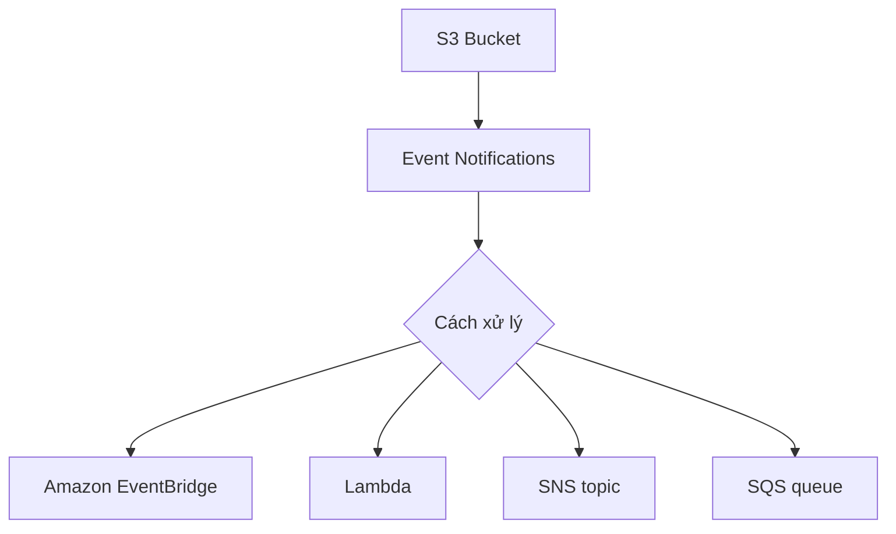

# 136. S3 Event Notifications - Hands On

## 🎯 Giới thiệu
Bài này demo cách cấu hình **S3 Event Notifications** để S3 phát sinh event khi có thay đổi trong bucket.

Mục tiêu chính:
- Tạo **bucket S3**
- Cấu hình **event notification**
- Gửi event đến **SQS**
- Upload file để kiểm tra event được tạo ra

---

## 1. Cấu hình S3 Event Notifications
Trong bucket S3, vào **Properties** rồi kéo xuống phần **Event notifications**.

Có 2 cách xử lý event:
- Bật **Amazon EventBridge integration** để gửi toàn bộ event từ S3 bucket sang EventBridge
- Tạo **event notification** trực tiếp để gửi sang một destination cụ thể

Trong demo này chọn cách đơn giản hơn:
- Tạo một notification tên `DemoEventNotification`
- Chọn loại event là **all object create events**
- Có thể lọc thêm bằng **prefix** và **suffix**, nhưng trong bài không dùng

Ngoài object create, S3 còn có nhiều loại event khác như:
- Object removals
- Object restores

---

## 2. Gửi event đến SQS
Trong phần destination, bài học chọn **SQS queue**.

Các bước thực hiện:
- Tạo một queue SQS tên `DemoS3Notification`
- Quay lại cấu hình notification trong S3
- Chọn queue vừa tạo
- Khi lưu, xuất hiện lỗi vì **SQS queue chưa cho phép S3 publish message**

Để sửa:
- Vào **Access policy** của queue
- Dùng **Policy Generator**
- Tạo policy kiểu **SQS queue policy**
- Chọn action **SendMessage**
- Nhập **ARN** của queue
- Generate policy và lưu lại

Sau đó:
- Quay lại S3
- Save lại cấu hình notification
- Lần này lưu thành công

Khi kiểm tra queue:
- SQS nhận được một message test
- Message này dùng để kiểm tra kết nối giữa **S3** và **SQS**

---

## 3. Kiểm tra event bằng upload file
Để test hoạt động của notification:
- Upload file ảnh `coffee.jpeg` vào bucket
- File được tạo thành công trong bucket
- Sau đó poll messages từ SQS

Kết quả quan sát được:
- Có một message mới trong queue
- `eventName` là **ObjectCreatedPut**
- `key` của object là **coffee.jpeg**

Điều này xác nhận rằng:
- Khi object được tạo trong S3
- Một event được sinh ra
- Event đó được gửi sang **SQS queue**

Nếu muốn tự động hóa xử lý tiếp, ví dụ tạo **thumbnail**, thì message trong SQS có thể được dùng làm đầu vào cho bước xử lý kế tiếp.

---

## 📊 Bảng tóm tắt
| Tiêu chí | Mô tả |
|----------|------|
| Mục tiêu | Demo S3 Event Notifications |
| Destination | Lambda, SNS topic, SQS queue, hoặc Amazon EventBridge |
| Cách làm trong bài | Tạo notification trực tiếp và gửi đến SQS |
| Vấn đề gặp phải | SQS chưa cho phép S3 gửi message |
| Cách khắc phục | Cập nhật access policy cho SQS queue |
| Kiểm tra | Upload `coffee.jpeg` và poll message từ SQS |
| Kết quả | Nhận event `ObjectCreatedPut` với key `coffee.jpeg` |

---

## 💡 Mẹo ghi nhớ cho kỳ thi AWS
- **S3 Event Notifications** có thể gửi đến:
  - **Lambda**
  - **SNS**
  - **SQS**
- Nếu dùng **SQS**, phải chắc chắn **access policy** cho phép S3 gửi message
- **EventBridge** là lựa chọn khác để nhận toàn bộ event từ S3
- Khi upload object, event có thể hiển thị như **ObjectCreatedPut**
- Đây là pattern quen thuộc để kích hoạt các bước xử lý tự động sau khi file được tạo

---

## ✅ Kết luận
S3 Event Notifications cho phép S3 phát sinh event khi có thay đổi trong bucket và gửi event đó sang **Lambda**, **SNS**, **SQS**, hoặc **Amazon EventBridge**.

Trong hands-on này:
- Tạo notification cho event create object
- Cấu hình SQS làm destination
- Cập nhật policy để S3 có quyền gửi message
- Upload file `coffee.jpeg` và xác nhận event được ghi nhận trong SQS
