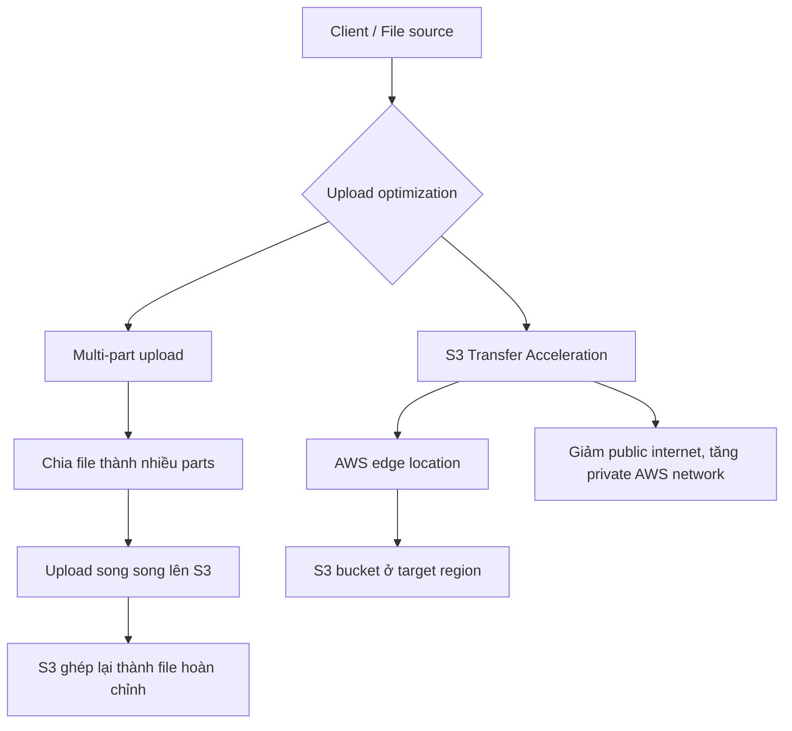
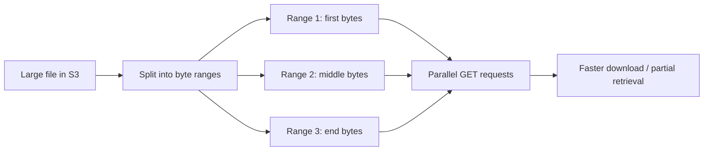

# 137. S3 Performance

## 🎯 Giới thiệu
- Amazon S3 mặc định có khả năng **auto scale** lên số lượng request rất lớn.
- **First byte** từ S3 thường ở mức khoảng **100 - 200 milliseconds**.
- Hiệu năng S3 được tính theo **per second per prefix**.
- S3 không giới hạn số lượng **prefixes** trong một bucket.

## 1. Baseline performance của S3
- Mỗi **prefix** hỗ trợ:
  - **3,500 PUT/COPY/POST/DELETE requests per second**
  - **5,500 GET/HEAD requests per second**
- **Prefix** là phần nằm giữa **bucket** và **file/object**.
- Ví dụ:
  - `folder1/sub1/file` có prefix là `folder1/sub1`
  - `folder1/sub2/file` có prefix là `folder1/sub2`
- Nếu phân tán reads đều qua nhiều prefix, tổng throughput sẽ tăng tương ứng.
- Ví dụ trong bài giảng: 4 prefixes có thể đạt **22,000 GET/HEAD requests per second** nếu phân phối đều.

## 2. Tối ưu upload: Multi-part upload và S3 Transfer Acceleration
- **Multi-part upload**:
  - Khuyến nghị dùng cho file **trên 100 MB**
  - **Bắt buộc** với file **trên 5 GB**
  - Chia file lớn thành nhiều parts nhỏ và upload **song song**
  - Sau khi tất cả parts được upload xong, S3 sẽ **ghép lại** thành file hoàn chỉnh
- **S3 Transfer Acceleration**:
  - Dùng cho cả **upload** và **download**
  - File được chuyển tới **AWS edge location** trước, rồi edge location forward dữ liệu đến S3 bucket ở region đích
  - Mục tiêu là giảm thời gian đi qua **public internet** và tăng phần truyền qua **private AWS network**
  - **Compatible with multi-part upload**

## 3. Tối ưu download: S3 Byte Range Fetches
- **S3 Byte Range Fetches** dùng để **parallelize GETs** bằng cách request các **byte ranges** cụ thể của file.
- Lợi ích:
  - Tăng tốc download
  - Tăng resilience khi một byte range bị lỗi, vì có thể retry một range nhỏ hơn
  - Có thể chỉ lấy **một phần** của file thay vì tải toàn bộ
- Ví dụ trong transcript:
  - Request phần đầu file
  - Request phần giữa file
  - Request phần cuối file
  - Hoặc chỉ request **50 bytes đầu** nếu đó là header cần thiết

## 📊 Bảng tóm tắt
| Tiêu chí | Mô tả |
|----------|------|
| Baseline performance | S3 auto scale rất lớn, first byte khoảng 100 - 200 ms |
| PUT/COPY/POST/DELETE | 3,500 requests/second/prefix |
| GET/HEAD | 5,500 requests/second/prefix |
| Prefix | Phần nằm giữa bucket và file/object |
| Multi-part upload | Khuyến nghị >100 MB, bắt buộc >5 GB, upload song song |
| S3 Transfer Acceleration | Dùng edge location để tăng tốc upload/download |
| Byte Range Fetches | Tải theo byte ranges để parallel GETs và lấy một phần file |

## 💡 Mẹo ghi nhớ cho kỳ thi AWS
- Nhớ cặp số quan trọng của S3:
  - **3,500** cho `PUT/COPY/POST/DELETE`
  - **5,500** cho `GET/HEAD`
  - Đều là **per prefix**
- Muốn tăng throughput, hãy **phân tán theo nhiều prefix** thay vì dồn vào một prefix.
- File lớn:
  - **>100 MB**: nên dùng **multi-part upload**
  - **>5 GB**: phải dùng **multi-part upload**
- Muốn tăng tốc truyền file qua khoảng cách địa lý:
  - dùng **S3 Transfer Acceleration**
- Muốn download nhanh hoặc chỉ lấy một phần file:
  - dùng **S3 Byte Range Fetches**

## ✅ Kết luận
- S3 mặc định đã có hiệu năng rất cao, nhưng để tối ưu thêm cần nhớ 3 kỹ thuật chính:
  - **Multi-part upload** cho upload file lớn
  - **S3 Transfer Acceleration** cho tăng tốc truyền file
  - **S3 Byte Range Fetches** cho download song song hoặc lấy một phần file
- Trọng tâm cần nhớ khi ôn thi là các **limits per prefix** và cách **phân tán workload** để tăng throughput.
