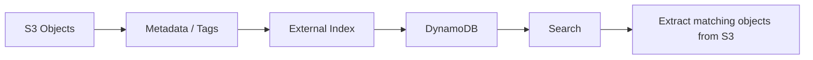

# 138. S3 Object Tags & Metadata

## 🎯 Giới thiệu
Bài này nói về 2 khái niệm trong S3: **user-defined object metadata** và **S3 object tags**. Cả hai đều là các cặp **key-value** gắn với object, nhưng cách dùng và vai trò khác nhau trong AWS exam.

## 1. **Metadata** trong S3
- Khi upload object, bạn có thể gắn **metadata** cho object.
- **Metadata** là các cặp **key-value** đi kèm với object.
- Nếu là **user-defined metadata**, key phải bắt đầu bằng `x-amz-meta-`.
- Có cả metadata do **AWS** tạo ra, ví dụ:
  - `Content-Length`
  - `Content-Type`
- Ví dụ:
  - `x-amz-meta-origin: paris` là metadata do bạn tự định nghĩa.
- Metadata được lấy ra cùng lúc khi retrieve object, và nó mô tả thông tin của chính object đó.

## 2. **S3 Object Tags**
- **S3 object tags** cũng là các cặp **key-value** gắn cho object trong Amazon S3.
- Tags phổ biến hơn vì chúng giống kiểu tag bạn thường thấy trong AWS.
- Tags có thể dùng cho:
  - **Fine-grained permissions**: cấp quyền chi tiết theo từng object có tag cụ thể.
  - **Analytics**: ví dụ với **S3 Analytics**, có thể group kết quả theo tags.
- Ví dụ tag:
  - `Project: Blue`
  - `PHI: True`

## 3. **Điểm quan trọng cho exam**
- **Metadata** và **tags** trong S3 **không searchable**.
- Bạn **không thể filter theo metadata**.
- Bạn **không thể filter theo tags**.
- Nếu muốn search object trong S3 bucket, cần:
  - xây dựng **external index** ở một database, ví dụ **DynamoDB**
  - lưu metadata/tags vào index đó
  - search trên **DynamoDB**
  - sau đó lấy ra các object tương ứng từ **Amazon S3**

## 📊 Bảng tóm tắt
| Tiêu chí | Mô tả |
|----------|------|
| Metadata | Cặp key-value gắn với object; user-defined metadata phải bắt đầu bằng `x-amz-meta-` |
| AWS metadata | Ví dụ `Content-Length`, `Content-Type` |
| Tags | Cặp key-value cho object; hay dùng cho permissions và analytics |
| Search | Không thể search/filter trực tiếp theo metadata hoặc tags trong S3 |
| Giải pháp search | Dùng external index như **DynamoDB** để tìm kiếm |

## 💡 Mẹo ghi nhớ cho kỳ thi AWS
- Nhớ rằng **S3 metadata** và **S3 object tags** đều **không searchable**.
- Nếu đề bài hỏi về tìm kiếm object theo tag/metadata, đáp án đúng thường là: **build an external index** như **DynamoDB**.
- `x-amz-meta-` là dấu hiệu nhận biết **user-defined metadata**.
- **Tags** thường gắn với use case về **permissions** và **analytics**.

## ✅ Kết luận
**Metadata** và **tags** đều là thông tin dạng key-value gắn với S3 object, nhưng chúng **không dùng để search trực tiếp trong S3**. Nếu cần truy vấn object theo thông tin này, bạn phải lưu dữ liệu vào một **external index** như **DynamoDB** rồi search ở đó.
