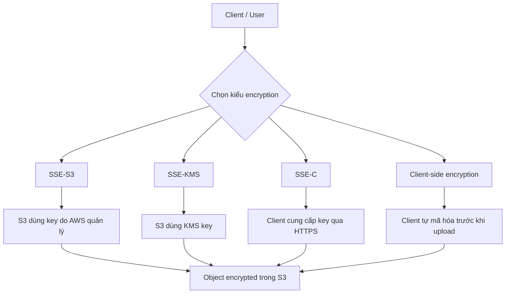
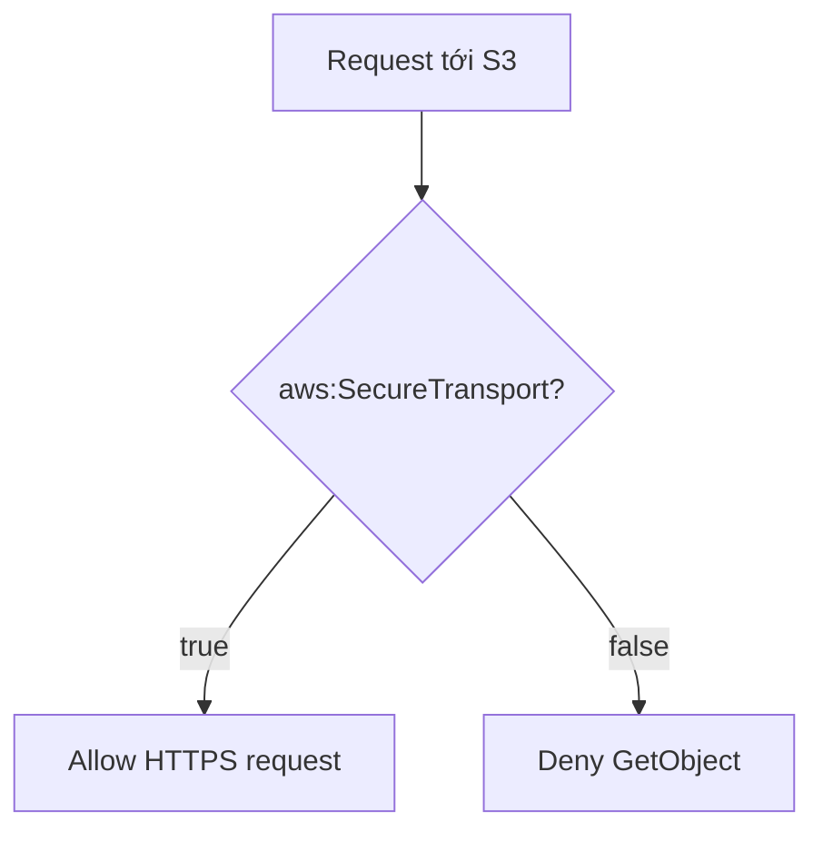

# 139. S3 Encryption

## 🎯 Giới thiệu
Amazon S3 hỗ trợ **object encryption** theo 4 cách chính:

- **SSE-S3**: server-side encryption với **Amazon S3-managed keys**
- **SSE-KMS**: server-side encryption với **KMS key**
- **SSE-C**: server-side encryption với **customer-provided key**
- **Client-side encryption**: mã hóa ở phía client trước khi upload lên S3

Điểm quan trọng cho kỳ thi AWS là phân biệt rõ:
- **Ai quản lý key**
- **Mã hóa diễn ra ở đâu**
- **Có cần HTTPS hay không**
- **Có liên quan tới KMS / CloudTrail / quota không**

## 1. Các kiểu S3 Object Encryption

### 🔐 SSE-S3
- Key do **AWS quản lý, sở hữu và xử lý**
- Bạn **không có quyền truy cập** vào key
- Dùng thuật toán **AES-256**
- Cần header:
  - `"x-amz-server-side-encryption": "AES256"`
- **Enabled by default** cho **new buckets** và **new objects**

### 🔐 SSE-KMS
- Mã hóa server-side nhưng key được quản lý bằng **AWS KMS**
- Bạn có **user control** với key
- Có thể theo dõi việc sử dụng key qua **CloudTrail**
- Cần header:
  - `"x-amz-server-side-encryption": "aws:kms"`
- Khi đọc object, cần:
  - quyền truy cập object
  - và quyền với **KMS key** đã dùng để mã hóa
- Sử dụng KMS API như:
  - `GenerateDataKey`
  - `Decrypt`
- Mỗi API call tính vào **KMS quotas**
- Nếu bucket có throughput rất cao và tất cả đều dùng KMS, có thể gặp **throttle/limit** theo quota

### 🔐 SSE-C
- Key do **client quản lý bên ngoài AWS**
- Vẫn là **server-side encryption** vì key được gửi tới AWS
- Amazon S3 **không lưu key** sau khi dùng, key sẽ bị **discarded**
- Bắt buộc:
  - dùng **HTTPS**
  - gửi key qua **HTTP headers** cho mỗi request
- Khi đọc object, phải cung cấp lại **key đã dùng để mã hóa**

### 🔐 Client-side encryption
- Client tự mã hóa dữ liệu **trước khi gửi lên S3**
- Giải mã cũng diễn ra **ở client**, bên ngoài Amazon S3
- Client **toàn quyền quản lý key** và encryption cycle
- Có thể dùng **Client-Side Encryption Library**

### Mermaid: Luồng tổng quan

## 2. Encryption in Transit
Encryption in transit còn gọi là **encryption in flight**, **SSL/TLS**.

S3 có 2 endpoint:
- **HTTP endpoint**: không mã hóa
- **HTTPS endpoint**: có mã hóa khi truyền

### Ý chính
- Dùng **HTTPS** được khuyến nghị để truyền dữ liệu an toàn
- Nếu dùng **SSE-C**, bạn **phải** dùng **HTTPS**
- Trong thực tế, nhiều client sẽ dùng HTTPS mặc định

### Ép buộc dùng HTTPS bằng bucket policy
Có thể gắn **bucket policy** để **deny** mọi `GetObject` nếu:

- `"aws:SecureTransport": "false"`

Ý nghĩa:
- `true` khi dùng **HTTPS**
- `false` khi không dùng kết nối mã hóa
- User dùng **HTTP** sẽ bị chặn
- User dùng **HTTPS** có thể được cho phép

### Mermaid: Flow policy cho HTTPS

## 3. Điểm cần nhớ theo từng cơ chế
- **SSE-S3**:
  - key do AWS quản lý
  - **AES-256**
  - default cho bucket/object mới
- **SSE-KMS**:
  - key do **KMS** quản lý
  - có **CloudTrail**
  - có thể bị ảnh hưởng bởi **KMS API quotas**
- **SSE-C**:
  - key do client quản lý
  - phải dùng **HTTPS**
  - key phải gửi kèm trong **HTTP headers**
- **Client-side encryption**:
  - client tự mã hóa trước khi upload
  - giải mã cũng ở client

## 📊 Bảng tóm tắt
| Tiêu chí | Mô tả |
|----------|------|
| **SSE-S3** | AWS quản lý key, dùng **AES-256**, enabled by default, header `AES256` |
| **SSE-KMS** | Dùng **KMS key**, có **CloudTrail**, cần quyền với object và key, có thể bị ảnh hưởng bởi KMS quotas |
| **SSE-C** | Client quản lý key, S3 không lưu key, bắt buộc **HTTPS**, key gửi qua headers |
| **Client-side encryption** | Client tự mã hóa trước khi upload và tự giải mã sau khi tải về |
| **Encryption in transit** | Dùng **HTTPS / SSL / TLS** để bảo vệ dữ liệu khi truyền |
| **Bucket policy enforcement** | Có thể deny `GetObject` nếu `aws:SecureTransport` là `false` |

## 💡 Mẹo ghi nhớ cho kỳ thi AWS
- Nhớ chuỗi phân biệt:
  - **SSE-S3 = AWS-owned key**
  - **SSE-KMS = KMS key + CloudTrail + quotas**
  - **SSE-C = Customer-provided key + HTTPS bắt buộc**
  - **Client-side = client tự mã hóa**
- Nếu thấy câu hỏi nói về:
  - **kiểm soát key** -> nghĩ tới **SSE-KMS**
  - **không lưu key ở AWS** -> nghĩ tới **SSE-C**
  - **mặc định cho bucket/object mới** -> **SSE-S3**
- Nếu cần chặn HTTP:
  - nhớ `aws:SecureTransport = false`
- Nếu đề bài nói về throughput cao và dùng KMS:
  - nhớ khả năng chạm **KMS API quota**

## ✅ Kết luận
S3 encryption trong transcript tập trung vào 4 cơ chế: **SSE-S3, SSE-KMS, SSE-C, client-side encryption** và thêm phần **encryption in transit** bằng **HTTPS/TLS**. Khi ôn thi, cần nhớ rõ **ai quản lý key**, **mã hóa ở đâu**, **header cần dùng**, và **bucket policy** để ép buộc truyền dữ liệu an toàn.
