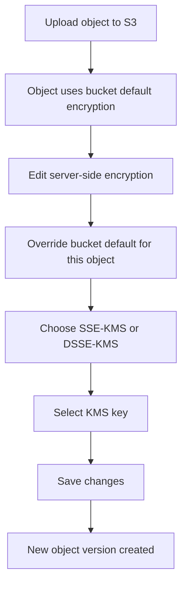

# 141. S3 Encryption - Hands On

## 🎯 Giới thiệu
Bài học này demo cách cấu hình và kiểm tra **S3 encryption** trực tiếp trên console:

- Tạo S3 bucket với **bucket versioning** và **default encryption**
- Upload object để xác nhận object được mã hóa
- Thay đổi encryption của object để thấy **new version** được tạo ra
- So sánh các lựa chọn trong console: **SSE-S3**, **SSE-KMS**, **DSSE-KMS**
- Nhắc lại rằng **SSE-C** chỉ làm được từ **CLI**, còn **client-side encryption** thì do phía client tự xử lý

## 1. Thiết lập bucket và default encryption
- Tạo bucket `demo-encryption-stephane-v2`
- Bật **bucket versioning**
- Chọn **default encryption** cho bucket
- Trong bài này, dùng **SSE-S3** làm default encryption ban đầu

### Kết quả sau khi upload object
- Upload file `coffee.jpg`
- Khi mở chi tiết object, phần **server side encryption** cho thấy file được mã hóa bằng:
  - **SSE-S3**
  - tức là dùng **Amazon S3 managed keys**

## 2. Thay đổi encryption của object và vai trò của versioning
Khi chỉnh sửa encryption của một object:
- Có thể override bucket default encryption cho riêng object đó
- Có thể chọn **SSE-KMS** hoặc **DSSE-KMS**
- Bài học chọn **SSE-KMS** vì đơn giản hơn và không tốn thêm tiền như tạo custom KMS key

### Chọn KMS key
- Có thể nhập **KMS key ARN**
- Hoặc chọn từ danh sách KMS keys của bạn
- Trong demo, dùng key mặc định:
  - **AWS/S3 key**
  - là **default KMS key for the S3 service**
- Nếu tạo **own KMS key**, sẽ phát sinh chi phí hàng tháng

### Vì sao cần versioning?
- Khi đổi server-side encryption của object, S3 tạo ra **new version**
- Do đó bật **versioning** giúp nhìn thấy rõ object có thêm phiên bản mới

### Mermaid flow

## 3. Các tùy chọn encryption trong console
Khi upload file mới như `beach.jpg`, trong **Properties** bạn có thể:

- Dùng **default encryption**
- Hoặc override bằng:
  - **SSE-S3**
  - **SSE-KMS**
  - **DSSE-KMS**

### Default encryption settings
Khi edit **default encryption** của bucket:
- Có thể chọn:
  - **SSE-S3**
  - **SSE-KMS**
  - **DSSE-KMS**
- Với **SSE-KMS**, có thêm tùy chọn **bucket key**
  - Mục đích: giảm chi phí bằng cách giảm số lượng **API calls to AWS KMS**
  - Tùy chọn này được bật mặc định

### Lưu ý quan trọng
- **SSE-C** không xuất hiện trong console
  - Vì **SSE-C** chỉ dùng được qua **CLI**
- **Client-side encryption** là mã hóa ở phía client trước khi upload lên AWS
  - AWS không cần biết dữ liệu đó đã được mã hóa ở client

## 📊 Bảng tóm tắt
| Tiêu chí | Mô tả |
|----------|------|
| Default encryption | Bucket phải chọn một kiểu mã hóa mặc định |
| Demo ban đầu | Dùng **SSE-S3** cho bucket |
| Kiểm tra encryption | Upload `coffee.jpg` và xem object được mã hóa bằng **SSE-S3** |
| Đổi encryption object | Có thể đổi sang **SSE-KMS** hoặc **DSSE-KMS** |
| Versioning | Khi sửa encryption, S3 tạo **new version** của object |
| KMS key | Có thể dùng **AWS/S3 default KMS key** hoặc own KMS key |
| Chi phí | Own KMS key có thể tốn tiền hàng tháng; default key của S3 không tính phí trong demo |
| Bucket key | Chỉ liên quan khi dùng **SSE-KMS**, giúp giảm số API calls tới KMS |
| SSE-C | Không có trong console, chỉ làm qua **CLI** |
| Client-side encryption | Mã hóa ở client trước khi upload, rồi giải mã ở client khi cần |

## 💡 Mẹo ghi nhớ cho kỳ thi AWS
- **SSE-S3** = S3 quản lý key
- **SSE-KMS** = dùng **KMS key**, có thể chọn **bucket key** để giảm chi phí API call
- **DSSE-KMS** = hai lớp mã hóa trên KMS
- **SSE-C** = chỉ làm được qua **CLI**, không có trong console
- Đổi encryption của object có thể tạo **new version**, nên nhớ bật **versioning**
- Nếu dùng **AWS/S3 default KMS key**, đó là key mặc định của service S3
- **Custom KMS key** có thể phát sinh chi phí

## ✅ Kết luận
Trong bài này, bạn thấy cách:
- Tạo bucket với **default encryption**
- Upload object để kiểm tra **SSE-S3**
- Chuyển sang **SSE-KMS** hoặc **DSSE-KMS**
- Hiểu rằng chỉnh encryption có thể tạo **new version**
- Nhớ được giới hạn của console với **SSE-C** và cách **client-side encryption** hoạt động
