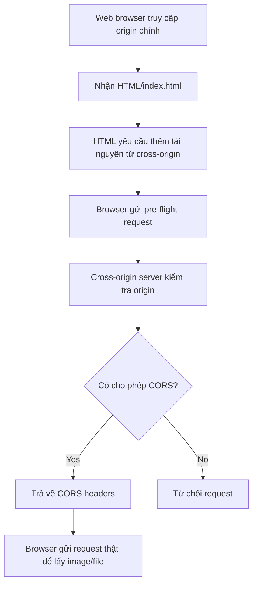

# 143. S3 CORS

## 🎯 Giới thiệu
- **CORS** là viết tắt của **Cross-Origin Resource Sharing**.
- Đây là cơ chế bảo mật ở **web browser** để cho phép hoặc từ chối request đến **origin khác** khi đang truy cập origin chính.
- Trong ngữ cảnh AWS, đây là chủ đề rất hay gặp trong exam, đặc biệt với **Amazon S3**.

## 1. Origin và Same Origin
- **Origin** gồm:
  - **scheme**
  - **protocol**
  - **host**
  - **domain**
  - **port**
- Ví dụ `https://www.example.com`:
  - protocol: `HTTPS`
  - domain: `www.example.com`
  - port ngầm định: `443`
- **Same origin** nghĩa là:
  - cùng **scheme**
  - cùng **host**
  - cùng **port**
- Nếu khác origin, browser sẽ không tự động cho request chạy tiếp, trừ khi server đích cho phép bằng CORS.

## 2. CORS hoạt động như thế nào
- Khi browser đang ở website A nhưng cần lấy tài nguyên từ website B:
  - browser sẽ gửi **pre-flight request**
  - request này hỏi trước xem origin của mình có được phép không
- Server ở origin đích nếu hỗ trợ CORS sẽ trả về **CORS headers**
- Header quan trọng được nhắc đến trong transcript:
  - **Access-Control-Allow-Origin**
- Nếu browser thấy headers hợp lệ:
  - nó mới gửi request thật để lấy tài nguyên
- Trong transcript, server có thể cho phép:
  - một **specific origin**
  - hoặc cho phép `*` để đại diện cho **all origins**

## 3. CORS trong Amazon S3
- Nếu client thực hiện **cross-origin request** lên **S3 bucket**, bucket phải được cấu hình đúng **CORS headers**
- Đây là tình huống rất phổ biến trong exam
- Ví dụ trong transcript:
  - một S3 bucket chứa website tĩnh: `my-bucket-html`
  - một S3 bucket khác chứa asset/image: `my-bucket-assets`
- Luồng:
  - browser tải `index.html` từ bucket thứ nhất
  - trong `index.html` có image nằm ở bucket thứ hai
  - browser gửi request sang bucket thứ hai với **origin** là bucket thứ nhất
  - nếu bucket thứ hai không có CORS đúng:
    - request bị từ chối
  - nếu CORS được cấu hình đúng:
    - browser được phép lấy image/file từ bucket kia

## 📊 Bảng tóm tắt
| Tiêu chí | Mô tả |
|----------|------|
| CORS | Cơ chế bảo mật của web browser để cho phép hoặc từ chối request giữa các origin |
| Origin | Gồm scheme, host, domain, port |
| Same origin | Cùng scheme, host, port |
| Pre-flight request | Request kiểm tra trước khi gửi request thật tới cross-origin |
| Header quan trọng | `Access-Control-Allow-Origin` |
| Ứng dụng với S3 | Cho phép browser lấy image/assets/file từ một S3 bucket khác origin |
| Cách cấu hình | Cho phép một origin cụ thể hoặc `*` cho mọi origin |

## 💡 Mẹo ghi nhớ cho kỳ thi AWS
- Nhớ công thức: **Same origin = same scheme + same host + same port**
- Khi thấy browser cần gọi sang domain/bucket khác, hãy nghĩ ngay đến **CORS**
- Với **S3 static website** và asset ở bucket khác, lỗi thường nằm ở **thiếu CORS headers**
- Từ khóa cần nhớ:
  - **pre-flight**
  - **Access-Control-Allow-Origin**
  - **cross-origin request**
  - **static website hosting trên S3**

## ✅ Kết luận
- **CORS** là cơ chế bảo mật của browser để kiểm soát request giữa các origin khác nhau.
- Trong **S3**, nếu website tải tài nguyên từ bucket khác, cần cấu hình **CORS headers** đúng để browser cho phép request.
- Đây là một chủ đề ngắn nhưng rất dễ xuất hiện trong AWS exam.
