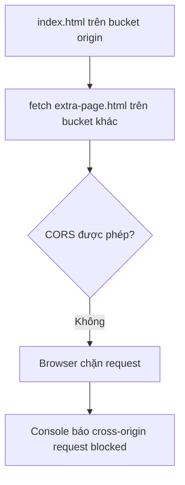
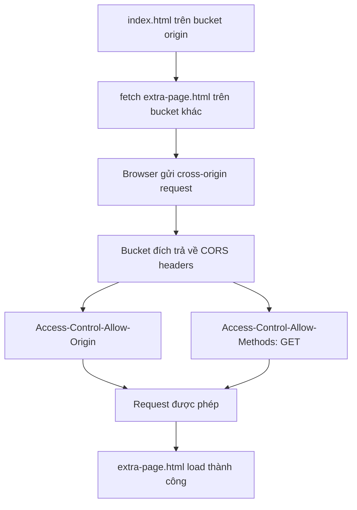

# 144. S3 CORS Hands On

## 🎯 Giới thiệu
Bài này thực hành **CORS** trên **S3 static website hosting** để thấy rõ:
- Khi request đi trong **same origin** thì hoạt động bình thường.
- Khi request sang **another origin** thì trình duyệt chặn nếu thiếu CORS headers.
- Cách sửa là cấu hình **CORS setting** cho bucket đích.

## 1. Chuẩn bị website và demo same origin
- Sửa `index.html` để bật phần demo CORS:
  - Bỏ comment ở phần `div`.
  - Sửa phần `script` để fetch thêm một file HTML khác.
- Upload 2 file vào cùng một bucket:
  - `index.html`
  - `extra-page.html`
- Khi mở website endpoint của bucket:
  - Trang hiển thị `Hello world I love coffee`
  - Hiển thị ảnh coffee
  - Nội dung từ `extra-page.html` được load xuống dưới
- Kết luận: request thành công vì cả hai file nằm trong cùng một bucket, tức là **same origin**.

## 2. Tạo another origin để gây lỗi CORS
- Tạo bucket mới, ví dụ `demo-other-origin-stephane`
- Chọn **region khác** để minh họa server khác nhau
- Bật **static website hosting**
- Unblock **public access**
- Cấu hình **bucket policy** để bucket public
- Upload `extra-page.html` vào bucket mới
- Mở Object URL của file:
  - File public và chạy được như một website riêng

### Mermaid: luồng request trước khi fix CORS

## 3. Fix bằng CORS setting
- Sửa lại `index.html` ở bucket gốc:
  - Thay đường dẫn fetch sang **full URL** của `extra-page.html` ở bucket khác
- Re-upload `index.html` vào bucket gốc
- Mở website và dùng **Chrome Developer Tools**
- Refresh trang:
  - Console báo lỗi **cross-origin request blocked**
  - Thiếu header kiểu **Access-Control-Allow**
- Vào bucket đích, mở **Permissions** và cấu hình **CORS**
- Thêm CORS rule sao cho:
  - `AllowedOrigins` là URL của bucket gốc
  - Không có dấu `/` ở cuối
- Sau khi lưu:
  - Refresh lại trang
  - `extra-page.html` được load thành công
  - Trong **Networking tab** thấy response headers có:
    - `Access-Control-Allow-Methods: GET`
    - `Access-Control-Allow-Origin: <origin của bucket gốc>`

### Mermaid: luồng request sau khi cấu hình CORS

## 📊 Bảng tóm tắt
| Tiêu chí | Mô tả |
|----------|------|
| Same origin | `index.html` và `extra-page.html` nằm cùng bucket nên fetch thành công |
| Another origin | `extra-page.html` nằm ở bucket khác, khác origin nên dễ bị browser chặn |
| Lỗi quan sát | Console báo **cross-origin request blocked** và thiếu **Access-Control-Allow** |
| Cách khắc phục | Cấu hình **CORS setting** trong bucket đích |
| Kết quả sau fix | Request được phép và nội dung từ bucket khác load bình thường |
| Header quan trọng | `Access-Control-Allow-Origin`, `Access-Control-Allow-Methods: GET` |

## 💡 Mẹo ghi nhớ cho kỳ thi AWS
- **CORS** liên quan đến việc browser cho phép hay chặn request **cross-origin**.
- Nếu request sang bucket khác mà bị chặn, hãy nghĩ ngay đến:
  - **CORS setting**
  - **Access-Control-Allow-Origin**
- Khi cấu hình CORS:
  - `AllowedOrigins` phải khớp với origin được phép
  - Không thêm `/` cuối URL nếu transcript yêu cầu bỏ
- Đọc đề thi có nhắc:
  - `same origin`
  - `cross-origin`
  - `browser blocked`
  - `Access-Control-Allow...`
  thì rất có thể đang nói về **CORS** trên S3.

## ✅ Kết luận
- Demo cho thấy request trong **same origin** chạy bình thường.
- Khi fetch sang bucket khác, browser chặn nếu bucket đích chưa có **CORS**.
- Chỉ cần cấu hình đúng **CORS rule** trên bucket đích, request sẽ thành công và website load được nội dung từ origin khác.
