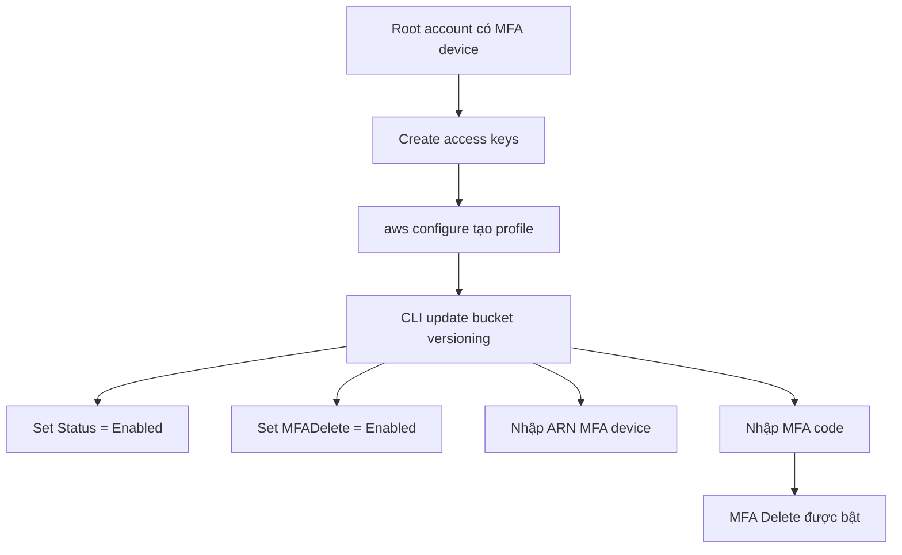

# 146. S3 MFA Delete Hands On

## 🎯 Giới thiệu
Bài học này демонстates cách bật và kiểm tra **S3 MFA Delete** trên một bucket đã bật **versioning**.

Điểm chính:
- **MFA Delete không thể bật từ AWS Console UI**
- Phải cấu hình bằng **AWS CLI**
- Cần có **MFA device** đã được thiết lập cho **root account**
- Khi **MFA Delete** bật, việc **xóa permanent** một object version sẽ bị chặn nếu không có MFA hợp lệ

## 1. Chuẩn bị trước khi bật MFA Delete
- Tạo S3 bucket và bật **bucket versioning**
- Kiểm tra trong **Properties > Bucket versioning**
- Xác nhận **MFA Delete** đang ở trạng thái **disabled**
- Trong **IAM / Security credentials**, đảm bảo **root account** đã có **virtual MFA device**
- Tạo **access keys** cho root account để cấu hình CLI
- Cấu hình một **profile** riêng bằng `aws configure`
- Kiểm tra cấu hình bằng `aws s3 ls` với profile vừa tạo

## 2. Bật MFA Delete bằng AWS CLI
- Dùng lệnh/setting cấu hình bucket versioning để:
  - `VersioningConfiguration.Status = Enabled`
  - `MFADelete = Enabled`
- Cần nhập:
  - **bucket name**
  - **ARN của MFA device**
  - **MFA code** từ app xác thực
- Nếu MFA code không đúng, thao tác sẽ fail và phải thử lại
- Sau khi thành công, refresh bucket trong console để thấy:
  - **Bucket versioning is enabled**
  - **MFA delete is enabled**

## 3. Kiểm tra hành vi khi MFA Delete đã bật
- Upload một object vào bucket
- Xóa object bình thường:
  - do bucket đã bật **versioning**, thao tác này chỉ tạo **delete marker**
- Kiểm tra **bucket versions** sẽ thấy có nhiều version của file
- Nếu cố **delete một specific version ID**:
  - hệ thống báo không thể xóa vì **MFA Delete is enabled**
- Muốn xóa permanent version đó thì phải:
  - dùng CLI để **disable MFA Delete**
  - nhập lại **MFA code** mới
- Sau khi disable:
  - xóa delete marker / version sẽ thực hiện được
  - trong console, **MFA Delete** sẽ hiển thị là **disabled**

## 📊 Bảng tóm tắt
| Tiêu chí | Mô tả |
|----------|------|
| Mục tiêu | Bật và kiểm tra **S3 MFA Delete** |
| Điều kiện | Bucket phải bật **versioning** |
| Cách bật | Không bật được bằng Console UI, phải dùng **AWS CLI** |
| Yêu cầu bắt buộc | **MFA device** cho **root account** |
| Xác thực | Cần **ARN của MFA device** và **MFA code** |
| Hành vi khi xóa | Xóa object thường tạo **delete marker** |
| Hành vi khi xóa version | Permanent delete bị chặn khi **MFA Delete** bật |
| Tắt MFA Delete | Dùng CLI và nhập **MFA code** hợp lệ |

## 💡 Mẹo ghi nhớ cho kỳ thi AWS
- **MFA Delete = bảo vệ xóa permanent** của S3 versioned bucket
- **Console không bật được**, nhớ chọn **CLI**
- Muốn bật **MFA Delete** thì phải có:
  - **root account**
  - **MFA device**
  - **access keys** để thao tác CLI
- Nếu bucket đã bật **versioning**, xóa object bình thường chỉ tạo **delete marker**
- **Permanent delete version** mới là phần bị chặn khi **MFA Delete** đang enabled
- Sau khi làm xong, nhớ **xóa/deactivate root access keys**

## ✅ Kết luận
- **S3 MFA Delete** là cơ chế tăng bảo vệ cho bucket đã bật **versioning**
- Không thể bật trực tiếp từ **AWS Console**
- Phải dùng **AWS CLI** với **root account**, **MFA device**, và **MFA code**
- Khi đã bật, **permanent delete** version sẽ bị kiểm soát chặt hơn
- Kết thúc bài lab, nên **deactivate root access keys** để đảm bảo an toàn
