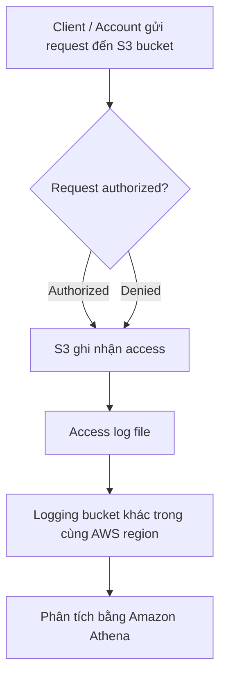

# 147. S3 Access Logs

## 🎯 Giới thiệu
S3 Access Logs dùng cho mục đích audit, giúp ghi lại mọi request vào S3 bucket. Mỗi access, dù **authorized** hay **denied**, đều được ghi thành file vào một **logging bucket** khác. Dữ liệu log sau đó có thể được phân tích bằng công cụ như **Amazon Athena**.

## 1. Cách hoạt động của S3 Access Logs
- Khi bật **access logs** cho một S3 bucket, mọi request gửi tới bucket đó sẽ được ghi log.
- Log được lưu thành file trong một **S3 logging bucket** khác.
- **Target logging bucket** phải nằm trong **cùng AWS region** với bucket được giám sát.
- Log có **specific format**, và format này được tham chiếu qua URL tài liệu riêng.

## 2. Cảnh báo quan trọng
- **Không bao giờ** đặt **logging bucket** trùng với bucket đang được giám sát.
- Nếu dùng cùng một bucket:
  - request sẽ tạo log
  - log lại tạo thêm request
  - dẫn đến **logging loop** vô hạn
- Hậu quả:
  - bucket phình to nhanh
  - phát sinh chi phí lớn

## 3. Ý nghĩa khi ôn thi AWS
- **S3 Access Logs** là tính năng phục vụ **audit** và theo dõi truy cập.
- Log ghi nhận cả **allowed** và **denied requests**.
- Log được lưu vào **another S3 bucket**.
- **Same region** là yêu cầu quan trọng cần nhớ.
- Có thể dùng **Amazon Athena** để phân tích log.

## 📊 Bảng tóm tắt
| Tiêu chí | Mô tả |
|----------|------|
| Mục đích | Audit và ghi nhận mọi access vào S3 bucket |
| Phạm vi log | Tất cả requests, kể cả **authorized** và **denied** |
| Nơi lưu log | Một **S3 logging bucket** khác |
| Yêu cầu region | Logging bucket phải ở **cùng AWS region** |
| Phân tích log | Có thể dùng **Amazon Athena** |
| Cảnh báo | Không đặt logging bucket trùng bucket đang monitor vì gây **logging loop** vô hạn |

## 💡 Mẹo ghi nhớ cho kỳ thi AWS
- Nhớ cụm: **“Access Logs = audit + another bucket + same region”**
- Nếu gặp câu hỏi về log truy cập S3, hãy nghĩ ngay đến:
  - **mọi request**
  - **khác bucket**
  - **cùng region**
  - **tránh logging loop**
- Câu bẫy hay gặp: dùng **chính bucket đang monitor** làm logging bucket là sai.

## ✅ Kết luận
S3 Access Logs là cơ chế ghi lại mọi request vào S3 bucket để phục vụ audit. Log được lưu sang một **S3 bucket khác** trong **cùng region**, và có thể phân tích bằng **Amazon Athena**. Điểm cần nhớ nhất là **không bao giờ dùng cùng bucket để tránh logging loop vô hạn**.
