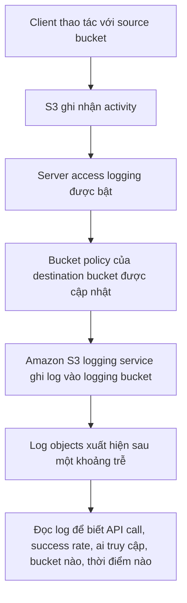

# 148. S3 Access Logs - Hands On

## 🎯 Giới thiệu
- Bài thực hành này демонстраte cách bật **S3 Server access logging** cho một bucket.
- Mục tiêu là ghi lại các hoạt động truy cập vào một **logging bucket** riêng.
- Khi bật logging, **Bucket policy** của destination bucket sẽ được cập nhật để **Amazon S3 logging service** có quyền ghi object vào đó.

## 1. Thiết lập logging bucket
- Tạo một bucket riêng làm **logging bucket**.
- Bucket này sẽ nhận các file log được S3 sinh ra.
- Chọn một bucket khác làm **source bucket** để bật logging.

## 2. Bật S3 Server access logging
- Vào **Properties** của source bucket.
- Kéo xuống phần **Server access logging** và chọn **Enable**.
- Cần khai báo:
  - **Destination bucket**: bucket nhận log
  - **Destination region**: ví dụ `eu-west-1`
  - **Prefix**: tùy chọn, có thể để trống
  - **Log object key format**: giữ mặc định trong bài
- Sau đó nhấn **Save changes**.

## 3. Kiểm tra log được tạo
- Thực hiện các hành động trong bucket như:
  - mở object
  - upload file, ví dụ `beach.jpeg`
- Các hoạt động này sẽ tạo ra **activity** và được ghi vào logging bucket.
- Log không xuất hiện ngay lập tức, cần chờ một thời gian.
- Khi log đã đến:
  - sẽ thấy nhiều object mới trong logging bucket
  - có thể mở một file log để xem thông tin truy cập

## 📊 Bảng tóm tắt
| Tiêu chí | Mô tả |
|----------|------|
| Tính năng | **S3 Server access logging** |
| Mục đích | Ghi lại activity truy cập vào bucket |
| Nơi lưu log | Một **logging bucket** riêng |
| Cấu hình chính | Destination bucket, region, prefix, log key format |
| Tác động phụ | **Bucket policy** của destination bucket được cập nhật |
| Độ trễ | Log đến chậm, có thể mất một khoảng thời gian |
| Nội dung log | API call, success rate, ai truy cập, bucket nào, thời điểm nào |

## 💡 Mẹo ghi nhớ cho kỳ thi AWS
- **Enable logging trên source bucket, log được đẩy sang destination bucket**.
- **Bucket policy** của destination bucket phải cho phép S3 ghi object.
- Log **không xuất hiện ngay**, cần nhớ yếu tố **delay**.
- File log cho biết:
  - **who accessed it**
  - **what bucket it was**
  - **at what time**
  - và các chi tiết của **API call**
- Đề thi hay hỏi về sự khác nhau giữa:
  - bucket đang được truy cập
  - bucket dùng để lưu log

## ✅ Kết luận
- **S3 Server access logging** là cách theo dõi activity của bucket bằng cách ghi log sang một bucket khác.
- Khi bật tính năng này, S3 sẽ cập nhật **Bucket policy** để có thể ghi log.
- Log sinh ra có độ trễ nhưng cung cấp nhiều thông tin truy cập hữu ích cho việc học và ôn thi AWS.
