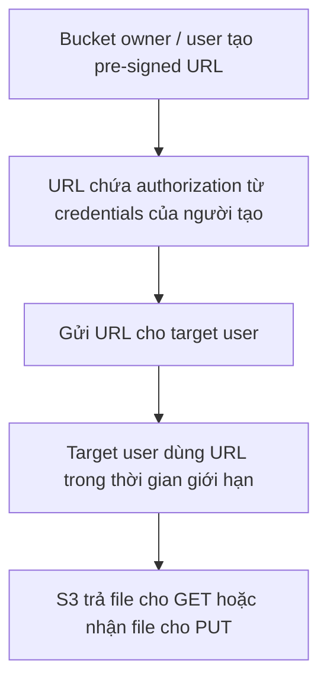

# 149. S3 Pre-signed URLs

## 🎯 Giới thiệu
Amazon S3 pre-signed URLs là URL có thể tạo bằng **S3 console**, **CLI** hoặc **SDK**.

- URL này có **expiration**.
- Khi người dùng nhận URL, họ sẽ **inherit the permissions** của người tạo URL cho thao tác **GET** hoặc **PUT**.
- Mục tiêu chính là cấp **access tạm thời** cho một file cụ thể trong S3 mà vẫn giữ **S3 bucket private**.

## 1. Cách hoạt động 🔄
- Người tạo URL là bucket owner hoặc một user có quyền phù hợp.
- S3 tạo ra pre-signed URL cho **một file cụ thể**.
- URL mang theo quyền truy cập tương ứng của người tạo.
- Người nhận URL dùng nó để truy cập file trong thời gian giới hạn.

## 2. Thời hạn của URL ⏳
- Tạo bằng **console**: tối đa **12 hours**.
- Tạo bằng **CLI**: tối đa **168 hours**.
- URL hết hạn sau khoảng thời gian này và không còn dùng được.

## 3. Use case phổ biến 🎯
- Cho phép người **không thuộc AWS** truy cập tạm thời một file riêng lẻ.
- Chỉ cho **logged-in users** tải một **premium video** từ S3.
- Cho phép một danh sách user thay đổi liên tục tải file bằng cách tạo URL động.
- Cho phép user **upload** file tạm thời vào đúng vị trí trong S3 bucket.
- Tất cả các trường hợp trên đều giúp giữ **S3 bucket private**.

## 📊 Bảng tóm tắt
| Tiêu chí | Mô tả |
|----------|------|
| Khái niệm | URL tạm thời cho S3 object |
| Cách tạo | S3 console, CLI, SDK |
| Thời gian hết hạn | Console: up to 12 hours, CLI: up to 168 hours |
| Quyền truy cập | User nhận URL inherit permissions của người tạo cho GET hoặc PUT |
| Mục đích | Chia sẻ file riêng lẻ an toàn mà không public bucket |
| Use case | Download hoặc upload tạm thời |

## 💡 Mẹo ghi nhớ cho kỳ thi AWS
- **Pre-signed URL = temporary access** cho **một file cụ thể**.
- Nhớ 2 thao tác chính: **GET** để download, **PUT** để upload.
- Dùng khi muốn **share file nhưng vẫn private bucket**.
- Nhớ thời hạn theo cách tạo:
  - **Console: 12 hours**
  - **CLI: 168 hours**
- Đây là lựa chọn rất hay khi cần cấp quyền **tạm thời** mà không mở public access.

## ✅ Kết luận
S3 pre-signed URLs là cách tạo URL có thời hạn để cấp quyền tạm thời cho một object trong S3. Chúng phù hợp cho các tình huống cần download hoặc upload có kiểm soát, trong khi vẫn giữ bucket ở trạng thái private.
