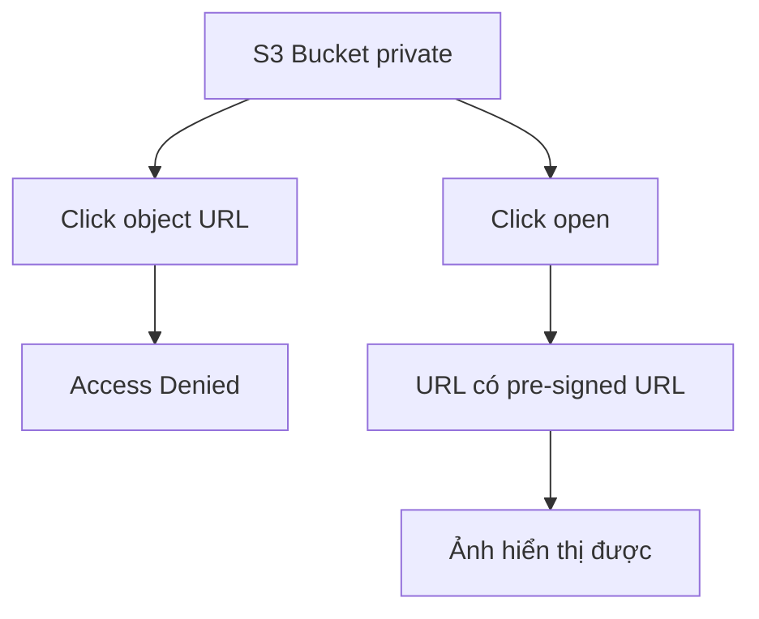

# 150. S3 Pre-signed URLs - Hands On

## 🎯 Giới thiệu
- Bài học này демонстраte cách dùng `S3 pre-signed URL` để chia sẻ quyền truy cập tạm thời vào object trong S3.
- Ví dụ dùng một bucket không public, nhưng vẫn có thể mở ảnh `coffee.jpg` thông qua `pre-signed URL`.
- Ý chính: object vẫn private, nhưng URL được ký bằng credentials của người tạo nên người khác có thể truy cập trong thời gian giới hạn.

## 1. Tình huống với object private 🔒
- Khi click vào `object URL` của ảnh trong bucket không public, hệ thống trả về `Access Denied`.
- Điều này cho thấy `public URL` không hoạt động vì bucket không public.
- Tuy nhiên, khi dùng nút `open`, ảnh vẫn hiển thị vì đường dẫn đó chứa `pre-signed URL`.

## 2. Pre-signed URL là gì ✍️
- `pre-signed URL` là URL đã được ký trước bằng credentials của người tạo.
- URL này cho phép truy cập vào object dù bucket và object vẫn private.
- Người nhận chỉ cần mở URL là có thể xem object, không cần quyền trực tiếp vào bucket.

## 3. Cách tạo pre-signed URL 🛠️
- Có 2 cách được nhắc đến:
  - Dùng `CLI`
  - Dùng ngay trên `Console`
- Trên console:
  - Chọn `object action`
  - Chọn `share a pre-signed URL`
  - Chọn thời gian hiệu lực, ví dụ `5 minutes`
  - Click `create pre-signed URL`
- Sau đó có thể share URL này cho người khác, và họ truy cập được cho đến khi URL hết hạn.

## 📊 Bảng tóm tắt
| Tiêu chí | Mô tả |
|----------|------|
| Mục đích | Chia sẻ truy cập tạm thời vào S3 object |
| Tính chất bucket/object | Vẫn có thể private |
| Cách hoạt động | URL được ký bằng credentials của người tạo |
| Cách tạo | `CLI` hoặc `Console` |
| Thời gian hiệu lực | Có thể đặt theo phút hoặc giờ |
| Lợi ích | Chia sẻ file nhanh, an toàn hơn vì URL có thời hạn |

## 💡 Mẹo ghi nhớ cho kỳ thi AWS
- `Pre-signed URL` = truy cập tạm thời vào `S3 object` mà không cần public bucket.
- Nếu thấy câu hỏi về “share file trong S3 nhưng vẫn private”, hãy nghĩ ngay đến `pre-signed URL`.
- Điểm quan trọng cần nhớ:
  - `bucket/private object` vẫn truy cập được
  - URL có `expiration`
  - Có thể tạo bằng `CLI` hoặc `Console`
- Từ khóa hay gặp: `share`, `temporary access`, `expires`, `private bucket`, `private object`.

## ✅ Kết luận
- `S3 pre-signed URL` là cách chia sẻ nhanh một object private trong S3 với thời gian truy cập giới hạn.
- Đây là giải pháp tiện lợi khi cần cho người khác xem file mà không phải mở public bucket.
- Giá trị cốt lõi của bài: `private vẫn private`, nhưng access được cấp tạm thời qua URL đã ký.
