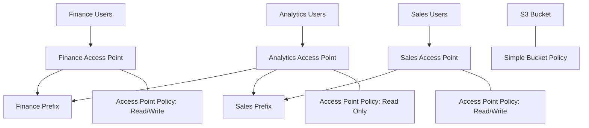

# 151. S3 Access Points

## 🎯 Giới thiệu
- Khi một S3 bucket có nhiều loại dữ liệu như `finance`, `sales`, và nhiều nhóm người dùng khác nhau, việc duy trì một `S3 bucket policy` duy nhất có thể trở nên rất phức tạp.
- `S3 Access Points` được dùng để tách cách truy cập theo từng nhóm dữ liệu, giúp quản lý bảo mật dễ hơn và mở rộng tốt hơn.
- Mỗi access point có thể gắn một `access point policy` riêng, tương tự như `S3 bucket policy`.

## 1. Vấn đề với S3 bucket policy lớn
- Một bucket chứa nhiều dữ liệu cho nhiều nhóm dễ làm `bucket policy` phình to theo thời gian.
- Khi số lượng user và dữ liệu tăng, việc quản lý security trực tiếp ở mức bucket trở nên khó kiểm soát.
- Đây là lý do cần tách quyền truy cập ra thành nhiều access point.

## 2. Cách hoạt động của S3 Access Points
- Tạo từng access point cho từng nhu cầu truy cập:
  - `finance access point` trỏ tới dữ liệu `finance`
  - `sales access point` trỏ tới dữ liệu `sales`
  - `analytics access point` có thể trỏ tới cả `finance` và `sales` nhưng chỉ `read only`
- Mỗi access point có `policy` riêng:
  - `finance` có thể cho `read write` trên `finance prefix`
  - `sales` có thể cho `read write` trên `sales prefix`
  - `analytics` có thể cho `read only`
- Người dùng chỉ truy cập được phần dữ liệu mà access point và IAM permissions cho phép.

## 3. VPC Origin và truy cập riêng tư
- `S3 Access Points` có thể có `DNS name` riêng để kết nối.
- Có thể cấu hình access point dùng:
  - `Internet` origin
  - `VPC` origin cho traffic private
- Với `VPC origin`, một `EC2 instance` trong `VPC` có thể truy cập S3 mà không đi qua Internet.
- Để truy cập private này, cần tạo `VPC endpoint`.
- `VPC endpoint policy` phải cho phép truy cập:
  - target buckets
  - access points
- Như vậy, security được quản lý ở 3 lớp:
  - `VPC endpoint policy`
  - `Access Point policy`
  - `S3 bucket level`

## 📊 Bảng tóm tắt
| Tiêu chí | Mô tả |
|----------|------|
| Mục tiêu | Đơn giản hóa quản lý security cho S3 bucket |
| Cách làm | Tạo nhiều `S3 Access Points` thay vì gom mọi quyền vào một bucket policy lớn |
| Quyền truy cập | Mỗi access point có `policy` riêng, giống `S3 bucket policy` |
| Phân quyền theo dữ liệu | Finance, Sales, Analytics có thể có access point riêng |
| Kết nối | Mỗi access point có `DNS name` riêng |
| Truy cập private | Có thể dùng `VPC origin` và `VPC endpoint` |
| Bảo mật | Quản lý ở `VPC endpoint policy`, `Access Point policy`, và `S3 bucket` |

## 💡 Mẹo ghi nhớ cho kỳ thi AWS
- `Access Point = tách quyền truy cập theo use case` 📌
- `Bucket policy` không cần gánh toàn bộ logic phức tạp khi số user và dữ liệu tăng.
- `Access Point policy` rất giống `S3 bucket policy`.
- Nếu cần truy cập private từ `EC2` trong `VPC`, hãy nhớ:
  - `VPC origin`
  - `VPC endpoint`
  - `VPC endpoint policy`
- Mỗi access point có `DNS name` riêng, đây là cách connect vào access point.

## ✅ Kết luận
- `S3 Access Points` giúp chia nhỏ và quản lý truy cập S3 theo từng nhóm dữ liệu.
- Chúng làm security dễ scale hơn bằng cách chuyển logic phân quyền từ `S3 bucket policy` sang các `access point policy` riêng.
- Khi dùng `VPC origin`, truy cập có thể diễn ra riêng tư thông qua `VPC endpoint`, tăng thêm lớp kiểm soát bảo mật.
