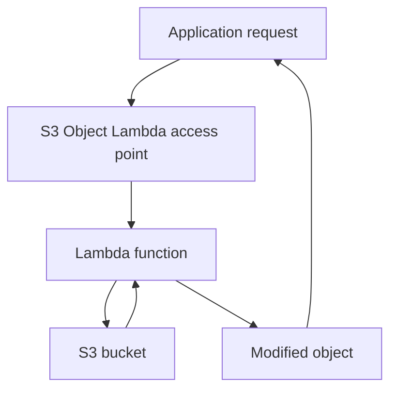

# 152. S3 Object Lambda

## 🎯 Giới thiệu
- **S3 Object Lambda** cho phép **biến đổi object ngay trước khi ứng dụng lấy về** từ S3.
- Mục tiêu chính: **không cần tạo nhiều S3 bucket hay sao chép nhiều phiên bản object** chỉ để phục vụ các nhu cầu khác nhau.
- Cơ chế này dùng **S3 access points** và gắn với **Lambda function** để xử lý dữ liệu khi truy xuất.

## 1. Khái niệm và mục đích
- Một **S3 bucket** có thể chứa dữ liệu gốc.
- Các ứng dụng khác nhau có thể cần **phiên bản object khác nhau**:
  - Ứng dụng **E-commerce** lấy **original object**.
  - Ứng dụng **analytics** chỉ được lấy **redacted object**.
  - Ứng dụng **marketing** có thể cần **enriched object**.
- Thay vì tạo bucket mới cho từng phiên bản, ta dùng **S3 Object Lambda** để xử lý object động khi request xảy ra.

## 2. Cách hoạt động

- Ứng dụng không truy cập trực tiếp object theo cách thông thường, mà đi qua **S3 Object Lambda access point**.
- **Object Lambda access point** sẽ **invoke Lambda function**.
- **Lambda function** lấy dữ liệu từ **S3 bucket** và thực hiện xử lý cần thiết.
- Kết quả trả về là object đã được **redact**, **enrich**, hoặc **transform** theo nhu cầu.

## 3. Use cases chính
- **Redact PII data**:
  - Phù hợp cho **analytics** hoặc **non-production environments**.
- **Enrichment dữ liệu**:
  - Ví dụ lấy thêm dữ liệu từ **customer loyalty database** để làm giàu object.
- **Chuyển đổi định dạng**:
  - Ví dụ từ **XML sang JSON**.
- **Xử lý nội dung động**:
  - Ví dụ **resizing** và **watermarking images on the fly**.
  - Watermark có thể **specific to the user** đang request object.

## 📊 Bảng tóm tắt
| Tiêu chí | Mô tả |
|----------|------|
| Mục tiêu | Biến đổi object trước khi ứng dụng nhận được dữ liệu |
| Thành phần chính | S3 bucket, S3 access points, S3 Object Lambda access point, Lambda function |
| Cách dùng | Ứng dụng truy cập qua Object Lambda access point, Lambda xử lý rồi trả object về |
| Lợi ích | Không cần tạo nhiều bucket hay nhiều bản sao của object |
| Use cases | Redact PII, enrich data, XML to JSON, resize/watermark image |

## 💡 Mẹo ghi nhớ cho kỳ thi AWS
- Nhớ công thức: **S3 Object Lambda = S3 access point + Lambda + modify object on the fly**.
- Khi đề bài nói:
  - **chỉ một bucket nhưng nhiều dạng dữ liệu đầu ra**
  - **redaction / enrichment / transformation**
  - **không muốn duplicate objects**
  -> hãy nghĩ đến **S3 Object Lambda**.
- Keywords nên nhớ: **access point**, **Lambda function**, **redact**, **enrich**, **transform**.

## ✅ Kết luận
- **S3 Object Lambda** cho phép tạo các **phiên bản object tùy biến khi truy xuất** từ cùng một S3 bucket.
- Đây là cách hiệu quả để phục vụ nhiều ứng dụng khác nhau mà **không cần sao chép dữ liệu**.
- Các use case điển hình là **redact PII**, **enrich data**, và **transform object** theo yêu cầu.
