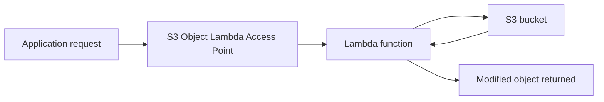

# 153. CloudFront - Overview

## 🎯 Giới thiệu
Bài này thực tế tập trung vào **S3 Object Lambda**.

- Mục tiêu là **thay đổi object ngay trước khi được trả về cho application**
- Thay vì phải **duplicate S3 bucket** hoặc tạo nhiều version của cùng một object
- Cách làm là dùng **S3 access points** kết hợp với **Lambda**
- Ứng dụng khác nhau có thể nhận **cùng một object gốc**, nhưng ở dạng đã **redact** hoặc **enrich**

## 1. S3 Object Lambda là gì? 🧩
**S3 Object Lambda** cho phép bạn:

- Giữ nguyên **một S3 bucket**
- Tạo các **access point** khác nhau trên cùng bucket
- Gắn **Lambda function** để xử lý object khi object được retrieve
- Trả về object đã được biến đổi thay vì object gốc

Ý tưởng chính:
- **Không cần tạo bucket mới**
- **Không cần lưu sẵn nhiều phiên bản dữ liệu**
- Dữ liệu được xử lý **on the fly** lúc request xảy ra

### Mermaid: Flow xử lý object

## 2. Cách hoạt động theo từng flow 🔄

### Flow 1: Analytics application
- **E-commerce application** có thể truy cập trực tiếp vào S3 bucket để **put/get original object**
- **Analytics application** chỉ cần object đã được **redacted**
- Ta tạo:
  - một **S3 access point**
  - gắn với một **Lambda function**
  - phía trên đó là **S3 Object Lambda access point**
- Khi analytics application gọi access point này:
  - request đi vào **S3 Object Lambda access point**
  - nó invoke **Lambda function**
  - Lambda lấy data từ **S3 bucket**
  - Lambda chạy code để **redact data**
  - ứng dụng nhận về **redacted object**

### Flow 2: Marketing application
- **Marketing application** cần object đã được **enrich**
- Dữ liệu enrich được lấy từ **customer loyalty database**
- Cũng dùng **Lambda function**
  - Lambda lookup dữ liệu từ database
  - enrich object trước khi trả về
- Sau đó tạo thêm một **S3 Object Lambda access point**
- Marketing application truy cập access point này để lấy **enriched object**

### Tóm ý quan trọng
- **Một S3 bucket duy nhất**
- Nhiều **access point**
- Nhiều kiểu xử lý dữ liệu khác nhau nhờ **Lambda**
- Mỗi application có thể nhận **dạng object khác nhau** từ cùng một nguồn

## 3. Use cases chính 🎯
Các use case được nhắc trong transcript:

- **Redact PII data**
  - dùng cho **analytics**
  - hoặc **non-production environments**
- **Convert data**
  - ví dụ **XML to JSON**
- **Transform dữ liệu tùy ý**
- **Resize và watermark images on the fly**
  - watermark có thể **specific to the user who request the object**

## 📊 Bảng tóm tắt
| Tiêu chí | Mô tả |
|----------|------|
| Mục đích | Modify object ngay trước khi object được retrieve |
| Thành phần chính | **S3 bucket**, **S3 access point**, **S3 Object Lambda access point**, **Lambda function** |
| Cách hoạt động | Application gọi access point, access point invoke Lambda, Lambda lấy dữ liệu từ S3 và biến đổi object |
| Lợi ích | Không cần duplicate bucket, không cần lưu nhiều version của cùng dữ liệu |
| Use cases | Redact PII, enrich data, XML to JSON, resize/watermark image |
| Đối tượng sử dụng | Analytics application, Marketing application, và các application cần dữ liệu biến đổi |

## 💡 Mẹo ghi nhớ cho kỳ thi AWS
- Nhớ câu: **“S3 Object Lambda = biến đổi object trước khi trả về”**
- **S3 access point** là nền tảng để gắn xử lý vào bucket
- **Lambda** là nơi viết code để:
  - **redact**
  - **enrich**
  - **transform**
- Khi thấy nhu cầu:
  - không muốn tạo bucket mới
  - không muốn duplicate data
  - nhưng vẫn cần output khác nhau cho từng app  
  hãy nghĩ đến **S3 Object Lambda**
- Keyword cần nhớ:
  - **PII**
  - **redacted object**
  - **enriched object**
  - **on the fly**

## ✅ Kết luận
**S3 Object Lambda** cho phép dùng **một S3 bucket** nhưng trả về dữ liệu theo nhiều dạng khác nhau nhờ **Lambda function** và **S3 Object Lambda access point**. Đây là cách xử lý rất phù hợp khi cần **redact, enrich, transform, resize, watermark** object mà không phải nhân bản dữ liệu trong nhiều bucket khác nhau.
