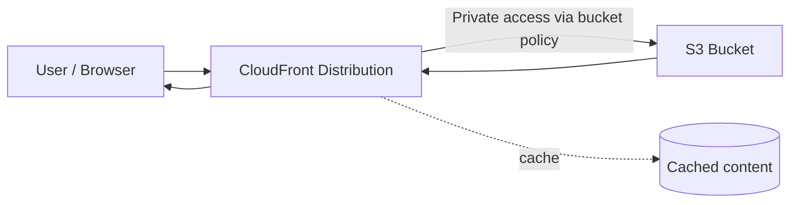

# 154. CloudFront Hands On

## 🎯 Giới thiệu
Bài thực hành này tập trung vào cách dùng **CloudFront** để phân phối nội dung từ **S3** mà không cần public trực tiếp các object trong bucket.

Mục tiêu chính:
- Tạo **S3 bucket** và upload file.
- Tạo **CloudFront distribution** với **free plan**.
- Cấu hình **private S3 bucket access** qua CloudFront.
- Kiểm tra việc truy cập nội dung và thấy lợi ích của **cache**.

## 1. Tạo S3 bucket và upload file 📦
- Tạo bucket tên `demo-CloudFront-Stephan-v4`.
- Giữ các thiết lập mặc định và click **Create Bucket**.
- Upload 3 file:
  - `beach.jpeg`
  - `coffee.jpg`
  - `index.html`
- Khi mở `index.html` trực tiếp bằng **object URL**:
  - Bị **Access Denied** vì object không public.
- Khi dùng **open**:
  - S3 tạo **pre-signed URL** cho object.
  - Có thể thấy nội dung text như:
    - `I love coffee`
    - `hello world`
  - Nhưng image vẫn chưa hiển thị vì image đó cũng không public.

## 2. Tạo CloudFront distribution 🌐
- Mở console **CloudFront** và tạo distribution mới.
- Chọn **free plan** vì đủ cho nhu cầu bài lab:
  - Có đủ requests và allowance
  - Có DNS protection
  - Có geographic traffic blocking
  - Có global CDN
  - Có free TLS certificates
- Đặt tên distribution là `demo new CloudFront`.
- Chọn kiểu sử dụng là **single site or app**.
- Chọn **origin type** là **Amazon S3**.
- Chọn bucket `demo CloudFront stephane v4`.
- Bật tùy chọn:
  - **allow private S3 bucket access to CloudFront**
  - **recommended origin settings**
  - **recommended cache settings**
- Không bật **web application firewall**.
- Review lại và tạo distribution.

### Mermaid: luồng truy cập

## 3. Truy cập nội dung qua CloudFront và quan sát cache ⚡
- Sau khi distribution được tạo, **bucket policy** trong S3 tự động được cập nhật.
- Policy này cho phép **CloudFront distribution** truy cập private vào bucket.
- Khi mở domain của CloudFront:
  - Truy cập thẳng gốc sẽ bị **Access Denied**.
  - Cần nhập đúng path:
    - `/coffee.jpg`
    - `/beach.jpeg`
    - `/index.html`
- Kết quả:
  - `coffee.jpg` hiển thị.
  - `beach.jpeg` hiển thị.
  - `index.html` hiển thị đầy đủ nội dung và image.
- Dù object trong S3 là **private**, CloudFront vẫn truy cập được nhờ **bucket policy**.
- Khi tải lại `beach.jpeg`, ảnh được lấy từ **cache**, nên tốc độ gần như tức thì.

## 📊 Bảng tóm tắt
| Tiêu chí | Mô tả |
|----------|------|
| Mục tiêu | Dùng CloudFront để phân phối nội dung từ S3 mà không public object |
| Source | S3 bucket chứa `beach.jpeg`, `coffee.jpg`, `index.html` |
| CloudFront plan | Chọn **free plan** |
| Origin | **Amazon S3** |
| Bảo mật | Bật **private S3 bucket access to CloudFront** |
| Kết quả | Truy cập nội dung qua CloudFront thành công dù S3 object private |
| Lợi ích nổi bật | Nội dung được **cache** giúp tải nhanh hơn |

## 💡 Mẹo ghi nhớ cho kỳ thi AWS
- **CloudFront + S3 private bucket** là mô hình rất hay gặp: object không public, nhưng CloudFront vẫn truy cập được qua **bucket policy**.
- Nếu truy cập S3 trực tiếp mà bị **Access Denied**, đó là dấu hiệu object chưa public.
- **CloudFront** không chỉ là CDN, mà còn giúp:
  - phân phối nhanh hơn nhờ **cache**
  - che giấu truy cập trực tiếp đến S3
- Khi dùng CloudFront với S3, hãy nhớ:
  - cần chọn **origin**
  - cần cấu hình quyền truy cập private
  - nội dung sẽ được truy cập qua **domain CloudFront** và đúng **path**
- Trong lab này, việc tải lại nhanh hơn là dấu hiệu rõ ràng của **cache hit**.

## ✅ Kết luận
Trong bài hands-on này, bạn đã:
- Tạo một **S3 bucket** và upload file.
- Tạo **CloudFront distribution** bằng **free plan**.
- Kết nối CloudFront với **S3 private bucket** bằng **bucket policy**.
- Truy cập file qua CloudFront thành công và thấy lợi ích của **cache**.

Kết luận quan trọng cho kỳ thi: **CloudFront có thể phục vụ nội dung từ S3 private nếu được cấp quyền phù hợp, đồng thời tăng tốc độ phân phối nhờ cache.**
