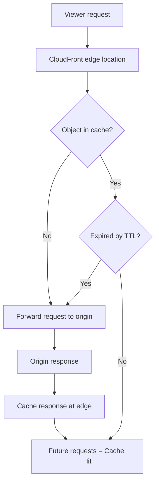
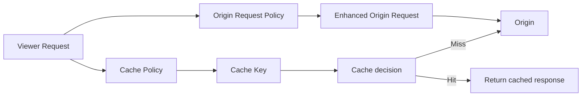

# 155. CloudFront - Caching & Caching Policies

## 🎯 Giới thiệu
CloudFront cache được đặt tại từng **CloudFront edge location**. Mục tiêu là tăng **Cache Hit ratio** bằng cách giảm số request phải đi về **origin**.  
Mỗi object trong cache được nhận diện bằng một **Cache Key**. CloudFront sẽ kiểm tra:
- object có trong cache không
- nếu có thì đã hết hạn theo **TTL** chưa
- nếu không có thì chuyển request về origin, rồi cache response tại edge location

## 1. Cách CloudFront caching hoạt động
- Cache nằm ở **mỗi edge location**, nên số cache tương ứng với số edge locations.
- CloudFront dùng **Cache Key** để xác định object nào đang được lưu.
- Nếu object:
  - **có trong cache** và **chưa hết TTL** → trả về **cache hit**
  - **không có trong cache** → forward request đến origin
- Response từ origin sẽ được cache lại để phục vụ các request sau.
- Có thể xóa object khỏi cache trước khi hết TTL bằng **invalidation**.

## 2. Cache Key và Cache Policy
### Cache Key là gì?
- Là **unique identifier** cho mỗi object trong cache.
- Mặc định gồm:
  - **host name**
  - **resource portion of URL**

Ví dụ:
- `mywebsite.com`
- `/content/stories/example-story.html`

Khi request có cùng host name và cùng resource portion, CloudFront sẽ có cơ hội tạo **cache hit**.

### Khi nào cần Cache Key phức tạp hơn?
Khi nội dung thay đổi theo:
- user
- device
- language
- location

Lúc này có thể thêm vào Cache Key:
- **HTTP headers**
- **cookies**
- **query strings**

### CloudFront cache policy điều khiển gì?
- Cách tạo **Cache Key**
- Có thể chọn cho:
  - **headers**: none / whitelist
  - **cookies**: none / whitelist / all / all except
  - **query strings**: none / whitelist / all except / all
- Kiểm soát **TTL**:
  - từ **0 seconds** đến **1 year**
  - hoặc dùng header:
    - **cache-control**
    - **expires**
- Có thể dùng:
  - **custom cache policies**
  - **managed policies** của AWS

### Điểm rất quan trọng
- Tất cả **HTTP headers, cookies, query strings** được đưa vào **Cache Key** sẽ tự động được **forward** tới origin request.

### Ví dụ theo language header
- Nếu dùng **none** cho HTTP headers:
  - không cache headers
  - headers không được forward
  - hiệu năng cache tốt nhất
- Nếu dùng **whitelist**:
  - chỉ những headers được chọn mới vào Cache Key
  - các headers này cũng được forward đến origin
  - phù hợp khi origin cần biết language để trả về nội dung đúng ngôn ngữ

## 3. Origin Request Policy và sự khác nhau với Cache Policy
### Origin Request Policy là gì?
Dùng khi bạn muốn:
- forward thêm **HTTP headers / cookies / query strings** tới origin
- nhưng **không muốn** chúng tham gia vào **Cache Key**

Nó cũng cho phép:
- thêm **custom HTTP headers**
- thêm **CloudFront HTTP headers**
- ngay cả khi chúng **không có trong viewer request**

Ví dụ:
- pass **API key**
- pass **secret header**

### Khác nhau cốt lõi
- **Cache Policy**: quyết định cái gì được dùng để cache
- **Origin Request Policy**: quyết định cái gì được gửi tới origin

### Tóm tắt flow
- Request vào có headers/cookies/query strings
- CloudFront cache theo **cache policy**
- Origin có thể cần thêm dữ liệu khác
- **origin request policy** sẽ bổ sung request gửi đến origin
- Phần bổ sung này **không ảnh hưởng** đến cache key

## 📊 Bảng tóm tắt
| Tiêu chí | Mô tả |
|----------|------|
| Cache location | Tại từng **CloudFront edge location** |
| Mục tiêu | Tăng **Cache Hit ratio**, giảm request đến origin |
| Cache Key mặc định | **host name** + **resource portion of URL** |
| Dữ liệu có thể thêm vào Cache Key | **HTTP headers**, **cookies**, **query strings** |
| Cache Policy | Quyết định Cache Key và **TTL** |
| TTL | Từ **0 seconds** đến **1 year** |
| Origin Request Policy | Forward thêm dữ liệu đến origin nhưng **không dùng cho cache key** |
| Invalidation | Xóa object khỏi cache trước khi TTL hết hạn |

## 💡 Mẹo ghi nhớ cho kỳ thi AWS
- **Cache Policy = cache cái gì**
- **Origin Request Policy = gửi cái gì cho origin**
- Dữ liệu đưa vào **Cache Key** thì cũng sẽ được **forward** đến origin
- Muốn nội dung theo ngôn ngữ, user, hoặc device thì cần mở rộng Cache Key bằng **headers / cookies / query strings**
- **Invalidation** dùng khi muốn xóa cache trước TTL
- Nhớ mặc định Cache Key là **host name + resource portion of URL**

## ✅ Kết luận
CloudFront caching hoạt động theo nguyên tắc: kiểm tra cache ở edge location, dùng **Cache Key** để xác định object, và chỉ đi về origin khi cần.  
Để tối ưu hiệu năng và kiểm soát request, cần phân biệt rõ:
- **Cache Policy** để quyết định nội dung nào được cache
- **Origin Request Policy** để quyết định nội dung nào được forward đến origin

Đây là điểm rất dễ hỏi trong kỳ thi AWS vì nó liên quan trực tiếp đến **cache hit**, **TTL**, **forwarding**, và cách CloudFront xử lý request/response.
