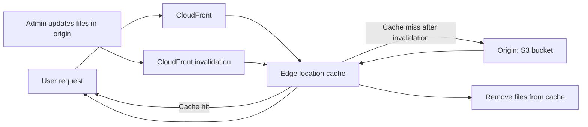

# 156. CloudFront - Cache Invalidations

## 🎯 Giới thiệu
- CloudFront có **backend origin** và các **edge locations** giữ **cache** riêng.
- Khi nội dung ở origin thay đổi, CloudFront **không tự biết ngay**.
- Nếu không làm gì thêm, CloudFront chỉ lấy nội dung mới sau khi **TTL của cache hết hạn**.
- Để nội dung mới được phục vụ sớm hơn, có thể dùng **CloudFront invalidation** để làm mới một phần hoặc toàn bộ cache.

## 1. Vì sao cần Cache Invalidation
- Khi file ở origin được cập nhật, edge locations vẫn có thể giữ **bản cũ trong cache**.
- Điều này làm user chưa thấy nội dung mới ngay.
- Invalidation giúp **xóa cache trước thời hạn TTL**, thay vì chờ hết TTL.

## 2. Cách hoạt động của Invalidation
- Bạn chỉ định **file path** để invalidation.
- Có thể:
  - Invalidate toàn bộ file bằng `*`
  - Invalidate theo path cụ thể, օրինակ: `/images/*`
- CloudFront sẽ gửi yêu cầu đến các edge locations để **xóa các file tương ứng khỏi cache**.
- Lần request tiếp theo, edge location sẽ **fetch lại từ origin** và lấy nội dung mới.

## 3. Ví dụ trong transcript
- Có một CloudFront distribution với **2 edge locations**.
- Mỗi edge location có cache riêng, đang chứa:
  - `index.html`
  - các images
- TTL của các file được đặt là **1 day**.
- Admin cập nhật:
  - `index.html`
  - một số images trong S3 bucket
- Để user thấy thay đổi sớm:
  - invalidate `/index.html`
  - invalidate `/images/*`
- Sau đó, khi user request `index.html`, edge location không còn file trong cache nên sẽ **request lại từ origin** và lấy bản mới.

## 📊 Bảng tóm tắt
| Tiêu chí | Mô tả |
|----------|------|
| Mục đích | Làm mới cache của CloudFront trước khi TTL hết hạn |
| Vấn đề giải quyết | Edge locations vẫn giữ nội dung cũ sau khi origin đã thay đổi |
| Cách thực hiện | Dùng **CloudFront invalidation** |
| Phạm vi invalidation | Có thể theo `*` hoặc theo path cụ thể như `/images/*` |
| Kết quả | File bị xóa khỏi cache, request sau đó sẽ lấy bản mới từ origin |
| Ý nghĩa thi AWS | Hiểu khi nào cần invalidation thay vì chờ TTL |

## 💡 Mẹo ghi nhớ cho kỳ thi AWS
- **TTL hết hạn mới tự refresh**.
- Nếu cần nội dung mới **ngay lập tức**, nghĩ đến **CloudFront invalidation**.
- Nhớ 2 kiểu path hay gặp:
  - `*` để xóa tất cả
  - `/path/*` để xóa theo thư mục
- Invalidation không làm đổi origin, chỉ làm **cache ở edge location bị xóa**.

## ✅ Kết luận
- CloudFront cache invalidations dùng để **xóa cache trước TTL** khi origin đã có nội dung mới.
- Đây là cách để CloudFront phục vụ lại file mới nhanh hơn thay vì chờ cache tự hết hạn.
- Trong transcript, ví dụ rõ nhất là invalidate `index.html` và `/images/*` để đồng bộ cập nhật từ S3 ra edge locations.
