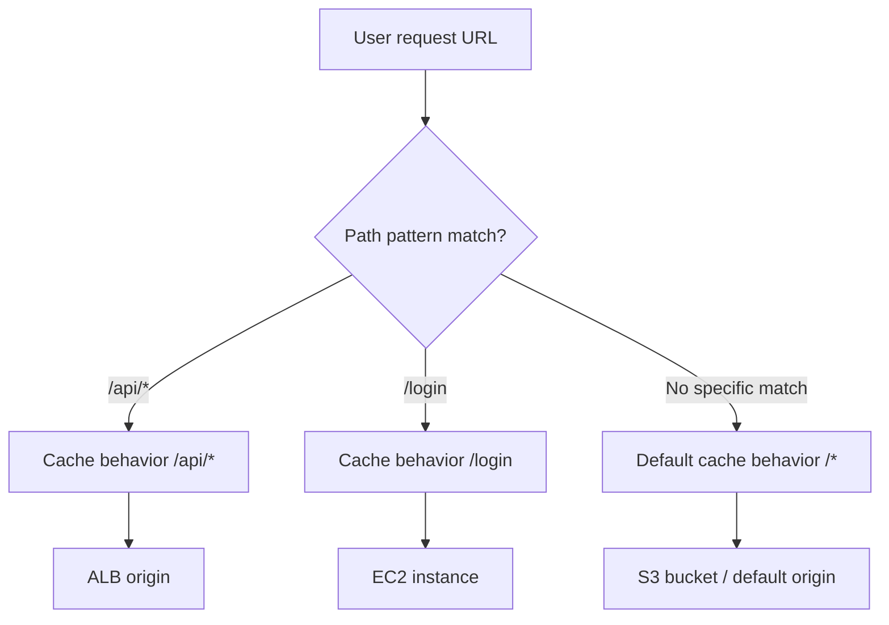

# 157. CloudFront - Cache Behaviors

## 🎯 Giới thiệu
CloudFront **cache behaviors** cho phép bạn cấu hình **nhiều origin** và **nhiều cache** khác nhau theo **URL path pattern**.  
Mục tiêu là:
- Route request đến origin phù hợp theo path.
- Tối ưu cache theo loại nội dung.
- Kiểm soát truy cập vào tài nguyên, ví dụ S3, bằng **signed cookies**.

## 1. Cache Behaviors theo path pattern
- Bạn có thể định nghĩa behavior riêng cho từng pattern như:
  - `/images/*` → một origin cụ thể
  - `/api/*` → origin khác
  - `/*` → **default cache behavior**
- Trong ví dụ của bài giảng:
  - `/api/*` trỏ đến **Application Load Balancer origin**
  - `/*` là **default cache behavior**, luôn được xử lý sau cùng nếu không có match cụ thể hơn
- Khi có nhiều cache behaviors:
  - CloudFront sẽ tìm **match cụ thể nhất**
  - Nếu không có match, nó quay về **default cache behavior**



## 2. Use case: Gate access vào S3 bằng signed cookies
- Một use case được nêu là **kiểm soát truy cập S3 bucket** bằng cách bắt user phải đăng nhập trước.
- Cách làm:
  - Tạo cache behavior cho `/login`
  - User truy cập `/login` sẽ được redirect đến **EC2 instance**
  - EC2 có nhiệm vụ tạo **CloudFront signed cookies**
  - Signed cookies được trả về cho user
  - User dùng signed cookies để truy cập **default cache behavior** (`/*`) và từ đó vào các file trong **S3 bucket**
- Nếu user cố truy cập default cache behavior mà **không có signed cookies**:
  - Request bị từ chối
  - Hệ thống sẽ điều hướng user về `/login`

```mermaid
flowchart LR
    U[User] --> L[/login]
    L --> E[EC2 instance]
    E --> S[Generate CloudFront signed cookies]
    S --> U
    U --> D[Default cache behavior /*]
    D -->|Signed cookies present| B[S3 bucket files]
    D -->|No signed cookies| L
```

## 3. Tối ưu cache hit
- Cache behaviors cũng được dùng để **maximize cache hit**.
- Với **static request**:
  - Có thể đi vào **Amazon S3**
  - Không cần cache policy phức tạp với headers hoặc session
  - Tăng hiệu quả cache dựa trên chính resource được request
- Với **dynamic request**:
  - Ví dụ REST/HTTP server dùng **load balancer** và **EC2**
  - Có thể cache dựa trên **headers** và **cookies** phù hợp với cache policy đã định nghĩa
- Ý chính là:
  - Static content và dynamic content nên có **cache behavior khác nhau**
  - Mỗi loại request được tối ưu theo đặc tính riêng

## 📊 Bảng tóm tắt
| Tiêu chí | Mô tả |
|----------|------|
| Khái niệm | CloudFront dùng cache behaviors để route request theo URL path pattern |
| Matching | Ưu tiên match cụ thể trước, `/*` là default cache behavior và được xử lý sau cùng |
| Routing | Có thể route đến các origin khác nhau như ALB, EC2, S3 |
| Bảo vệ truy cập | Có thể dùng `/login` + EC2 để tạo CloudFront signed cookies |
| Tối ưu cache | Static content có thể cache đơn giản hơn, dynamic content có thể cache theo headers/cookies |
| Mục tiêu | Tăng kiểm soát truy cập và maximize cache hit |

## 💡 Mẹo ghi nhớ cho kỳ thi AWS
- `/*` = **default cache behavior**, luôn là fallback cuối cùng.
- Path cụ thể hơn như `/api/*` hoặc `/login` sẽ được xét trước `/*`.
- Nếu cần bảo vệ S3 bằng login, nhớ flow:
  - `/login` → EC2 → **signed cookies** → `/*` → S3
- Cache behavior khác nhau giúp:
  - Route đúng origin
  - Tăng cache hit
  - Tách static và dynamic traffic rõ ràng

## ✅ Kết luận
CloudFront **cache behaviors** cho phép phân luồng request theo path pattern, gắn mỗi pattern với một origin hoặc cache strategy riêng, và luôn dùng `/*` làm default fallback. Trong transcript, hai use case chính là **gating access vào S3 bằng signed cookies** và **tối ưu cache hit** cho static/dynamic content.
