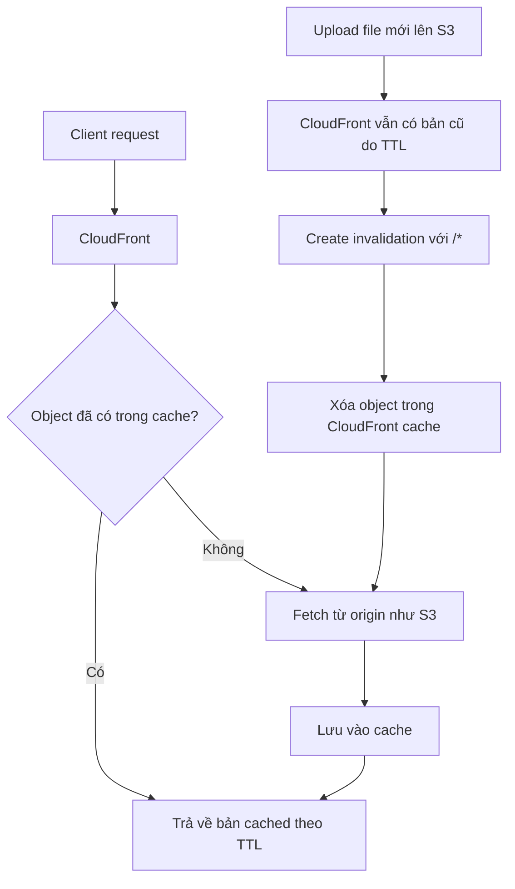

# 158. CloudFront - Caching & Caching Invalidations - Hands On

## 🎯 Giới thiệu
Bài này minh họa cách cấu hình **CloudFront caching behavior** trên **platform distribution**, cách tạo **cache policy**, **origin request policy**, và cách dùng **invalidations** để buộc CloudFront lấy lại nội dung mới từ **S3**.

## 1. Cache policy và origin request policy
- Ở **default behavior**:
  - Path pattern là `*`.
  - Không sửa được path pattern vì đây là behavior mặc định.
- Trong phần **cache key and origin request**:
  - Có thể tạo **cache policy**.
  - Có thể tạo thêm **origin request policy** nếu cần.

### Cache policy
- Ví dụ: `DemoCachePolicy`.
- Cho phép điều khiển **TTL**:
  - `minimum TTL`
  - `maximum TTL`
  - `default TTL`
- Cho phép cấu hình **cache key settings**:
  - Headers nào được đưa vào cache key
  - Query strings nào được đưa vào cache key
  - Cookies nào được đưa vào cache key
- Ý nghĩa:
  - Data được cache dựa trên các thành phần này.
  - Nếu chọn headers/query strings/cookies trong cache key, chúng cũng sẽ được chuyển tới origin request.

### Origin request policy
- Ví dụ: `DemoOriginPolicy`.
- Dùng để thêm các thành phần bổ sung vào request gửi tới origin:
  - Headers
  - Query strings
  - Cookies
- Mục tiêu là mở rộng request gửi tới origin ngoài những gì đã có trong cache key.

## 2. Cache behaviors và độ ưu tiên
- Có thể tạo **new behavior** để override behavior mặc định.
- Ví dụ:
  - `/images/*` có thể trỏ tới **new origin**.
  - Origin có thể là **S3 bucket**, **EC2 instance**, hoặc bất kỳ origin nào khác.
- Mỗi behavior có thể có:
  - **cache key**
  - **origin request policy**
- Khi nhiều behaviors cùng tồn tại:
  - **behavior cụ thể hơn** sẽ được chọn trước.

## 3. Caching invalidations
- Transcript dùng file `index.html` để minh họa TTL.
- Sau khi sửa nội dung trong `index.html`:
  - Upload lại file vào **S3 bucket**.
  - Vì **versioning chưa bật**, file bị **replace**.
- Kết quả:
  - Mở trực tiếp từ **S3** thấy nội dung mới.
  - Refresh qua **CloudFront** vẫn thấy nội dung cũ vì CloudFront còn cache theo TTL, ở đây là **1 day**.
- Cách xử lý:
  - Vào tab **Invalidations** trong CloudFront.
  - Tạo invalidation với wildcard `*`.
  - Điều này xóa mọi object trong CloudFront cache.
  - Sau đó CloudFront sẽ fetch lại object mới từ **Amazon S3**.
- Sau khi invalidation hoàn tất:
  - Refresh CloudFront URL sẽ thấy nội dung mới.

## 📊 Bảng tóm tắt
| Tiêu chí | Mô tả |
|----------|------|
| Default behavior | Path pattern là `*`, không sửa được path pattern |
| Cache policy | Điều khiển TTL và cache key cho headers, query strings, cookies |
| Origin request policy | Thêm headers, query strings, cookies vào request gửi tới origin |
| Multiple behaviors | Có thể tạo behavior riêng như `/images/*` và behavior cụ thể hơn sẽ được chọn trước |
| Invalidation | Dùng `*` để xóa object trong CloudFront cache và buộc fetch lại từ origin |
| Kết quả thực hành | S3 thấy nội dung mới ngay, CloudFront chỉ thấy nội dung mới sau invalidation |

## 💡 Mẹo ghi nhớ cho kỳ thi AWS
- **Cache policy** = quyết định cái gì đi vào **cache key** và TTL.
- **Origin request policy** = quyết định cái gì được gửi thêm tới **origin**.
- **Specific behavior wins** = behavior cụ thể hơn sẽ được ưu tiên.
- **CloudFront có thể giữ bản cũ theo TTL** dù S3 đã có bản mới.
- Muốn ép CloudFront lấy lại nội dung mới, dùng **invalidation**.

## ✅ Kết luận
Bài học này cho thấy CloudFront cache dựa trên **TTL**, **cache key**, và **behavior**. Khi nội dung ở **S3** thay đổi nhưng CloudFront vẫn trả về bản cũ, có thể dùng **invalidation** để xóa cache và buộc CloudFront lấy lại object mới từ origin.
