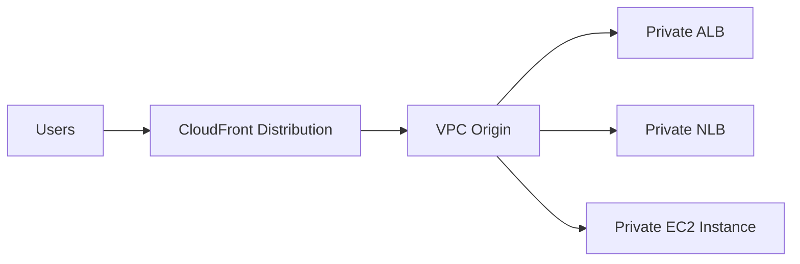

# 159. CloudFront - ALB/EC2 as an Origin

## 🎯 Giới thiệu
- Bài này nói về cách dùng `CloudFront` để phân phối nội dung từ `ALB` hoặc `EC2` làm origin.
- Có 2 cách chính:
  - **Cách mới, tốt hơn**: dùng `VPC origins`
  - **Cách cũ**: dùng public network và whitelist IP của CloudFront edge locations
- Mục tiêu là hiểu cách CloudFront kết nối đến backend và vì sao `VPC origins` an toàn hơn.

## 1. Cách mới: `VPC origins` 🛡️
- `CloudFront distribution` nhận request từ người dùng qua các `edge locations`.
- Sau đó CloudFront tạo một `VPC origin` để kết nối đến backend.
- Backend có thể là:
  - `ALB`
  - `NLB`
  - `EC2 instance`
- Application có thể nằm trong private subnets của VPC.
- Toàn bộ hệ thống vẫn có thể giữ **private**, không cần expose trực tiếp ra Internet.
- Đây được mô tả là một trong những cách setup an toàn nhất vì:
  - ứng dụng vẫn hosted privately
  - chỉ những gì cần thiết mới được expose qua CloudFront

## 2. Cách cũ: public network + security group whitelist 🌐
- Trước khi có `VPC origin`, CloudFront thường phải đi theo cách cũ hơn.
- `EC2 instance` hoặc `ALB` phải là **public**.
- Bạn phải lấy danh sách public IP của CloudFront edge locations.
- Sau đó cập nhật `security group` để chỉ cho phép các public IP này truy cập vào `EC2` hoặc `ALB`.
- Nếu dùng `ALB`:
  - `ALB` phải public
  - `EC2 instances` phía sau có thể private
  - giao tiếp giữa `ALB` và `EC2` vẫn có thể dùng `security group`
- Cách này tốn công hơn vì phải:
  - tìm public IPs của CloudFront
  - cập nhật `security group`

## 3. Nhược điểm của cách cũ và lý do chọn `VPC origins` ⚠️
- Cách cũ có rủi ro:
  - nếu ai đó thay đổi `security group` của `ALB` hoặc `EC2`
  - thì instance có thể bị public rộng hơn chỉ riêng CloudFront
- Vì vậy, so với cách cũ, `VPC origins` là cách **tốt hơn và mới hơn**.
- Kết luận của bài:
  - nếu muốn triển khai an toàn và private hơn, nên dùng `VPC origins`
  - cách public + whitelist IP chỉ là cách cũ để hiểu lịch sử triển khai

## 📊 Bảng tóm tắt
| Tiêu chí | Mô tả |
|----------|------|
| Cách mới | Dùng `VPC origins` |
| Backend hỗ trợ | `ALB`, `NLB`, `EC2 instance` |
| Mức độ private | Có thể giữ toàn bộ backend trong private subnets |
| Cách cũ | Public `ALB`/`EC2` + whitelist public IP của CloudFront |
| Nhược điểm cách cũ | Phải cập nhật `security group`, dễ phát sinh rủi ro nếu bị sửa sai |
| Ý nghĩa thi AWS | Hiểu sự khác nhau giữa cách cũ và cách mới khi dùng CloudFront làm origin |

## 💡 Mẹo ghi nhớ cho kỳ thi AWS
- Nhớ nhanh:
  - **CloudFront + private backend** = `VPC origins`
  - **CloudFront + public IP whitelist** = cách cũ
- Nếu đề bài nhấn mạnh:
  - private subnets
  - không expose Internet
  - an toàn hơn
  - thì nghĩ ngay đến `VPC origins`
- Nếu đề bài nói về:
  - edge locations IP
  - security group allow CloudFront IPs
  - public ALB/EC2
  - thì đó là cách triển khai cũ

## ✅ Kết luận
- `CloudFront` có thể làm origin cho `ALB` hoặc `EC2`.
- Cách **mới và tốt hơn** là dùng `VPC origins` để giữ backend private.
- Cách **cũ** là public origin + whitelist IP của CloudFront edge locations, nhưng phức tạp và kém an toàn hơn.
