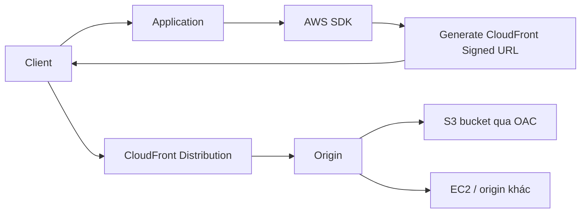

# 161. CloudFront Signed URL / Cookies

## 🎯 Giới thiệu
- Khi muốn **giữ content ở trạng thái private** nhưng vẫn cấp quyền truy cập cho người dùng toàn cầu, có thể dùng:
  - **CloudFront signed URL**
  - **CloudFront signed cookie**
- Mục tiêu là:
  - Biết **ai có quyền truy cập**
  - Kiểm soát **content nào** được truy cập trên **CloudFront distribution**
- Ở cuối bài, ý chính là phân biệt:
  - **Signed URL**
  - **Signed Cookie**

## 1. Cách hoạt động của CloudFront Signed URL / Cookie
- Khi tạo **URL** hoặc **cookie**, cần gắn **policy**.
- Policy xác định:
  - **Thời gian hết hạn** của URL/cookie
  - **IP ranges** nào được truy cập
  - **Trusted signers** nào có thể tạo signed URL cho người dùng
- Thời hạn có thể rất ngắn hoặc rất dài:
  - Content như **movie** hoặc **music**: có thể chỉ vài phút
  - Content private dùng lâu dài: có thể kéo dài **nhiều năm**

### Mermaid: Flow của Signed URL

- Flow trong transcript:
  - Client **auth/authenticate** với application
  - Application dùng **AWS SDK** để tạo **signed URL**
  - URL được trả về cho client
  - Client dùng URL đó để lấy dữ liệu qua **CloudFront**
- Với **signed cookie**, cách dùng tương tự, nhưng cookie có thể dùng lại cho nhiều file

## 2. Signed URL vs Signed Cookie
- **Signed URL**
  - Cấp quyền cho **từng file riêng lẻ**
  - 1 file = 1 URL
  - Nếu có 100 files thì sẽ có 100 URLs
- **Signed Cookie**
  - Cấp quyền cho **nhiều files**
  - Cookie có thể **reuse**
  - 1 cookie dùng cho nhiều file

- Chọn theo ngữ cảnh:
  - Muốn kiểm soát theo file: dùng **signed URL**
  - Muốn cấp quyền cho nhiều file cùng lúc: dùng **signed cookie**

## 3. CloudFront Signed URL vs S3 Pre-signed URL
- Đây là hai khái niệm khác nhau, phục vụ mục đích khác nhau.

### CloudFront Signed URL
- Cho phép truy cập vào **path**
- Dùng được với **bất kỳ origin nào**
  - Không chỉ S3
  - Có thể là **HTTP backend** hoặc origin khác
- Là **account-wide key-pair**
  - Chỉ **root** có thể quản lý
- Có thể filter theo:
  - **IP**
  - **path**
  - **date**
  - **expiration**
- Có thể tận dụng **CloudFront caching**

### S3 Pre-signed URL
- Gửi request như thể là **người đã pre-sign URL**
- Nếu URL được sign bằng IAM principal của mình, thì người nhận URL có quyền giống như mình
- Có **limited lifetime**
- Client có thể truy cập **trực tiếp S3 bucket** bằng URL đó

### Khi nào dùng cái nào?
- Nếu người dùng truy cập qua **CloudFront distribution**:
  - Dùng **CloudFront signed URL**
- Nếu người dùng truy cập **trực tiếp S3** và không dùng CloudFront:
  - Dùng **S3 pre-signed URL**
- Trong transcript, nếu S3 được bảo vệ bởi **bucket policy** và chỉ cho phép **OAI/OAC**, thì client **không thể** truy cập trực tiếp S3 như bình thường, nên cần **CloudFront signed URL**

## 📊 Bảng tóm tắt
| Tiêu chí | Mô tả |
|----------|------|
| Mục đích | Cấp quyền truy cập private content cho người dùng |
| CloudFront signed URL | Truy cập theo từng file, qua CloudFront |
| CloudFront signed cookie | Truy cập nhiều file, có thể reuse cookie |
| Policy | Xác định expiration, IP ranges, trusted signers |
| Thời hạn | Có thể vài phút hoặc kéo dài nhiều năm |
| CloudFront signed URL | Dùng cho path, không phụ thuộc origin |
| S3 pre-signed URL | Truy cập trực tiếp S3, request như người đã sign |
| Caching | CloudFront signed URL tận dụng được CloudFront caching |
| Quản lý key-pair | Account-wide, chỉ root quản lý theo transcript |

## 💡 Mẹo ghi nhớ cho kỳ thi AWS
- **Signed URL = 1 file**
- **Signed Cookie = nhiều file**
- **CloudFront signed URL**:
  - Dùng với **CloudFront**
  - Cho phép theo **path**
  - Có thể áp dụng **IP / date / expiration**
- **S3 pre-signed URL**:
  - Dùng trực tiếp với **S3**
  - Request mang quyền của người đã sign URL
- Nếu S3 bị khóa bởi **OAI/OAC** và bạn muốn cấp quyền cho người dùng ở phía ngoài:
  - Nghĩ đến **CloudFront signed URL / cookies**
- Nếu mục tiêu là phân phối content qua CloudFront và vẫn giữ private:
  - Chọn **signed URL** hoặc **signed cookie** tùy số lượng file cần cấp quyền

## ✅ Kết luận
- **CloudFront signed URL / signed cookie** dùng để bảo vệ content private nhưng vẫn cho phép phân phối toàn cầu.
- **Signed URL** phù hợp cho từng file, còn **signed cookie** phù hợp cho nhiều file.
- **CloudFront signed URL** khác **S3 pre-signed URL** ở chỗ nó hoạt động qua CloudFront và không phụ thuộc vào S3 làm origin.
- Trong đề thi, hãy chú ý các từ khóa: **policy**, **expiration**, **IP ranges**, **trusted signers**, **OAC/OAI**, **CloudFront caching**, và sự khác nhau giữa **CloudFront** với **S3**.
