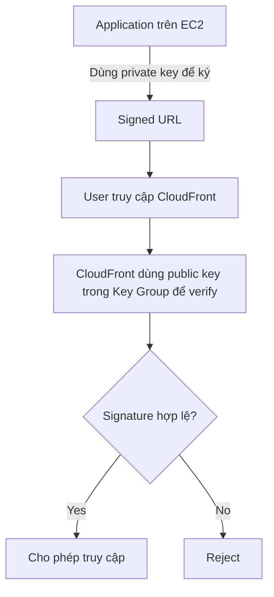

# 162. CloudFront Signed URL - Key Groups + Hands On

## 🎯 Giới thiệu
- Bài này nói về cách tạo và dùng key để ký `CloudFront Signed URL`.
- Có 2 cách signer:
  - Cách mới, được khuyến nghị: dùng `trusted key group`
  - Cách cũ: dùng `CloudFront key pair` gắn với `root account`
- Mục tiêu chính:
  - `EC2` hoặc application sẽ dùng `private key` để ký URL
  - `CloudFront` dùng `public key` để xác minh chữ ký

## 1. Cách mới: Trusted Key Group ✅
- Đây là cách được khuyến nghị hiện tại.
- Có thể tạo một hoặc nhiều `key group` trong CloudFront distribution.
- Tạo cặp `RSA key`:
  - `private key`: dùng ở application, ví dụ `EC2`, để tạo signed URL
  - `public key`: upload lên `CloudFront` để verify signature
- Có thể tạo và rotate keys qua APIs.
- `IAM` được dùng để bảo vệ API quản lý `key group` và `public keys`.

## 2. Hands On trong console 🛠️
- Vào phần quản lý CloudFront keys trong console.
- Tạo `public key`:
  - Cần sinh `RSA key` với kích thước `2,048 bits`
  - Lấy `public key` và dán vào CloudFront
  - Nếu lỗi thì kiểm tra lại đúng `2,048 bits`
- Tạo `key group`:
  - Có thể thêm tối đa `5 public keys`
  - `key group` sẽ được CloudFront reference để cho phép signed URL
- Lưu ý:
  - Transcript dùng `root user` trong demo
  - Nhưng `IAM user` có quyền phù hợp cũng có thể tạo `public keys` và `key groups`

## 3. Cách cũ: CloudFront Key Pair cổ điển ⚠️
- Cách này yêu cầu dùng `root account` credentials và AWS console.
- Vào `My Security Credentials` của root account.
- Có thể:
  - tạo `new key pair`
  - hoặc upload key pair riêng
- Sau đó:
  - download `private key file`
  - download `public key file`
- Key pair có thể ở trạng thái:
  - `active`
  - `inactive`
  - `deleted`
- Nhược điểm:
  - Không an toàn bằng cách mới
  - Không có APIs để quản lý
  - Không nên dùng `root account`

## 📊 Bảng tóm tắt
| Tiêu chí | Mô tả |
|----------|------|
| Cách khuyến nghị | `Trusted key group` |
| Cách cũ | `CloudFront key pair` gắn với `root account` |
| Private key | Dùng bởi application/`EC2` để ký URL |
| Public key | Upload lên `CloudFront` để verify chữ ký |
| Quản lý key | Có thể tạo/rotate bằng APIs ở cách mới |
| Bảo mật | Cách mới an toàn hơn, không cần root |
| Key group | Có thể chứa tối đa `5 public keys` |

## 💡 Mẹo ghi nhớ cho kỳ thi AWS
- Nhớ rằng:
  - `New = Key Group + IAM + APIs`
  - `Old = Root account + Console + CloudFront key pair`
- `Private key` luôn nằm ở phía application để ký.
- `Public key` luôn nằm ở phía CloudFront để verify.
- Nếu đề bài nhắc đến signed URL và quản lý key hiện đại, chọn `trusted key group`.
- Nếu thấy nhắc đến `root account` và `CloudFront key pair`, đó là cách cũ, không khuyến nghị.

## ✅ Kết luận
- `CloudFront Signed URL` có 2 cơ chế signer, nhưng cách nên dùng là `trusted key group`.
- Cách mới cho phép quản lý key bằng APIs, dùng `IAM` để bảo vệ, và dễ automate hơn.
- Cách cũ phụ thuộc `root account`, không có APIs, và kém an toàn hơn.
- Với bài thi AWS, ưu tiên nhớ: `public key` lên `CloudFront`, `private key` ở application/`EC2`.
