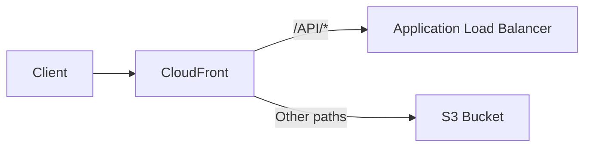
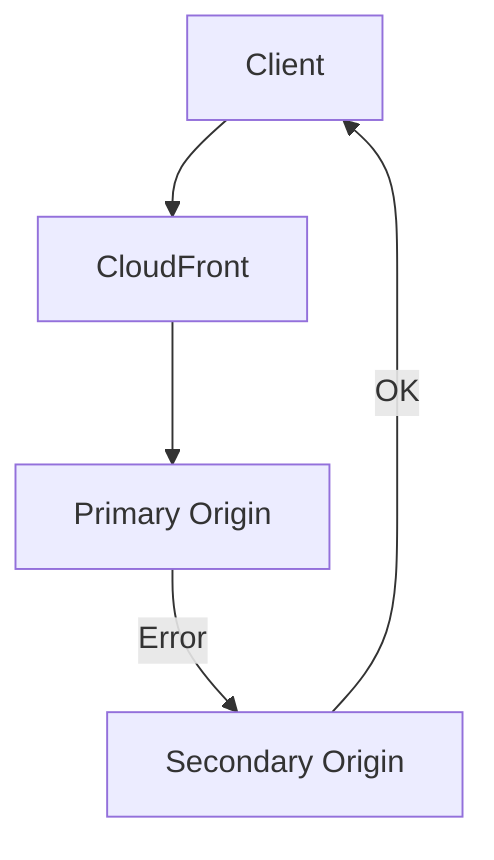
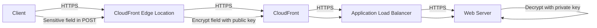

# 163. CloudFront Advanced Concepts

## 🎯 Giới thiệu
- Bài này tập trung vào các khái niệm **CloudFront advanced** thường gặp trong kỳ thi AWS.
- Nội dung chính:
  - **Pricing** và **Price Classes**
  - **Multiple origins** và **Origin Groups**
  - **Field-level encryption**

## 1. Pricing và Price Classes 💰
- **CloudFront edge locations** nằm trên toàn thế giới, nên chi phí **data out** sẽ khác nhau theo khu vực.
- Càng đi về các khu vực đắt hơn thì giá càng cao.
- Ví dụ trong transcript:
  - **Mexico, United States, Canada**: 10 TB đầu tiên khoảng **$0.08/GB**
  - **India**: khoảng **$0.17/GB**
  - Khi lượng data transfer tăng rất lớn, chi phí trên mỗi GB giảm xuống
  - Trên **5 petabytes**, chi phí ở United States có thể xuống khoảng **$0.02/GB**
- **Price classes** cho phép giảm số lượng edge locations được dùng để tối ưu chi phí.

### Các loại Price Class
- **Price Class All**
  - Dùng tất cả regions
  - Performance tốt nhất
  - Chi phí cao hơn
- **Price Class 200**
  - Dùng nhiều regions
  - Loại trừ các regions đắt nhất
- **Price Class 100**
  - Chỉ dùng các regions rẻ nhất

## 2. Multiple Origins và Origin Groups 🌍
- CloudFront có thể route request đến **different origins** dựa trên:
  - **content type**
  - **path**
- Dùng **cache behaviors** để map path đến origin phù hợp.
- Ví dụ:
  - `/API/*` → **Application Load Balancer**
  - Các path khác → **S3 bucket**

### Mermeid: Multiple origins

### Origin Groups
- **Origin group** dùng cho **high availability** và **failover**.
- Một origin group gồm:
  - **1 primary origin**
  - **1 secondary origin**
- Nếu **primary origin** lỗi, CloudFront sẽ retry request sang **secondary origin**.

### Failover flow

### Trường hợp dùng với S3
- Có thể dùng **two S3 buckets** trong hai regions khác nhau.
- Khi có **replication** giữa hai bucket:
  - dữ liệu ở origin A được replicate sang origin B
- Nếu region của bucket chính gặp outage:
  - CloudFront failover sang bucket phụ ở region khác
- Mục tiêu:
  - **regional high availability**
  - **disaster recovery**

## 3. Field-level Encryption 🔐
- Mục đích: bảo vệ **sensitive information** xuyên suốt application stack.
- Là lớp bảo mật bổ sung bên cạnh **encryption in flight using HTTPS**.
- Dữ liệu nhạy cảm sẽ được **encrypt tại edge location**.
- Việc này dùng **asymmetric encryption**:
  - **public key** để encrypt
  - **private key** để decrypt
- Trong **POST request**, có thể chỉ định tối đa **10 fields** cần mã hóa, ví dụ **credit card**.

### Flow xử lý

- Trong flow này:
  - **Edge location** sẽ encrypt field nhạy cảm
  - Dữ liệu đi qua **CloudFront** và **Application Load Balancer** vẫn ở dạng encrypted
  - Chỉ **web server** có **private key** và logic ứng dụng phù hợp mới decrypt được field đó

## 📊 Bảng tóm tắt
| Tiêu chí | Mô tả |
|----------|------|
| Pricing | Chi phí data out của CloudFront thay đổi theo region/continent của edge location |
| Price Class All | Dùng toàn bộ edge locations, performance tốt nhất, chi phí cao hơn |
| Price Class 200 | Dùng nhiều regions nhưng loại trừ regions đắt nhất |
| Price Class 100 | Chỉ dùng các regions rẻ nhất |
| Multiple Origins | Route đến origin khác nhau dựa trên path hoặc loại nội dung |
| Origin Groups | Gồm primary và secondary origin để failover khi origin chính lỗi |
| Field-level Encryption | Mã hóa các field nhạy cảm ở edge bằng public key, chỉ web server giải mã bằng private key |

## 💡 Mẹo ghi nhớ cho kỳ thi AWS
- **Price Class = tối ưu chi phí bằng cách giảm số edge locations**
- **All = tất cả regions**, **200 = nhiều regions**, **100 = ít regions nhất**
- **Multiple origins = route theo path**
- **Origin groups = failover / high availability**
- **Field-level encryption = encrypt field nhạy cảm tại edge, dùng public key / private key**
- Nếu đề bài nhắc tới:
  - **regional failover**
  - **disaster recovery**
  - **path-based routing**
  - **sensitive data in POST request**
  
  thì hãy nghĩ ngay đến các tính năng CloudFront trong bài này.

## ✅ Kết luận
- CloudFront không chỉ là CDN, mà còn hỗ trợ:
  - tối ưu chi phí qua **Price Classes**
  - định tuyến linh hoạt qua **multiple origins**
  - tăng độ sẵn sàng với **origin groups**
  - bảo vệ dữ liệu nhạy cảm bằng **field-level encryption**
- Đây là các ý quan trọng để nhận diện nhanh trong câu hỏi thi AWS.
