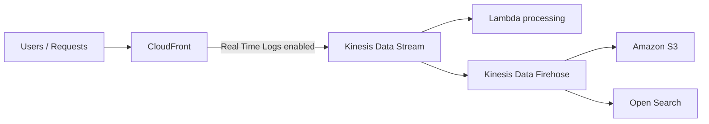

# 164. CloudFront - Real Time Logs

## 🎯 Giới thiệu
CloudFront Real Time Logs cho phép gửi **tất cả request** mà CloudFront nhận được sang **Kinesis Data Stream** theo thời gian thực.  
Mục tiêu là để **monitor**, **analyze** và **take actions** dựa trên hiệu năng content delivery.

## 1. Luồng xử lý Real Time Logs
- Users gửi nhiều request vào **CloudFront**.
- Khi bật **real-time logs**, các request này được log vào **Kinesis Data Stream**.
- Từ stream này, bạn có thể dùng:
  - **Lambda** để xử lý record
  - **Kinesis Data Firehose** để xử lý theo batch khi cần **near real-time processing**
- Với Firehose, dữ liệu có thể được gửi tiếp đến:
  - **Amazon S3**
  - **Open Search**
  - hoặc destination khác phù hợp

## 2. Các tuỳ chọn cấu hình quan trọng
- **Sampling rate**:
  - Là phần trăm request bạn muốn nhận trong **Kinesis Data Stream**
  - Hữu ích khi traffic rất cao và không muốn log toàn bộ request
- **Fields**:
  - Chọn các field cần lấy vào stream
- **Cache behaviors / path patterns**:
  - Chọn những cache behavior hoặc path pattern cụ thể để theo dõi
  - Ví dụ: chỉ muốn xem request tới path như `/images`

## 3. Ý nghĩa thực tế
- Phù hợp khi cần theo dõi request gần như ngay lập tức
- Giúp tập trung vào một phần traffic thay vì toàn bộ
- Cho phép lọc theo **path pattern** và chọn dữ liệu cần thiết để phân tích

## 📊 Bảng tóm tắt
| Tiêu chí | Mô tả |
|----------|------|
| Dịch vụ chính | **CloudFront Real Time Logs** |
| Đích nhận log | **Kinesis Data Stream** |
| Xử lý sau stream | **Lambda** hoặc **Kinesis Data Firehose** |
| Mục tiêu | Monitor, analyze, và phản ứng theo hiệu năng delivery |
| Tùy chọn cấu hình | **sampling rate**, **fields**, **cache behaviors / path patterns** |
| Use case | Chỉ lấy một phần request hoặc một path cụ thể như `/images` |

## 💡 Mẹo ghi nhớ cho kỳ thi AWS
- Nhớ mấu chốt: **CloudFront Real Time Logs -> Kinesis Data Stream**
- Nếu cần xử lý tiếp:
  - **Lambda** cho xử lý record
  - **Firehose** cho batch processing và đẩy sang **S3** hoặc **Open Search**
- Khi traffic lớn, hãy nghĩ đến **sampling rate** thay vì log toàn bộ request
- Có thể giới hạn theo **fields** và **path patterns** để giảm dữ liệu không cần thiết

## ✅ Kết luận
CloudFront Real Time Logs là cơ chế gửi request của CloudFront sang **Kinesis Data Stream** theo thời gian thực, phục vụ giám sát và phân tích.  
Điểm cần nhớ khi ôn thi là luồng **CloudFront -> Kinesis Data Stream -> Lambda/Firehose**, cùng các tuỳ chọn **sampling rate**, **fields**, và **path patterns**.
