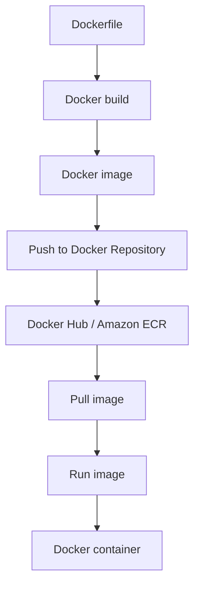

# 165. Docker Introduction

## 🎯 Giới thiệu
Docker là một **software development platform** dùng để deploy apps theo kiểu **container technology**. Ý tưởng chính là đóng gói ứng dụng vào các **containers** chuẩn hóa, để app chạy **giống nhau trên mọi operating system** và giảm vấn đề compatibility.

## 1. Docker là gì và dùng để làm gì? 🚀
- Docker giúp package app vào **containers**.
- Container có tính chuẩn hóa, nên:
  - chạy trên bất kỳ machine nào
  - behavior **predictable**
  - giảm công sức maintain và deploy
- Docker phù hợp với:
  - **microservice architecture**
  - **lift and shift** apps từ on-premises lên cloud
  - bất kỳ nhu cầu nào cần chạy **container**

## 2. Docker hoạt động và vòng đời image/container 🧱
- Trên một server, có thể là **EC2 Instance**:
  - chạy **Docker agent**
  - sau đó start nhiều **Docker containers**
- Một server có thể chạy nhiều container:
  - nhiều container cho cùng một Java app
  - nhiều container cho cùng một node JS app
  - cả database như **MySQL** cũng có thể chạy trong Docker
- Docker image được lưu trong **Docker Repository**:
  - **Docker Hub**: public repository, có base images cho nhiều technology/OS như Ubuntu, MySQL
  - **Amazon ECR (Elastic Container Registry)**: dùng cho private images
  - **Amazon ECR Public Gallery**: public repository option của ECR

## 3. Docker vs Virtual Machine và dịch vụ AWS liên quan ☁️
- Docker khác **virtual machine** ở chỗ:
  - Docker **share resources với host**
  - nhiều containers có thể cùng chạy trên một server
- Với **VM**:
  - có infrastructure
  - host OS
  - hypervisor
  - app + guest OS
  - các EC2 virtual machines là separate và isolated
- Với **Docker container**:
  - có infrastructure
  - host OS
  - **Docker Daemon**
  - nhiều containers nhẹ chạy trên cùng daemon
  - có thể share networking và some data
- Theo transcript, Docker container:
  - ít “secure” hơn VM theo cách nói trong bài
  - nhưng chạy được **nhiều container hơn trên một server**
- Dịch vụ AWS liên quan đến Docker:
  - **Amazon ECS**: nền tảng quản lý Docker của AWS
  - **Amazon EKS**: managed version of Kubernetes
  - **AWS Fargate**: serverless container platform, dùng với cả ECS và EKS
  - **Amazon ECR**: lưu container images

## 📊 Bảng tóm tắt
| Tiêu chí | Mô tả |
|----------|------|
| Docker | Platform để deploy apps theo dạng container |
| Lợi ích | Standardized, predictable, dễ maintain và deploy |
| Use cases | Microservice architecture, lift and shift, chạy container |
| Image lưu ở đâu | Docker Hub, Amazon ECR, ECR Public Gallery |
| Vòng đời | Dockerfile → build → image → push → repository → pull → run → container |
| So với VM | Docker share host resources, VM tách biệt qua hypervisor |
| AWS services | ECS, EKS, Fargate, ECR |

## 💡 Mẹo ghi nhớ cho kỳ thi AWS
- **Dockerfile → image → container**: nhớ đúng thứ tự vòng đời.
- **Push** image lên repository, **pull** về rồi **run** thành container.
- **ECR** là nơi lưu container images trên AWS.
- **ECS** là service quản lý container của AWS.
- **EKS** là managed Kubernetes của AWS.
- **Fargate** là serverless container platform và chạy được với cả **ECS** lẫn **EKS**.
- Khi so với VM, nhớ điểm mấu chốt: **containers share host resources**, còn **VM isolated** hơn.

## ✅ Kết luận
Docker là nền tảng container giúp app chạy nhất quán trên nhiều môi trường. Trong AWS, ba mảnh ghép quan trọng cần nhớ là **ECS**, **EKS**, **Fargate**, cùng với **ECR** để lưu images.
