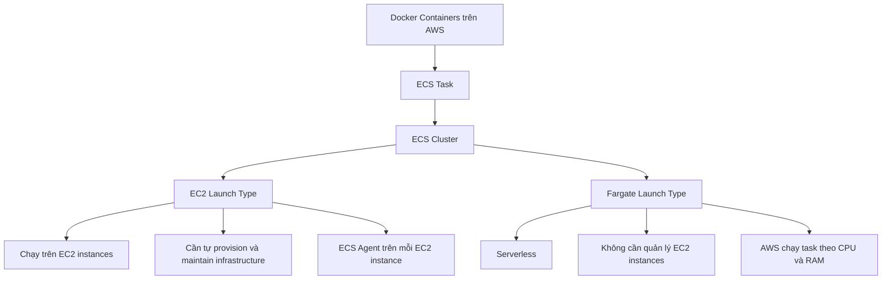

# 166. Amazon ECS

## 🎯 Giới thiệu
Amazon ECS (Elastic Container Service) là dịch vụ để chạy Docker containers trên AWS dưới dạng **ECS Task** trong một **ECS Cluster**.

- Có 2 **launch types** chính:
  - **EC2 Launch Type**
  - **Fargate Launch Type**
- ECS thường xuất hiện trong câu hỏi thi về:
  - cách chạy containers
  - quyền IAM cho task và instance
  - tích hợp Load Balancer
  - lưu trữ dữ liệu bền vững với **EFS**

## 1. EC2 Launch Type vs Fargate Launch Type
### 🖥️ EC2 Launch Type
- ECS Cluster được tạo từ nhiều **EC2 instances**
- Bạn phải **provision** và **maintain** hạ tầng
- Mỗi EC2 instance phải chạy **ECS Agent**
- ECS Agent sẽ register instance vào:
  - Amazon ECS service
  - ECS Cluster đã chỉ định
- Khi start/stop ECS tasks, AWS sẽ đặt containers lên các EC2 instances phù hợp

### ☁️ Fargate Launch Type
- Không cần provision infrastructure
- Không cần quản lý EC2 instances
- Là mô hình **serverless**
- Chỉ cần tạo **task definition**
- AWS tự chạy ECS tasks dựa trên nhu cầu **CPU** và **RAM**
- Scale bằng cách tăng số lượng tasks, không cần thêm EC2 instances

### ✅ Ý chính để ôn thi
- **EC2 Launch Type**: tự quản lý EC2 instances
- **Fargate**: serverless, dễ quản lý hơn
- Đề thi thường ưu tiên **Fargate** khi muốn đơn giản hóa vận hành

## 2. IAM Roles cho ECS Tasks
### 🔐 EC2 Instance Profile Role
Chỉ dùng khi **EC2 Launch Type**.

- Dùng bởi **ECS Agent**
- ECS Agent dùng role này để gọi:
  - ECS service
  - **CloudWatch Logs** để gửi container logs
  - **ECR** để pull Docker images
  - **Secrets Manager** hoặc **SSM Parameter Store** để tham chiếu sensitive data

### 🎭 ECS Task Role
Dùng cho **cả EC2 Launch Type và Fargate**.

- Mỗi task có thể có một role riêng
- Role được khai báo trong **task definition**
- Cho phép task gọi các AWS services khác nhau
- Ví dụ trong transcript:
  - Task A role gọi **S3**
  - Task B role gọi **DynamoDB**

### 📌 Điểm cần nhớ
- **Instance Profile Role** = dành cho ECS Agent trên EC2
- **Task Role** = dành cho application chạy trong task

## 3. Load Balancer và Data Persistence
### 🌐 Load Balancer Integrations
ECS tasks có thể được expose ra ngoài bằng Load Balancer.

- **Application Load Balancer (ALB)**
  - Là lựa chọn tốt nhất cho đa số use case
  - Dùng được với **EC2** và **Fargate**
  - Hỗ trợ endpoint HTTP/HTTPS

- **Network Load Balancer (NLB)**
  - Khuyến nghị khi cần:
    - rất high throughput
    - high performance
    - dùng với **AWS Private Link**

- **Classic Load Balancer**
  - Có thể dùng
  - Không được khuyến nghị
  - Không có advanced features
  - Không thể link với **Fargate**

### 💾 Data Persistence với EFS
Nếu cần lưu trữ dữ liệu bền vững cho ECS, transcript nhấn mạnh **EFS**.

- **Amazon EFS** là network file system
- Compatible với cả:
  - **EC2 Launch Type**
  - **Fargate Launch Type**
- Có thể mount trực tiếp vào ECS tasks
- Các tasks ở nhiều **AZ** có thể share cùng một data source
- Use case chính:
  - **persistent multi-AZ shared storage** cho containers

### ⭐ Combo nổi bật
- **Fargate + EFS**
  - serverless cho compute
  - serverless cho file storage
  - phù hợp khi cần shared persistent storage cho containers

## 📊 Bảng tóm tắt
| Tiêu chí | Mô tả |
|----------|------|
| ECS là gì | Elastic Container Service, chạy Docker containers dưới dạng ECS Task trong ECS Cluster |
| EC2 Launch Type | Chạy task trên EC2 instances, phải tự quản lý hạ tầng |
| Fargate Launch Type | Serverless, không cần quản lý EC2 instances, AWS tự chạy task |
| Instance Profile Role | Dùng cho ECS Agent trên EC2, gọi ECS, CloudWatch Logs, ECR, Secrets Manager, SSM Parameter Store |
| Task Role | Dùng cho application trong task, có thể khác nhau theo từng task |
| Load Balancer tốt nhất | **ALB** cho đa số use case |
| NLB | Phù hợp high throughput, high performance, hoặc AWS Private Link |
| Classic Load Balancer | Không khuyến nghị, không dùng được với Fargate |
| Persistence | **EFS** mount vào ECS tasks, dùng cho shared storage đa AZ |
| Combo mạnh nhất | **Fargate + EFS** cho mô hình serverless và persistent storage |

## 💡 Mẹo ghi nhớ cho kỳ thi AWS
- **EC2 Launch Type** = bạn quản lý máy chủ
- **Fargate** = AWS quản lý máy chủ, bạn chỉ lo task
- **Instance Profile Role** chỉ liên quan đến **EC2 + ECS Agent**
- **Task Role** là quyền của ứng dụng trong container
- **ALB** là lựa chọn mặc định tốt nhất cho ECS
- **NLB** chỉ khi cần throughput/performance cao hoặc Private Link
- **EFS** là đáp án quen thuộc khi cần persistent shared storage cho ECS
- Nếu đề bài nói “ít vận hành nhất”, nghĩ đến **Fargate**
- Nếu đề bài nói “chia sẻ file giữa nhiều task, nhiều AZ”, nghĩ đến **EFS**

## ✅ Kết luận
Amazon ECS cho phép chạy Docker containers trong **ECS Cluster** theo hai cách:
- **EC2 Launch Type**: kiểm soát hạ tầng nhiều hơn
- **Fargate**: serverless và đơn giản hơn

Khi ôn thi, cần nhớ rõ:
- phân biệt **Instance Profile Role** và **Task Role**
- chọn đúng **ALB / NLB / Classic Load Balancer**
- dùng **EFS** khi cần dữ liệu persistent và shared storage cho ECS tasks
