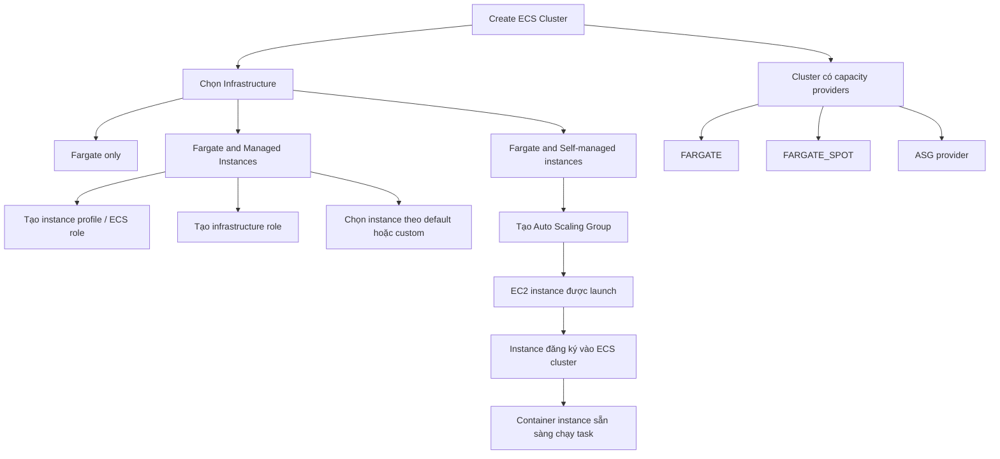

# 167. Creating ECS Cluster - Hands On

## 🎯 Giới thiệu
Bài này hướng dẫn tạo **Amazon ECS cluster** đầu tiên và quan sát cách ECS cấp phát năng lực chạy task thông qua các **capacity provider**. Nội dung tập trung vào việc tạo cluster, chọn kiểu hạ tầng, tạo role cần thiết, và xem **EC2 instance** tự đăng ký vào cluster.

## 1. Tạo ECS Cluster
- Vào **Clusters** rồi chọn **Create cluster**.
- Đặt tên cluster, ví dụ: `DemoCluster`.
- ECS cung cấp nhiều cách lấy capacity:
  - **Fargate only**: serverless, AWS lo phần server.
  - **Fargate and Managed Instances**: AWS quản lý EC2 instance phía sau.
  - **Fargate and Self-managed instances**: kiểu cũ, tự quản lý EC2 và Auto Scaling Group.

## 2. Infrastructure và role cần thiết
- Với **Fargate and Managed Instances**:
  - Cần tạo **instance profile** cho ECS.
  - Cần tạo **infrastructure role**.
- Có thể để ECS:
  - Chọn instance mặc định theo **task definition** và **service requirements**.
  - Hoặc chọn **custom** theo:
    - **vCPU**
    - **memory**
    - **Allowed instance type**, ví dụ chỉ `t3.micro`.
- Sau đó có thể nhấn **Create** để hoàn tất.

## 3. Self-managed instances và container instance
- Để phù hợp với các lecture tiếp theo, bài này cũng minh họa cách dùng **self-managed instances**:
  - Tạo **Auto Scaling Group** on-demand.
  - Chọn instance type, ví dụ `t3.micro`.
  - Dùng default role cho **EC2 instance role**.
  - Maximum là `2`.
  - Không cần SSH.
  - Root EBS volume tối thiểu `30 GB`.
  - Giữ network settings mặc định.
- ECS tự tạo một ASG như `Infra-ECS-Cluster`.
  - Min capacity `0`
  - Max capacity `5`
  - Creation đang trong tiến trình.
- Khi tăng desired capacity lên `1`:
  - Một **EC2 instance** được tạo.
  - Instance này tự đăng ký vào `DemoCluster`.
  - Trong ECS, nó xuất hiện dưới **Container instances**.
- Instance hiển thị capacity còn lại, ví dụ:
  - `1024 CPU available`
  - `982 memory available`
- Cluster lúc này có thể chạy task trên:
  - **FARGATE**
  - **FARGATE_SPOT**
  - **ASG provider / container instances**

## 📊 Bảng tóm tắt
| Tiêu chí | Mô tả |
|----------|------|
| Mục tiêu | Tạo ECS cluster đầu tiên và quan sát capacity providers |
| Kiểu hạ tầng | `Fargate only`, `Fargate and Managed Instances`, `Fargate and Self-managed instances` |
| Role quan trọng | `instance profile`, `infrastructure role`, `ecsInstanceRole` |
| Self-managed setup | Dùng Auto Scaling Group và EC2 instance |
| Kết quả | EC2 instance đăng ký vào cluster dưới dạng `container instance` |
| Capacity providers | `FARGATE`, `FARGATE_SPOT`, `ASG provider` |

## 💡 Mẹo ghi nhớ cho kỳ thi AWS
- **Fargate** = không cần quan tâm server.
- **Managed Instances** = AWS quản lý EC2 phía sau.
- **Self-managed instances** = bạn tự lo ASG, AMI, instance type.
- Khi EC2 instance đã register vào ECS cluster, nó trở thành **container instance**.
- ECS cluster có thể chứa nhiều **capacity providers**, không chỉ một kiểu duy nhất.
- Nếu đề thi nhắc đến **desired capacity**, hãy liên hệ ngay với việc EC2 instance được launch và đăng ký vào cluster.

## ✅ Kết luận
Bài này cho thấy quy trình tạo **ECS cluster** và cách ECS gắn kết với **Fargate**, **Managed Instances**, hoặc **Self-managed EC2 instances**. Điểm quan trọng nhất là hiểu rằng khi EC2 instance chạy lên và đăng ký vào cluster, nó sẽ trở thành **container instance** để ECS có thể đặt task lên đó.
