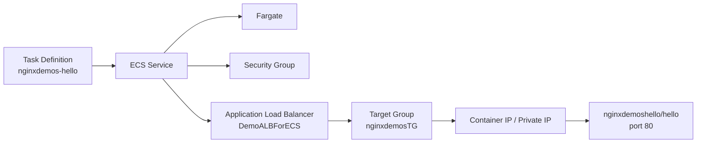

# 168. Creating ECS Service - Hands On

## 🎯 Giới thiệu
- Bài học này hướng dẫn cách tạo **ECS service** sau khi đã tạo **task definition**.
- Demo dùng **AWS Fargate** để chạy container theo kiểu **serverless compute**.
- Container được lấy từ Docker Hub image `nginxdemoshello/hello`.
- Mục tiêu cuối cùng:
  - deploy service thành công,
  - gắn với **Application Load Balancer (ALB)**,
  - truy cập được trang welcome của nginx,
  - và quan sát cách **scale up/down** của ECS service.

## 1. Tạo `Task Definition`
- Tạo mới task definition tên `nginxdemos-hello`.
- Chọn:
  - **Fargate** thay vì EC2
  - **Linux**
  - kích thước task nhỏ để tiết kiệm chi phí: `0.5 vCPU`, `1 GB memory`
- **Task role**:
  - là **IAM role** gán cho task nếu container cần gọi AWS services
  - trong demo không dùng nên để trống
- **Task execution role**:
  - để mặc định
  - nếu chưa tồn tại thì ECS service sẽ tự tạo
- Container cấu hình:
  - Name: `nginxdemos-hello`
  - Image: `nginxdemoshello/hello`
  - Port mapping: `80 -> 80`
- Storage:
  - dùng **ephemeral storage** mặc định của Fargate

## 2. Tạo `ECS Service`
- Vào cluster `demo cluster` và tạo service mới.
- Chọn:
  - task definition family: `nginxdemoshello`
  - revision mới nhất
  - compute configuration: **Fargate**
  - platform version: **latest**
- Deployment configuration:
  - kiểu `replica`
  - ban đầu chạy `1 task`
- Networking:
  - giữ subnet mặc định
  - tạo **security group** mới
  - cho phép **HTTP traffic** từ mọi nơi để truy cập port `80`
  - bật **Public IP**
- Load balancing:
  - bật load balancing
  - tạo **Application Load Balancer**
  - đặt tên: `DemoALBForECS`
  - listener port: `80`
  - tạo **target group** mới: `nginxdemosTG`
- Không thay đổi:
  - **VPC Lattice**
  - **service auto scaling**
  - volumes

## 3. Kiểm tra service và scale
- Sau khi deploy:
  - service ở trạng thái `active`
  - `desired task = 1`
  - `running = 1`
- Kiểm tra target group:
  - thấy ALB đã liên kết
  - một IP address của container đã được register làm target
- Lấy DNS name của ALB và mở trên browser:
  - hiển thị **nginx welcome page**
- Xem trong service:
  - tab **Tasks** cho biết task đang chạy, private IP, containers, logs
  - tab **Events** cho thấy chuỗi sự kiện:
    - task started
    - registered vào target group
    - deployment completed
    - steady state
- Scale up:
  - update `desired number of tasks` từ `1` lên `3`
  - ECS sẽ provision thêm task trên **Fargate**
  - load balancer phân phối request giữa các container
  - refresh browser sẽ thấy IP thay đổi
- Scale down để tiết kiệm chi phí:
  - cập nhật desired tasks về `0`
  - đồng thời đưa **desired capacity** của **Auto Scaling Group** về `0`
  - đảm bảo không còn instance/container chạy trên cluster EC2 của ECS

## 📊 Bảng tóm tắt
| Tiêu chí | Mô tả |
|----------|------|
| Mục tiêu | Tạo ECS service từ task definition và chạy container trên Fargate |
| Compute | Dùng **AWS Fargate** thay vì EC2 |
| Container image | `nginxdemoshello/hello` từ Docker Hub |
| Port mapping | `80 -> 80` |
| IAM | `task role` chỉ cần khi container gọi AWS services |
| Networking | Security group cho HTTP, bật Public IP |
| Load balancing | Tạo **ALB** và **target group** cho service |
| Trạng thái thành công | `desired task = 1`, `running = 1`, ALB truy cập được nginx page |
| Scaling | Tăng desired tasks lên `3`, sau đó giảm về `0` để tiết kiệm chi phí |

## 💡 Mẹo ghi nhớ cho kỳ thi AWS
- **Task definition** phải có trước khi tạo **ECS service**.
- **Fargate** = serverless compute cho ECS tasks/services.
- **Task role** dùng khi container cần gọi AWS services.
- **Task execution role** có thể được ECS tạo tự động.
- Khi gắn **ALB**, request đi qua **target group** rồi tới container.
- ECS service có thể tăng/giảm số task rất nhanh bằng cách đổi `desired count`.
- Muốn dừng chi phí demo, nhớ giảm cả:
  - số task của service
  - và `desired capacity` của cluster/Auto Scaling Group nếu có EC2 instances

## ✅ Kết luận
- Bài học đã dựng thành công một **ECS service** trên **Fargate**.
- Service được kết nối với **Application Load Balancer** và **target group**.
- Có thể truy cập nginx từ DNS của ALB và quan sát **scale up/down** bằng cách thay đổi số task.
- Toàn bộ flow chính cần nhớ: **Task Definition -> ECS Service -> Fargate -> ALB -> Target Group -> Container**.
