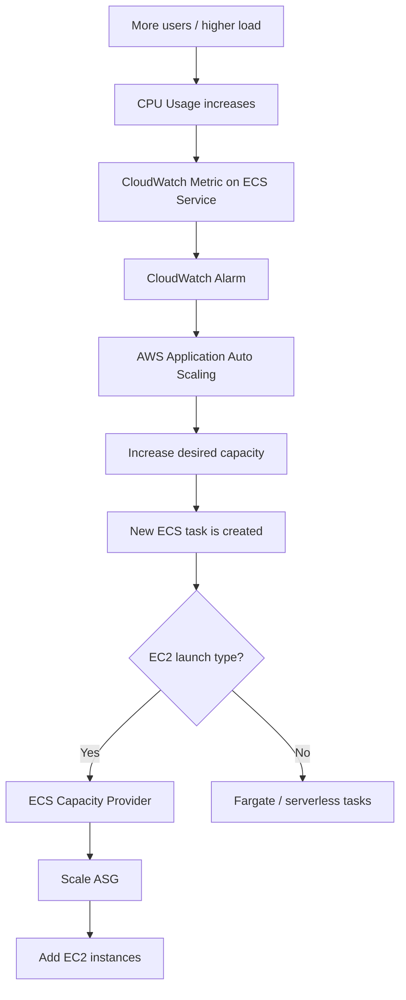

# 169. Amazon ECS - Auto Scaling

## 🎯 Giới thiệu
- **ECS Service Auto Scaling** cho phép tăng hoặc giảm số lượng **ECS tasks** trong service một cách tự động.
- Có thể scale thủ công, nhưng trọng tâm của bài là **auto scaling** bằng **AWS Application Auto Scaling**.
- Nội dung quan trọng nhất cần nhớ cho thi:
  - Metric có thể scale on
  - Loại scaling
  - Sự khác nhau giữa **task-level scaling** và **EC2 cluster scaling**
  - Khi nào nên dùng **Fargate** hoặc **ECS Cluster Capacity Provider**

## 1. Metrics dùng để Auto Scaling 📈
AWS Application Auto Scaling cho ECS Service chỉ dùng 3 metrics chính:

- **CPU Utilization** của ECS Service
- **Memory Utilization** của ECS Service
- **ALB Request Count Per Target** từ **ALB**

> Đây là các metrics được nhấn mạnh là cần nhớ.

## 2. Các kiểu Auto Scaling ⚙️
Có 3 kiểu scaling cho ECS Service:

- **Target Tracking**
  - Theo dõi một target cụ thể cho các metrics bên trên
- **Step Scaling**
- **Scheduled Scaling**
  - Dùng khi muốn scale trước cho các thay đổi có thể dự đoán được

## 3. ECS Service Scaling vs EC2 Cluster Scaling 🧩
- Scale ở mức **ECS Service task level** không đồng nghĩa với scale **EC2 cluster** phía sau.
- Nếu dùng **EC2 launch type**, việc tăng task có thể cần thêm **EC2 instances** để đủ capacity.
- Nếu không muốn quản lý EC2 backend thì **Fargate** làm cho service auto scaling dễ cấu hình hơn vì mọi thứ là **serverless**.
- Transcript nhấn mạnh rằng exam thường khuyến khích dùng **Fargate**.

### Với EC2 launch type:
Có 2 cách để scale EC2 instances phía sau:

- **Auto Scaling Group Scaling**
  - Ví dụ scale ASG dựa trên **CPU Utilization**
  - Khi CPU tăng mạnh thì thêm EC2 instance
- **ECS Cluster Capacity Provider**
  - Cách mới và thông minh hơn
  - Khi thiếu capacity để chạy task mới, nó sẽ tự động scale **ASG**
  - Capacity Provider được ghép với **Auto Scaling Group**

> Nếu phải chọn giữa **Auto Scaling Group Scaling** và **ECS Cluster Capacity Provider**, hãy chọn **ECS Cluster Capacity Provider** cho **EC2 launch type**.

## Mermaid: Flow auto scaling của ECS Service

## 📊 Bảng tóm tắt
| Tiêu chí | Mô tả |
|----------|------|
| Dịch vụ dùng để auto scaling | **AWS Application Auto Scaling** |
| Metrics có thể scale on | **CPU Utilization**, **Memory Utilization**, **ALB Request Count Per Target** |
| Kiểu scaling | **Target Tracking**, **Step Scaling**, **Scheduled Scaling** |
| Task scaling vs cluster scaling | Scale **task** không đồng nghĩa scale **EC2 cluster** |
| Cách dễ hơn cho service auto scaling | **Fargate** vì **serverless** |
| Cách scale EC2 backend | **Auto Scaling Group Scaling** hoặc **ECS Cluster Capacity Provider** |
| Cách được khuyên dùng cho EC2 launch type | **ECS Cluster Capacity Provider** |
| Luồng kích hoạt scaling | **CloudWatch Metric → CloudWatch Alarm → Auto Scaling → tăng desired capacity → tạo task mới** |

## 💡 Mẹo ghi nhớ cho kỳ thi AWS
- Nhớ đúng 3 metrics: **CPU**, **Memory**, **ALB Request Count Per Target**.
- Nhớ 3 kiểu scaling: **Target Tracking**, **Step Scaling**, **Scheduled Scaling**.
- Phân biệt rõ:
  - **ECS Service scaling** = scale số **task**
  - **EC2 launch type scaling** = còn phải scale **EC2 instances**
- Nếu đề bài nói **easier**, **serverless**, hoặc muốn đơn giản hóa việc scaling service, nghĩ đến **Fargate**.
- Nếu dùng **EC2 launch type**, ưu tiên **ECS Cluster Capacity Provider** hơn **Auto Scaling Group Scaling**.

## ✅ Kết luận
- **ECS Service Auto Scaling** dùng **AWS Application Auto Scaling** để tự động tăng giảm số task.
- Ba metrics cần nhớ là **CPU Utilization**, **Memory Utilization**, và **ALB Request Count Per Target**.
- Với **EC2 launch type**, cần chú ý thêm phần scale **EC2 instances** ở backend, và **ECS Cluster Capacity Provider** là cách thông minh hơn để làm việc này.
