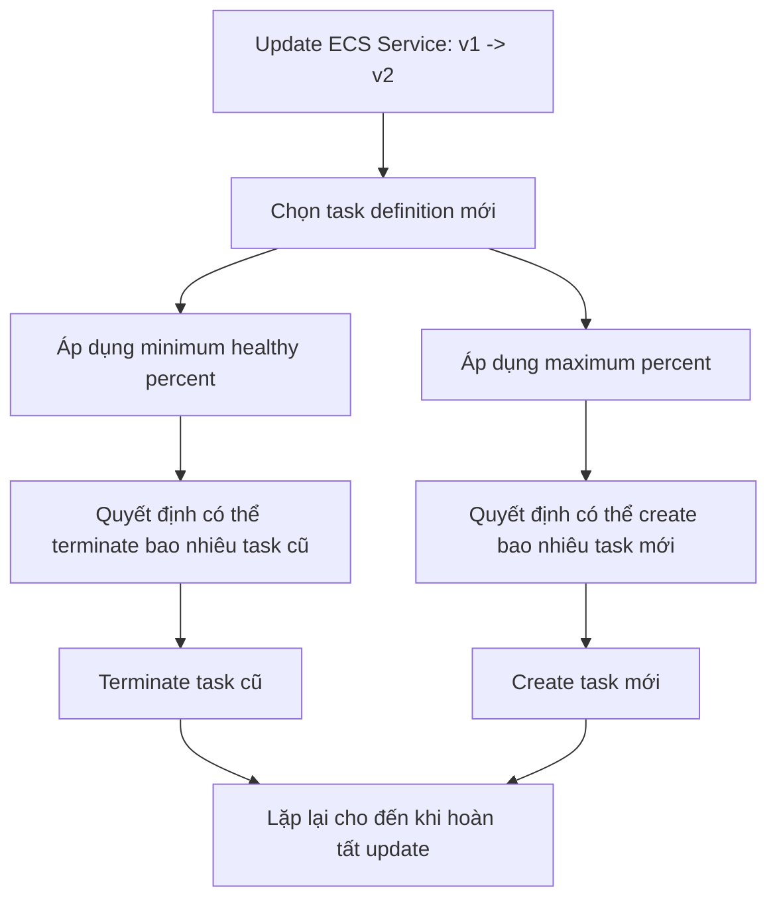

# 170. Amazon ECS - Rolling Updates

## 🎯 Giới thiệu
- Khi update một ECS service từ version cũ sang version mới, ECS dùng **rolling updates** để kiểm soát:
  - số lượng task được **start** và **stop** tại mỗi thời điểm
  - thứ tự thực hiện update
- Hai tham số quan trọng khi update service:
  - **minimum healthy percent**
  - **maximum percent**
- Mặc định trong lecture:
  - `minimum healthy percent = 100`
  - `maximum percent = 200`

## 1. Cơ chế Rolling Updates trong ECS
- ECS service đang chạy nhiều tasks, ví dụ 9 tasks tương ứng với 100% capacity hiện tại.
- Khi update, ECS không đổi toàn bộ cùng lúc.
- Thay vào đó, ECS sẽ:
  - tạo task mới của version mới
  - sau đó terminate task cũ
  - lặp lại cho đến khi toàn bộ service chuyển sang version mới
- Mục tiêu là đảm bảo service được update dần dần thay vì dừng toàn bộ cùng lúc.

## 2. Vai trò của `minimum healthy percent` và `maximum percent`
- **minimum healthy percent**
  - Cho biết service phải giữ tối thiểu bao nhiêu % capacity đang chạy.
  - Nếu đặt thấp hơn 100%, ECS có thể terminate một phần task cũ trước khi tạo đủ task mới.
- **maximum percent**
  - Cho biết service có thể tăng lên tối đa bao nhiêu % capacity trong lúc update.
  - Giá trị này quyết định số task mới có thể được tạo thêm trong quá trình rolling update.

### Tác động chính
- `minimum healthy percent` thấp hơn 100%:
  - ECS được phép giảm capacity tạm thời
  - phù hợp với case terminate trước rồi create sau
- `maximum percent` cao hơn 100%:
  - ECS được phép tạo thêm task mới trước
  - phù hợp với case create trước rồi terminate sau

## 3. Hai kịch bản ví dụ
### Kịch bản 1: `min = 50%`, `max = 100%`
- Bắt đầu với 4 tasks.
- ECS có thể:
  - terminate 2 tasks cũ trước
  - capacity còn 50%
  - tạo 2 tasks mới
  - quay lại 100%
  - tiếp tục terminate 2 tasks cũ
  - rồi tạo 2 tasks mới
- Đây là kiểu **terminate trước, create sau**.

### Kịch bản 2: `min = 100%`, `max = 150%`
- Bắt đầu với 4 tasks.
- ECS **không thể terminate task cũ trước**, vì minimum là 100%.
- ECS sẽ:
  - tạo 2 tasks mới trước, capacity lên 150%
  - sau đó terminate 2 tasks cũ, quay về 100%
  - tiếp tục lặp lại cho đến khi hoàn tất
- Đây là kiểu **create trước, terminate sau**.

## 📊 Bảng tóm tắt
| Tiêu chí | Mô tả |
|----------|------|
| Mục đích | Update ECS service từ version cũ sang version mới theo từng bước |
| Cơ chế | Create task mới và terminate task cũ dần dần |
| `minimum healthy percent` | Xác định mức capacity tối thiểu cần giữ trong lúc update |
| `maximum percent` | Xác định mức capacity tối đa được phép tăng lên trong lúc update |
| `min < 100%` | Có thể terminate task cũ trước |
| `max > 100%` | Có thể create task mới trước |
| Ý nghĩa thi AWS | Thường chỉ cần nhớ cách `min` và `max` ảnh hưởng đến thứ tự update |

## 💡 Mẹo ghi nhớ cho kỳ thi AWS
- Nhớ 2 ý chính:
  - **min healthy** = giữ lại task cũ tối thiểu bao nhiêu
  - **max percent** = được phép tăng thêm bao nhiêu task mới
- Nếu muốn **terminate trước**:
  - cần `minimum healthy percent < 100`
- Nếu muốn **create trước**:
  - cần `maximum percent > 100`
- Trong đề thi, chỉ cần xác định:
  - ECS đang ưu tiên **giữ an toàn capacity**
  - hay cho phép **tăng capacity tạm thời** để rollout version mới

## ✅ Kết luận
- Rolling updates trong ECS là cách update service theo từng bước để chuyển từ version cũ sang version mới.
- Hai tham số quan trọng là `minimum healthy percent` và `maximum percent`.
- Chúng quyết định ECS sẽ **terminate task cũ trước** hay **create task mới trước** trong quá trình update.
